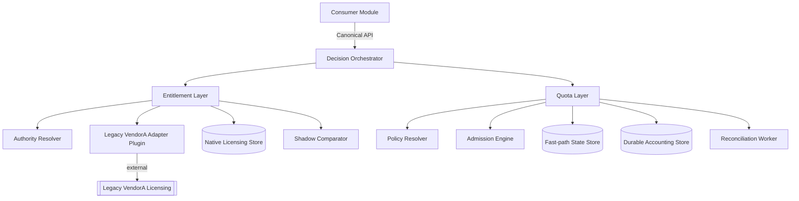
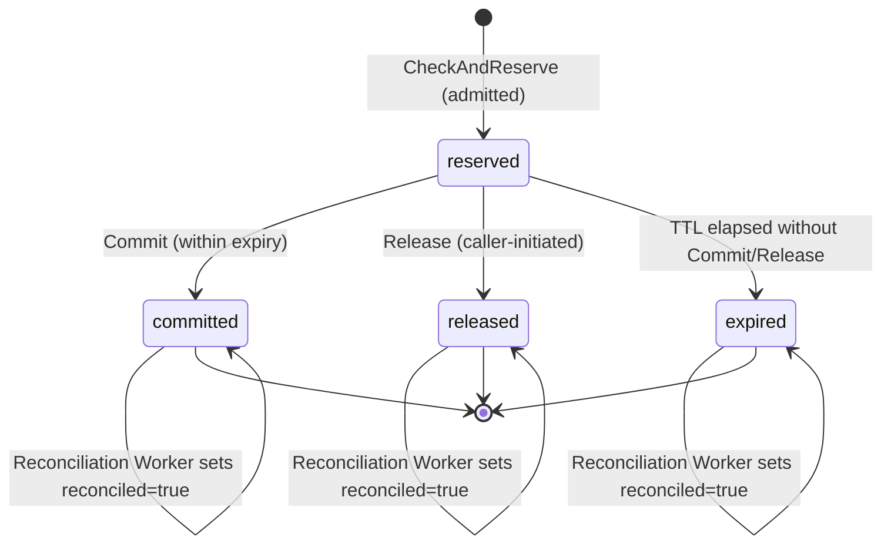
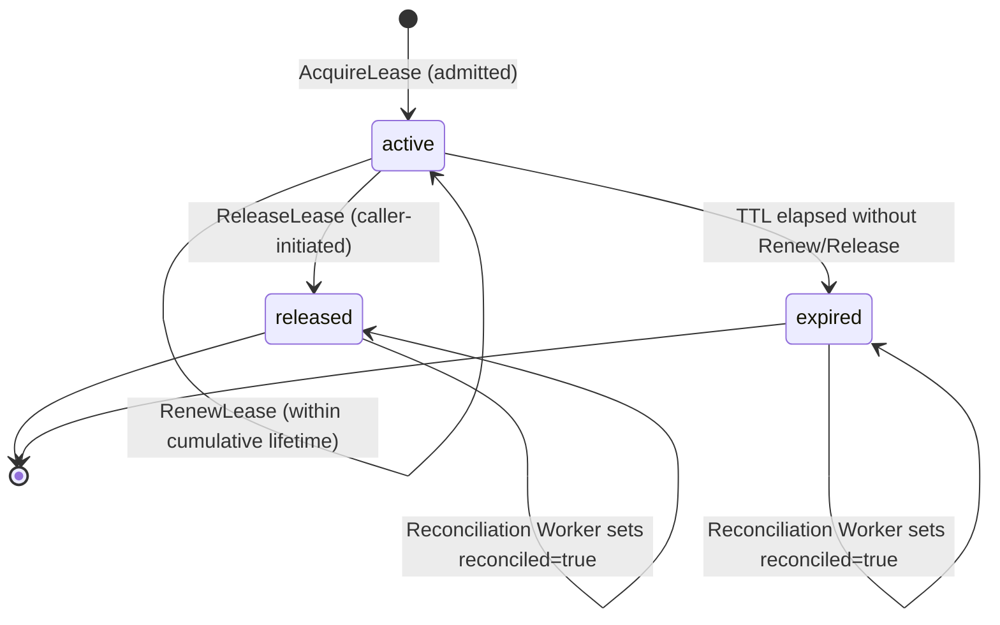
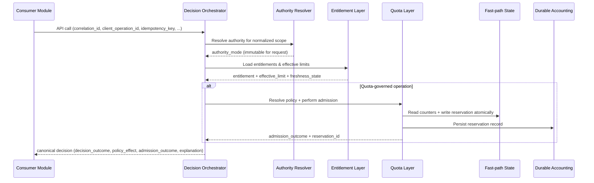
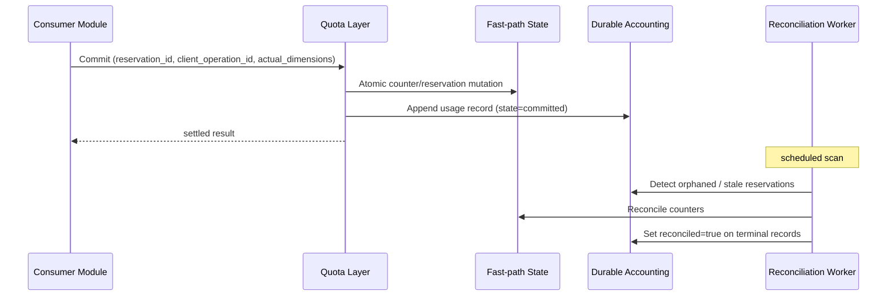

# Technical Design — Licensing Service

- [ ] `p3` - **ID**: `cpt-cf-licensing-service-design-root`

## Table of Contents

<!-- generated by `cypilot toc` -->

## 1. Architecture Overview

### 1.1 Architectural Vision

Licensing Service is a unified ModKit module that owns both canonical licensing truth (entitlements, effective
limits, authority routing, legacy adaptation, shadow comparison) and runtime quota governance (policy resolution,
admission, reservation lifecycle, usage accounting, reconciliation). The module exposes one SDK and one API surface
to consumer modules, returning a single explainable decision covering both entitlement and quota state.

Internally, the module is organized as two cooperating layers behind one public contract: an **entitlement layer**
and a **quota layer**. The layer boundary is enforced through an internal trait interface rather than through a
service boundary, preserving separation of concerns without inter-service latency or coordination overhead. The
federated authority model (see ADR-0001) lives inside the entitlement layer; the unification rationale is recorded
in ADR-0002.

For legacy VendorA deployments, the entitlement layer delegates to a legacy-adapter plugin behind the canonical
API. Platform consumers never consume the adapter directly. Canonical platform-native authority is supported for
new modules and can coexist with legacy-authoritative scopes in the same deployment through explicit per-scope
routing.

### 1.2 Architecture Drivers

#### Functional Drivers

| Requirement | Design Response |
|-------------|------------------|
| `cpt-cf-licensing-service-fr-canonical-api` | One umbrella SDK surface (§3.3) with entitlement and quota sub-interfaces; no parallel public surfaces. |
| `cpt-cf-licensing-service-fr-authority-routing` | Authority resolver component (§3.2) maps normalized licensing scope to exactly one authority mode. |
| `cpt-cf-licensing-service-fr-no-cross-authority-failover` | Authority resolution cached for request lifetime (per the request-evaluation immutability clause of the PRD requirement); cross-authority fallback disallowed in the resolver (§3.6). |
| `cpt-cf-licensing-service-fr-internal-ownership` | Layered component model (§3.2) with internal trait boundary between entitlement and quota layers. |
| `cpt-cf-licensing-service-fr-decision-orchestration` | Decision orchestrator (§3.2) sequences entitlement lookup → effective-limit resolution → quota admission in one in-process path. |
| `cpt-cf-licensing-service-fr-reservation-lifecycle` | Reservation state machine (§3.6.1) with four-state closed set and `reconciled` audit flag. |
| `cpt-cf-licensing-service-fr-shared-recovery-state-machine` | Shared recovery FSM embedded in platform-approved SDK (§3.6.2). |
| `cpt-cf-licensing-service-fr-idempotent-lifecycle` | Canonical request equality (§3.4) and two-key model (`client_operation_id` + `idempotency_key`). |
| `cpt-cf-licensing-service-fr-check-and-reserve` | `CheckAndReserve` implemented against the fast-path state store with atomic counter/reservation mutation (§3.2). |
| `cpt-cf-licensing-service-fr-durable-usage-accounting` | Durable authoritative accounting store separated from fast-path state (§3.2, §3.7). |
| `cpt-cf-licensing-service-fr-reserved-consumed-independence` | Admission formula sums outstanding reservations and windowed committed usage (§3.5). |
| `cpt-cf-licensing-service-fr-absolute-stale-write-protection` | Optimistic-concurrency object key for `quantity_model = absolute` dimensions (§3.4). |
| `cpt-cf-licensing-service-fr-reconciliation` | Reconciliation worker component (§3.2) writes durable `reconciled` audit flag (§3.6.1). |
| `cpt-cf-licensing-service-fr-shadow-observability` | Shadow comparator component (§3.2) performs canonicalized comparison (§3.4). |
| `cpt-cf-licensing-service-fr-freshness-semantics` | Freshness classifier (§3.5) computes state from authority-emission timestamp. |
| `cpt-cf-licensing-service-fr-degraded-policy` | Policy gate in the decision orchestrator (§3.2) applies per-operation-class degraded eligibility. |
| `cpt-cf-licensing-service-fr-soft-hard-outcomes` | Decision mapper (§3.2) produces `(decision_outcome, policy_effect, admission_outcome)` triplet per the closed mapping in PRD §5.7. |
| `cpt-cf-licensing-service-fr-retry-after-semantics` | `retry_after_seconds` derivation, ceiling, and floor-not-deadline semantics (§3.5 Retry-After Mechanics). |
| `cpt-cf-licensing-service-fr-deferred-admission` | Entitlement-layer deferred semantics and `deferred_retry_after_seconds` clamp-on-overflow mechanics (§3.5 Deferred Retry-After Mechanics). |
| `cpt-cf-licensing-service-fr-subject-kind-registry` | Durable, versioned registry with fast-path cache and ingress validation in the decision orchestrator (§3.4 Subject Kind Registry). |
| `cpt-cf-licensing-service-fr-persisted-grant-update` | `Update` admission path reusing the admission formula but performing atomic counter advance / absolute-level persistence without reservation lifecycle (§3.5 Update Admission Mechanics; endpoint in §3.3). |
| `cpt-cf-licensing-service-fr-release-outcome` | Caller-supplied `release_outcome` label persisted on the terminal reservation/lease record; partitions the `released` bucket without altering lifecycle or capacity (§3.6.1 Release Outcome Semantics). |
| `cpt-cf-licensing-service-fr-audit-coverage` | Transactional outbox (`admin_audit_outbox`) co-committed with the admin mutation in a single RDBMS transaction; asynchronous dispatcher delivers to the platform audit service (§3.7 Administrative Audit Path). |
| `cpt-cf-licensing-service-fr-entitlement-grant-renewal-grace` | `renewable_until` is an additive authority-reported attribute propagated through the decision response; excluded from shadow equality and does not participate in admission (§3.6 Canonical Decision Flow, via adapter contract in §3.3). |
| `cpt-cf-licensing-service-fr-canonical-model` | §3.1 Domain Model enumerates the canonical entities (feature, offering item, entitlement grant, effective limit, authority, decision explanation); legacy payloads are translated by the adapter before they reach consumers (§3.2 Legacy VendorA Adapter). |
| `cpt-cf-licensing-service-fr-feature-semantics` | §3.1 *Feature Granularity — Sub-capabilities as First-Class Features* covers `activity_type`, `quantity_model`, and canonical unit semantics; the resource-type registry (§3.4 Canonical Unit per Resource Type) underpins unit enforcement. |
| `cpt-cf-licensing-service-fr-decision-contract` | Decision Orchestrator (§3.2) emits the canonical decision contract; §3.4 Canonicalization Rules (Idempotency Request Equality, Shadow Comparison Canonicalization) ensure deterministic field construction. |
| `cpt-cf-licensing-service-fr-lookup-contract` | §3.3 Endpoints Overview (`GetEffectiveEntitlements`, `GetEffectiveLimits`) and §3.6.4 Canonical Decision Flow produce lookup responses embedding the canonical decision contract. |
| `cpt-cf-licensing-service-fr-decision-outcome-semantics` | Decision Orchestrator (§3.2) plus Soft-Threshold Evaluation (§3.5) produce `decision_outcome`, `policy_effect`, and `admission_outcome` deterministically per the closed mappings. |
| `cpt-cf-licensing-service-fr-explainable-decisions` | Decision Orchestrator (§3.2) emits explainable metadata (limiting scopes, policy IDs, dimensions, timestamps, operation identity, retry-after, downgrade data); contributing-reason-codes construction is normative in §3.5 Soft-Threshold Evaluation. |
| `cpt-cf-licensing-service-fr-explanation` | Authority-aware explanation fields (resolved authority, limiting component, policy/entitlement basis, primary `reason_code`) are produced by the Decision Orchestrator (§3.2) and threaded through §3.6.4 Canonical Decision Flow. |
| `cpt-cf-licensing-service-fr-single-authority` | §2.1 Design Principle *One Authority per Scope* (`cpt-cf-licensing-service-principle-one-authority-per-scope`) forbids dual-authoritative scopes; Authority Resolver (§3.2) enforces this at request boundary. |
| `cpt-cf-licensing-service-fr-disabled-mode` | Authority Resolver (§3.2) returns a deterministic `authoritative deny` decision for disabled-mode scopes without invoking admission or the fast-path state store. |
| `cpt-cf-licensing-service-fr-native-authority` | Entitlement Layer (§3.2) plus the durable accounting store (§3.7 `quota_policies`, entitlement-grant tables) serve native-authoritative scopes; §3.3 contract surface is shared with legacy. |
| `cpt-cf-licensing-service-fr-native-entitlements` | Native entitlement CRUD through Entitlement Layer (§3.2); mutations audited through the transactional outbox (§3.7 Administrative Audit Path). |
| `cpt-cf-licensing-service-fr-legacy-adapter` | Legacy VendorA Adapter (Plugin) component (§3.2) sits behind `cpt-cf-licensing-service-contract-legacy-adapter` (§3.3); anti-corruption translation is the plugin's responsibility. |
| `cpt-cf-licensing-service-fr-legacy-projection` | §3.5 Freshness Classification reads `last_successful_refresh_at` of the adapter-maintained local projection as the authority-emission timestamp; cache semantics per §3.4. |
| `cpt-cf-licensing-service-fr-adapter-plugin-isolation` | §3.2 Legacy VendorA Adapter (Plugin) isolates all adapter-specific state behind the canonical trait boundary; public callers never see VendorA payloads. |
| `cpt-cf-licensing-service-fr-sync-status` | §3.5 Freshness Classification surfaces `source_version` / watermark / `staleness` metadata through the freshness pipeline; passed through §3.6.4 Canonical Decision Flow. |
| `cpt-cf-licensing-service-fr-error-distinction` | Decision Orchestrator (§3.2) returns either a canonical decision (possibly `decision_state = degraded`) or a service error through the service-error contract — never both; §3.5 Freshness Classification drives the degraded-vs-error choice. |
| `cpt-cf-licensing-service-fr-ai-workloads` | No AI-specific code path; AI consumers use the generic decision + reservation pipeline (§3.3, §3.5, §3.6.1) with AI-shaped resource types registered through §3.4 Canonical Unit per Resource Type. |
| `cpt-cf-licensing-service-fr-generic-consumers` | Same pipeline as `fr-ai-workloads`; non-AI consumers (uploads, storage, vector ops, job execution) register their resource types through §3.4 and consume §3.3 without module-specific branches. |
| `cpt-cf-licensing-service-fr-multi-dimensional-decisioning` | Admission formula (§3.5) evaluates per `(p, d)`; dimension-set alignment on `Commit` enforced via `dimension_set_mismatch` (§3.6.1 Commit Magnitude Semantics). |
| `cpt-cf-licensing-service-fr-quota-class-coverage` | Rate and budget quotas realised through §3.5 Period and Window Semantics (SSA-008/SSA-011); concurrency realised through §3.6.3 Lease Lifecycle Mechanics (SSA-200). |
| `cpt-cf-licensing-service-fr-quota-policy-lifecycle` | Policy CRUD through §3.3 contracts; `quota_policies` table (§3.7) plus state-transition audit via the transactional outbox (§3.7 Administrative Audit Path). |
| `cpt-cf-licensing-service-fr-quota-policy-resolution` | §3.5 Soft-Threshold Evaluation resolves `P_applicable` under the canonical scope-narrowness total order; emergency-override precedence handled through the decision-orchestrator policy gate (§3.2). |
| `cpt-cf-licensing-service-fr-hierarchical-scope-evaluation` | §3.5 Soft-Threshold Evaluation aggregates across the hierarchical scope order (`model > api_key > user > project > model_family > tenant > region > platform`) with Union-warn / AND-cap / AND-downgrade composition. |
| `cpt-cf-licensing-service-fr-preview-vs-reserve` | Two distinct endpoints (§3.3 `POST /quota/check` vs `POST /quota/reservations`); admission formula applied identically per §3.5 with only the documented side-effect delta and degraded-state delta. |
| `cpt-cf-licensing-service-fr-effective-quota` | §3.3 `GET /quota/effective` preview endpoint returns effective limits, remaining quota, limiting scopes, and resource dimensions without mutating state. |
| `cpt-cf-licensing-service-fr-bounded-overshoot` | §3.6.1 Commit Magnitude Semantics (SSA-010) enforces per-policy `allow_overshoot_bound_percent`; `overshoot_capacity_exhausted` / `commit_exceeds_reservation` error codes surface the classification. |
| `cpt-cf-licensing-service-fr-safe-degradation` | Same Decision Orchestrator policy gate (§3.2) as `fr-degraded-policy`; degraded-eligible operation-class whitelist plus explicit deny / allow / emergency fallback decision per operation class. |
| `cpt-cf-licensing-service-fr-partial-failure-recovery` | §3.6.1 Reservation TTL Mechanics (SSA-004) + §3.6.2 Shared Recovery State Machine + Reconciliation Worker (§3.2) cover orphaned reservations, worker failures, delayed usage delivery, and unknown-outcome client retries. |
| `cpt-cf-licensing-service-fr-shadow-mode` | Shadow Comparator component (§3.2) evaluates non-authoritative native decisions; canonicalization per §3.4 Shadow Comparison Canonicalization; same pipeline as `fr-shadow-observability`. |

#### NFR Allocation

| NFR ID | NFR Summary | Allocated To | Design Response | Verification Approach |
|--------|-------------|--------------|-----------------|----------------------|
| `cpt-cf-licensing-service-nfr-decision-latency` | Hot-path latency budget for decision APIs | Fast-path state store + in-process decision orchestrator | In-process evaluation avoids network hop; fast-path counters in Redis-class store | Load testing against the `CheckAndReserve` path |
| `cpt-cf-licensing-service-nfr-availability` | Monthly decision-producing request availability target | Decision Orchestrator + Safe Degradation path (§3.2, `fr-safe-degradation`) | Degraded-eligible read paths return policy-directed degraded decisions; state-changing paths return documented service errors; no silent fail-open | Synthetic availability probes against hot-path endpoints; service-error rate dashboards |
| `cpt-cf-licensing-service-nfr-observability` | Decision-path observability signals | Decision Orchestrator + telemetry emission (§3.2) | Structured decision-record emission on every path includes routing mode, decision state, primary reason code, freshness metadata, limiting-factor metadata, and `shadow_comparison_bucket` when shadow is enabled | Log-pipeline field-coverage checks; telemetry schema conformance tests |
| `cpt-cf-licensing-service-nfr-correlation-traceability` | 100% decisions emit `correlation_id` | Decision orchestrator | Mandatory `correlation_id` field on every decision path; structured logging adapter | Log-pipeline coverage checks |
| `cpt-cf-licensing-service-nfr-auditability` | Durable audit of decisions and mismatches | Durable accounting store + shadow comparator | Append-only decision audit log joined by `correlation_id` | Audit log retention and join-ability tests |
| `cpt-cf-licensing-service-nfr-no-double-truth` | Reject configurations creating dual-authoritative scope ownership | Authority Resolver + policy-admission validation (§3.2) | Single-authority invariant enforced at authority-rule admission; `error_code = conflicting_authority_configuration` on dual ownership attempts | Policy-admission unit tests for dual-ownership rejection |
| `cpt-cf-licensing-service-nfr-staleness-visibility` | Stale-read responses carry explicit stale-state metadata | Decision Orchestrator + Freshness Classification (§3.5) | Responses served beyond `fresh_threshold` carry `freshness_state`, staleness-derived metadata, and degraded-mode semantics per `fr-freshness-semantics` | Freshness-classification integration tests across the three-state closed set |
| `cpt-cf-licensing-service-nfr-quota-decision-latency` | Hot-path latency budget for quota decisions | Quota Layer (§3.2) + fast-path counter store | Admission formula executes inside the same fast-path transaction as reservation creation; no cross-service hop on the quota path | Load testing against `CheckAndReserve` for quota-governed workloads |
| `cpt-cf-licensing-service-nfr-reservation-durability` | Zero acknowledged settlement records lost under single-node failure | Durable accounting store (§3.2) + transactional outbox (§3.7) | Settlement records persisted durably before `Commit` acknowledgement; outbox ensures at-least-once propagation to downstream sinks | Kill-node durability tests; outbox replay verification |
| `cpt-cf-licensing-service-nfr-reconciliation-lag` | Reconciliation lag bound | Reconciliation worker + outbox delivery | Scheduled reconciliation scans drain durable state; outbox propagation to analytic sinks | Lag metric on reconciliation pipeline |
| `cpt-cf-licensing-service-nfr-quota-observability` | Quota-specific observability signals | Quota Layer + telemetry emission (§3.2) | Per-decision quota records emit `admission_outcome`, `reason_code`, limiting scopes, and reservation lifecycle state as structured fields | Quota telemetry schema conformance tests |

#### Key ADRs

| ADR ID | Decision Summary |
|--------|-----------------|
| `cpt-cf-licensing-service-adr-federated-licensing-authority` | Federated authority model with legacy and native modes coexisting per-scope |
| `cpt-cf-licensing-service-adr-unified-licensing-quota-module` | Unified licensing + quota module with internal layer split |
| `cpt-cf-licensing-service-adr-reservation-lifecycle-and-reconciled-semantics` | Four-state reservation lifecycle; `reconciled` is a post-terminal audit flag |

### 1.3 Architecture Layers

- [ ] `p3` - **ID**: `cpt-cf-licensing-service-tech-stack`

| Layer | Responsibility | Technology |
|-------|---------------|------------|
| Public API | Umbrella SDK surface; canonical licensing and quota contracts | Rust SDK + ModKit REST |
| Decision Orchestration | Sequences entitlement → effective-limit → admission in one in-process path | Rust traits, internal |
| Entitlement Layer | Authority resolution, federation, legacy adaptation, entitlement/limit read models, shadow comparison | Rust, internal |
| Quota Layer | Policy resolution, admission, reservation lifecycle, usage accounting, reconciliation | Rust, internal |
| Fast-path State | Low-latency counters, reservation state, lease-backed concurrency control | Redis-class store (capability profile below) |
| Durable Authoritative Accounting | Policies, authoritative usage records, aggregate views, shadow audit | PostgreSQL-class RDBMS |
| Legacy Adapter | Translation to/from legacy VendorA licensing systems | ModKit plugin behind the entitlement layer |
| Audit & Observability | Decision audit, shadow mismatch records, quota telemetry | Platform audit sinks |

##### Fast-path state store capability profile

"Redis-class" is a capability label, not a product choice. Any candidate store selected as the fast-path
backing **MUST** provide the following capabilities; the module's admission, reservation lifecycle,
consistency model, and idempotency guarantees all rely on them and are unsafe against a store that omits
any one:

| Capability | Requirement | Why the module relies on it |
|------------|-------------|-----------------------------|
| Atomic read-modify-write on a single key | Server-side atomic counter increment with overflow/underflow detection, single-key CAS, or equivalent | Per-window counter advance on `counted` / `incremental` admission (§3.5) |
| Multi-key atomic transaction bounded to one admission | All-or-nothing commit across: per-window counter(s), reservation record, idempotency record, shadow-audit scratch — within the same round-trip (e.g. `MULTI/EXEC`, `WATCH`, or Lua-script equivalent) | Admission atomicity (§3.5), commit magnitude atomicity (§3.6.1), reservation expiry/commit derived-expired classification (§3.6.1) |
| Compare-and-set on a record version token | Optimistic-concurrency primitive gated by a version, generation, or `(object_key, persisted_version)` pair | Absolute-value stale-write protection (§3.4), idempotency replay matching |
| TTL-bound record expiry | Server-managed key TTL with second-granularity expiration; opaque to the consumer but observable through existence checks | Online idempotency TTL (§3.4), reservation `expires_at` classification, lease `expires_at` classification |
| Strong read-your-writes on a single key | A successful write is visible to every subsequent read of the same key from any node, with no replica-lag window that violates PRD §4.4 (Consistency model) | Read-your-writes guarantee on the fast-path object graph |
| Linearizable single-key writes | Per-key total order of writes across concurrent writers | Prevents lost updates on reservation state transitions and on counter advance |
| Bounded-latency point reads/writes | p99 under the decision-latency budget declared in `cpt-cf-licensing-service-nfr-decision-latency` (DESIGN NFR Allocation) | Hot-path admission budget |
| Persistence or replicated durability before acknowledgment | Each acknowledged write is either persisted or replicated enough to survive a single-node failure | Idempotency durability, reservation visibility across recovery |

Redis (standalone with AOF `everysec` or AOF `always`, or with replicated persistence) and Redis-compatible
stores (KeyDB, Dragonfly, Valkey, Elasticache with appropriate configuration) all satisfy this profile and
are valid fast-path backings. Stores that violate any capability (e.g. eventually-consistent key-value
stores without CAS, or stores without server-side atomic transactions) are **NOT** valid backings; the
module's correctness guarantees do not compose over such stores. Swapping the fast-path backing for a
store that meets this profile is an implementation-level change and does not require a PRD update, but a
DESIGN update listing the concrete backing and its configuration is required for operator visibility.

## 2. Principles & Constraints

### 2.1 Design Principles

#### One Authority per Scope

- [ ] `p2` - **ID**: `cpt-cf-licensing-service-principle-one-authority-per-scope`

Each normalized licensing scope resolves to exactly one authority mode (`legacy_authoritative`, `native_authoritative`,
`shadow`, or `disabled`). Dual authority for the same scope is forbidden. In `shadow` mode, the authoritative
decision remains the only user-visible decision and the shadow decision is observability-only. This principle keeps federated routing deterministic,
auditable, and shadow-comparable.

**ADRs**: `cpt-cf-licensing-service-adr-federated-licensing-authority`

#### Layered Internal Ownership

- [ ] `p2` - **ID**: `cpt-cf-licensing-service-principle-layered-ownership`

The entitlement layer owns commercial licensing truth; the quota layer owns runtime admission and usage accounting.
Crossing the boundary requires the internal trait interface. The quota layer never constructs or mutates
entitlement-owned state.

| Concern | Owned by |
|---------|----------|
| `entitlement_existence` | Entitlement layer |
| `feature_enablement` | Entitlement layer |
| `effective_licensed_limit` | Entitlement layer |
| `commercially_authoritative_consumed_quantity` | Entitlement layer (native) / legacy authority (legacy scopes) |
| `policy_resolution` | Quota layer |
| `admission_decision` | Quota layer |
| `reservation_lifecycle_state` | Quota layer |
| `runtime_counters` | Quota layer |
| `reconciliation_audit_flag` | Quota layer (reconciliation worker) |

**ADRs**: `cpt-cf-licensing-service-adr-unified-licensing-quota-module`

#### No Cross-Authority Fallback

- [ ] `p2` - **ID**: `cpt-cf-licensing-service-principle-no-cross-authority-fallback`

Once a scope is resolved to an authority mode, the module never silently switches to a different authority because
the resolved authority is stale, slow, or unavailable. The only permitted outcomes are authoritative decision,
policy-permitted degraded decision derived from the resolved authority context, or a service error.

**ADRs**: `cpt-cf-licensing-service-adr-federated-licensing-authority`

#### Idempotency First

- [ ] `p2` - **ID**: `cpt-cf-licensing-service-principle-idempotency-first`

Every state-changing operation (`CheckAndReserve`, `Commit`, `Release`) requires a `client_operation_id` and an
`idempotency_key`. The module is replay-safe by construction: transport retries of the same call and business-level
retries of the same operation both return the previously accepted result without double-settlement. Canonical field
equality (§3.4) governs replay matching.

#### Centralized State Machine

- [ ] `p2` - **ID**: `cpt-cf-licensing-service-principle-centralized-state-machine`

All reservation lifecycle transitions and the post-terminal setting of the `reconciled` audit flag go through one
shared recovery state machine provided by the platform-approved SDK. Consumers never implement ad-hoc recovery.

**ADRs**: `cpt-cf-licensing-service-adr-reservation-lifecycle-and-reconciled-semantics`

### 2.2 Constraints

#### Modular Monolith Deployment

- [ ] `p2` - **ID**: `cpt-cf-licensing-service-constraint-modular-monolith`

This design preserves the modular monolith boundary while deliberately keeping the internal runtime contract small in the
initial delivery tier. The quota runtime and entitlement resolution stay within the same module and the same process /
network boundary. Future extraction into a separate process is explicitly preserved by keeping the internal trait
boundary stable.

#### Single-Region p1

- [ ] `p2` - **ID**: `cpt-cf-licensing-service-constraint-single-region-v1`

p1 operates as a single-region deployment. Multi-region correctness (region-pinned authority, cross-region shadow,
multi-region reconciliation) is out of scope for p1 but must not be foreclosed by p1 designs.

## 3. Technical Architecture

### 3.1 Domain Model

**Technology**: Rust structs (internal), GTS-defined resource types (cross-module)

**Core Entities**:

| Entity | Description |
|--------|-------------|
| `EntitlementGrant` | Canonical record that a scope is allowed to use an offering item or feature |
| `EffectiveLimit` | Resolved usage or quantity restriction for the current scope |
| `QuotaPolicy` | Policy rule defining limits, scope, behavior, and priority |
| `Reservation` | Temporary hold on quota capacity prior to settlement; tracked by four-state lifecycle |
| `UsageRecord` | Durable record of estimated or actual resource consumption tied to a subject, action, and lifecycle state |
| `AuthorityRoutingRule` | Per-scope configuration mapping a normalized licensing scope to an authority mode |
| `DecisionAuditRecord` | Append-only record of a decision, joined by `correlation_id` |
| `ShadowComparisonRecord` | Append-only record of authoritative-vs-shadow decision pairs and mismatch classifications |

**Relationships**:

- `EntitlementGrant` → `EffectiveLimit`: grants produce effective limits after policy resolution
- `QuotaPolicy` → `EffectiveLimit`: quota policy contributes its own effective limit that composes with entitlement limits
- `Reservation` → `UsageRecord`: each terminal reservation produces at least one usage record
- `ShadowComparisonRecord` → `DecisionAuditRecord`: joined by `correlation_id`

#### Feature Granularity — Sub-capabilities as First-Class Features

- [ ] `p1` - **ID**: `cpt-cf-licensing-service-design-feature-granularity`

The canonical domain model does **not** carry a separate "sub-feature", "add-on", "rider", or "support
contract" concept parallel to `EntitlementGrant`. When a commercial product ships multiple independently-
licensable sub-capabilities under the same tenant and product family — for example:

- *product use* vs *version upgrades* / *premium support* vs *technical maintenance* (classic perpetual +
  maintenance contracts, common in enterprise software asset management),
- *base platform* vs *optional add-on modules* (e.g. disaster recovery, advanced backup, cloud storage
  add-on),
- *base tier* vs *premium-support tier* covered under separate renewal cadences,

each sub-capability **MUST** be modelled as its own independent `EntitlementGrant` whose
`offering_item_or_feature` component of the normalized licensing scope uses a distinct feature identifier,
while the remaining scope components (`tenant_scope`, `subject_scope`, `product_family`,
`deployment_environment`, `usage_dimension`) are equal or deliberately related. Example canonical feature
identifiers for a product `foo`:

- `foo.use` — right to run the product.
- `foo.version_upgrade` — right to install a newer major version (the classic "maintenance entitlement").
- `foo.premium_support` — right to open premium support tickets.

##### Why this is the first-class modelling pattern

Modelling sub-capabilities as independent `EntitlementGrant` records gives every sub-capability:

- its own lifecycle (`active / pending_* / expired / revoked / absent`), so "product use expired but
  premium support still active" is representable without special cases;
- its own freshness, `renewable_until`, `effective_limit`, and shadow comparison footprint, so each
  sub-capability evolves commercially independently;
- its own authority routing, so a scope can remain `legacy_authoritative` for `foo.use` while being
  `native_authoritative` for a newly-launched `foo.premium_support` without dual-authority conflicts.

##### Normative guidelines

1. Consumer modules and legacy adapters **MUST NOT** conflate multiple sub-capabilities into one grant by
   attaching side-channel attributes such as `maintenance_expires_at` or `support_level` to a single
   `EntitlementGrant`; these end up in free-form payloads outside the canonical contract and break shadow
   comparison. Each sub-capability gets its own feature identifier.
2. Feature identifier naming **MUST** follow `resource_type_id` syntax (`^[a-z][a-z0-9_]*(\.[a-z][a-z0-9_]*)+$`)
   so that audit queries, shadow comparison, and registry lookups treat sub-capabilities like any other
   feature.
3. Legacy adapters that project from a legacy catalogue (VendorA, SKU registries, or analogous systems) in
   which sub-capabilities are modelled as scalar attributes on a single subscription **MUST** split them into
   independent `EntitlementGrant` records at the adapter boundary. The split **MUST** be atomic per refresh
   cycle so that shadow comparison never observes a partial projection (for example, `foo.use = active` but
   `foo.version_upgrade` still absent from the same snapshot).
4. Consumers that need to evaluate "does the caller hold both sub-capabilities" compose two
   `CheckFeatureEntitlement` calls (or one `GetEffectiveEntitlements` that returns both grants). Licensing
   Service does **not** invent higher-order "bundle" operations for this case; bundles are a consumer-side
   concern.

##### Non-goal

This subsection is a **modelling convention**, not a new entity. It does not add a column to
`EntitlementGrant`, does not widen any closed set, and does not introduce a new API surface. It fixes the
normative answer to "how do I represent a maintenance/support/add-on contract in the canonical domain
model" so that different adapter teams do not diverge.

### 3.2 Component Model



#### Decision Orchestrator

- [ ] `p2` - **ID**: `cpt-cf-licensing-service-component-decision-orchestrator`

##### Why this component exists

Sequences every consumer-facing call through entitlement resolution, effective-limit resolution, and (for
quota-governed operations) admission, producing one canonical decision object.

##### Responsibility scope

Owns canonical decision assembly, `correlation_id` propagation, degraded-policy gating per operation class, and the
mapping of quota `admission_outcome` to canonical `decision_outcome` and `policy_effect` per PRD §5.7.

##### Responsibility boundaries

Does not own authority routing (delegates to Authority Resolver), does not own policy resolution or admission math
(delegates to Quota Layer), does not own durable accounting writes.

##### Related components

- `cpt-cf-licensing-service-component-entitlement-layer` — calls
- `cpt-cf-licensing-service-component-quota-layer` — calls
- `cpt-cf-licensing-service-component-shadow-comparator` — publishes to (for shadow mode)

##### Correlation ID Source (SSA-012)

`correlation_id` follows a **caller-supplied, server-fallback** rule so the module can participate in
cross-component distributed tracing without depending on every caller to have one.

- **Input**: the caller MAY supply `correlation_id` on each request, either via an explicit request field or via
  the standard W3C Trace Context `traceparent` header. When both are present the explicit field wins and the
  mismatch is logged at debug level. When the caller supplies `traceparent` but no explicit `correlation_id`, the
  orchestrator derives `correlation_id = trace_id` from the `traceparent` header.
- **Validation**: a supplied `correlation_id` MUST match the pattern `^[A-Za-z0-9._:\-]{1,128}$`. Longer or
  malformed values are rejected with `error_code = invalid_correlation_id`. This admits UUIDs, OpenTelemetry
  trace-ids (`32 hex`), and typical service-mesh IDs without committing to a single format.
- **Fallback**: when no caller-supplied value is present (no explicit field, no `traceparent`), the orchestrator
  generates a new UUIDv7. Monotonicity of UUIDv7 is a useful property for audit-log ordering but is not a
  correctness invariant.
- **Uniqueness**: caller-supplied `correlation_id` is not required to be unique across requests; two requests
  sharing the same `correlation_id` are treated as two rows in the decision audit log with the same correlation
  tag. `correlation_id` is **not** an idempotency key and MUST NOT be used for deduplication (see
  `cpt-cf-licensing-service-fr-idempotent-lifecycle` for the two canonical deduplication identifiers).
- **Propagation**: the resolved `correlation_id` is returned on every response (success or error), stamped on
  every `DecisionAuditRecord` and `ShadowComparisonRecord`, and attached to structured logs and emitted telemetry
  spans for the request. Downstream calls to the legacy VendorA adapter forward the same value via adapter
  headers so that VendorA-side logs can be joined.
- **Non-goal**: the orchestrator does not own trace-span hierarchy or baggage propagation; that is the platform
  tracing layer's concern. `correlation_id` is a stable, flat, request-scoped tag.

Uses the PRD-declared additive code `invalid_correlation_id`
(see `cpt-cf-licensing-service-fr-reason-error-semantics`).

#### Entitlement Layer

- [ ] `p2` - **ID**: `cpt-cf-licensing-service-component-entitlement-layer`

##### Why this component exists

Owns canonical licensing truth and federated authority routing. Normalizes legacy and native licensing concepts into
the platform canonical model.

##### Responsibility scope

Entitlement lookup, effective-limit resolution, authority routing, freshness classification, explanation metadata,
shadow comparison orchestration, legacy adapter delegation.

##### Responsibility boundaries

Never resolves quota policy, never performs admission, never writes reservation state, never mutates runtime
counters.

##### Related components

- `cpt-cf-licensing-service-component-authority-resolver` — owns
- `cpt-cf-licensing-service-component-legacy-adapter` — owns (plugin)
- `cpt-cf-licensing-service-component-shadow-comparator` — owns
- `cpt-cf-licensing-service-component-quota-layer` — provides effective limits to

#### Authority Resolver

- [ ] `p2` - **ID**: `cpt-cf-licensing-service-component-authority-resolver`

##### Why this component exists

Deterministic, cacheable mapping from normalized licensing scope to authority mode (`legacy_authoritative`,
`native_authoritative`, or `disabled`). Resolution is stable for the lifetime of a request and is immutable across
cross-authority fallback attempts.

##### Responsibility scope

Rule table evaluation, conflict detection (returns `conflicting_authority_configuration` error on dual-authoritative
mappings), explicit representation of `disabled` scopes as `scope_disabled` denial rather than as service errors.

##### Responsibility boundaries

Does not return stale authority mode silently; does not fall back across authorities.

#### Legacy VendorA Adapter (Plugin)

- [ ] `p2` - **ID**: `cpt-cf-licensing-service-component-legacy-adapter`

##### Why this component exists

Provides canonicalized access to legacy VendorA licensing systems without exposing VendorA-specific types to
platform consumers.

##### Responsibility scope

Translates VendorA domain concepts to canonical `EntitlementGrant` and `EffectiveLimit`; signals freshness and
availability via canonical codes; is composed as a ModKit plugin behind the entitlement layer.

##### Responsibility boundaries

Cannot be consumed directly by platform modules; cannot bypass canonical Licensing Service contracts; does not own
quota decisions.

#### Quota Layer

- [ ] `p2` - **ID**: `cpt-cf-licensing-service-component-quota-layer`

##### Why this component exists

Owns runtime admission, reservation lifecycle, usage accounting, and reconciliation for quota-governed operations.

##### Responsibility scope

Policy resolution (reading policies from the durable store and caching into the fast-path store), admission math
against combined outstanding reservations and committed usage, reservation state machine transitions, durable usage
record persistence, reconciliation orchestration, shared recovery state machine ownership.

##### Responsibility boundaries

Never redefines commercial licensing truth; never owns `entitlement_existence`, `feature_enablement`,
`effective_licensed_limit`, or `commercially_authoritative_consumed_quantity`.

##### Related components

- `cpt-cf-licensing-service-component-entitlement-layer` — consumes effective limits from
- `cpt-cf-licensing-service-component-reconciliation-worker` — owns

#### Reconciliation Worker

- [ ] `p2` - **ID**: `cpt-cf-licensing-service-component-reconciliation-worker`

##### Why this component exists

Detects and corrects leaked reservations, mismatched estimated-vs-actual usage, lost settlement gaps, and stale
aggregates. Writes the durable `reconciled` audit flag on already-terminal records.

##### Responsibility scope

Scheduled scans over durable accounting state; orphan-reservation recovery after expiry; `reconciled` flag setting
via the shared recovery state machine; emission of reconciliation audit records.

##### Responsibility boundaries

Does not change lifecycle state of already-terminal records; does not release or re-allocate quota capacity when
setting `reconciled`; does not alter entitlement-layer state.

#### Shadow Comparator

- [ ] `p2` - **ID**: `cpt-cf-licensing-service-component-shadow-comparator`

##### Why this component exists

Supports migration readiness by comparing authoritative and shadow decisions for the same normalized scope without
affecting the live authoritative response.

##### Responsibility scope

Canonicalized comparison (§3.4 Shadow Comparison Canonicalization), mismatch classification over the closed set
`{match, outcome_mismatch, effect_mismatch, reason_mismatch, limit_mismatch, shadow_error, shadow_timeout, shadow_skipped}`,
append-only shadow comparison records joined by `correlation_id`.

##### Responsibility boundaries

Never participates in the live decision path; never returns its output to the caller.

### 3.3 API Contracts

High-level contracts; detailed request/response shapes are specified in PRD §7 (Public Library Interfaces) and in
the module's OpenAPI / Rust SDK.

- [ ] `p2` - **ID**: `cpt-cf-licensing-service-design-api-contracts`

- **Contracts**: `cpt-cf-licensing-service-contract-legacy-adapter`
- **Technology**: Rust SDK + REST/OpenAPI (ModKit)
- **Location**: linked from PRD §7

**Endpoints Overview**:

| Method | Path | Description | Stability |
|--------|------|-------------|-----------|
| `POST` | `/licensing/decisions/check-feature-entitlement` | Canonical feature-entitlement check | experimental |
| `GET`  | `/licensing/entitlements` | Effective entitlements lookup | experimental |
| `GET`  | `/licensing/limits` | Effective limits lookup | experimental |
| `POST` | `/licensing/decisions/get` | Full canonical licensing decision | experimental |
| `POST` | `/quota/check` | Quota preview (no durable state) | experimental |
| `POST` | `/quota/reservations` | `CheckAndReserve` — atomic admission + reservation creation | experimental |
| `POST` | `/quota/reservations/{id}/commit` | Settle a reservation with actual usage | experimental |
| `POST` | `/quota/reservations/{id}/release` | Release unused reservation | experimental |
| `See PRD §7 / SDK` | `TBD (lease API surface)` | `AcquireLease` — lease-based concurrency admission distinct from reservations; exact transport shape is defined by the SDK/OpenAPI contract and is intentionally not duplicated here before stabilization | experimental |
| `See PRD §7 / SDK` | `TBD (lease API surface)` | `RenewLease` — extend an active lease subject to TTL and cumulative-lifetime bounds; exact transport shape is defined by the SDK/OpenAPI contract | experimental |
| `See PRD §7 / SDK` | `TBD (lease API surface)` | `ReleaseLease` — release a live lease and return held concurrency capacity; exact transport shape is defined by the SDK/OpenAPI contract | experimental |
| `POST` | `/quota/usage/update` | Persisted-grant `Update` — atomic counter advance / absolute-level persistence without reservation lifecycle (`cpt-cf-licensing-service-fr-persisted-grant-update`) | experimental |
| `GET`  | `/quota/effective` | Effective quota inspection | experimental |
| `GET`  | `/quota/usage/summary` | Aggregated usage and remaining-quota views | experimental |

### 3.4 Canonicalization Rules

This section consolidates every place where correctness depends on canonical form.

- [ ] `p2` - **ID**: `cpt-cf-licensing-service-design-canonicalization`

#### Normalized Licensing Scope

The normalized licensing scope is the canonical tuple
`(tenant_scope, subject_scope, product_family, offering_item_or_feature, deployment_environment, usage_dimension)`.
Missing dimensions use an explicit canonical null-equivalent rather than field omission. This tuple is the join key
across routing, cache identity, audit identity, and shadow comparison, realizing
`cpt-cf-licensing-service-fr-normalized-scope`.

#### Idempotency Request Equality

"Same semantic input" for idempotency replay matching (`cpt-cf-licensing-service-fr-idempotent-lifecycle`) is
evaluated by the module using canonical field-level equality over the caller-supplied request body, scoped per
operation type. Rules:

- Lexicographic ordering of object keys at every nesting level.
- Integer encoding without leading zeros.
- Omitted optional fields and explicit `null` are treated as equivalent.
- Array element ordering is preserved (arrays are significant).
- Case-sensitive string comparison; no whitespace trimming inside string values.
- Server-assigned fields (`reservation_id`, server timestamps, `correlation_id`) are excluded from the comparison.
- Quota-dimension quantities are compared as integers in the canonical unit defined for the resource type; no
  floating-point comparison.

Mismatch on a `(client_operation_id, operation_type)` pair produces a service error
(`error_code = idempotency_conflict`).

#### Subject Kind Registry

- [ ] `p2` - **ID**: `cpt-cf-licensing-service-design-subject-kind-registry`

Realizes `cpt-cf-licensing-service-fr-subject-kind-registry`. The registry is a durable, versioned,
platform-wide catalogue of registered `subject_kind` identifiers whose presence gates the canonical
encoding `<subject_kind>:<opaque_id>` used inside `subject_scope`.

##### Storage and lookup

- **Durable store**: the registry is persisted in the same durable relational store that holds
  `QuotaPolicy` and the resource-type registry; schema columns are `subject_kind` (primary key),
  `owning_module_id`, `semver`, `opaque_id_pattern`, `opaque_id_max_length`, `retired_at`, `created_at`,
  `updated_at`. Built-in kinds `project`, `user`, `api_key` are inserted as fixtures on first start-up and
  are idempotent across restarts.
- **Fast-path cache**: admission, policy admission, and audit-record emission **MAY** cache the resolved
  registry under the same TTL and invalidation-deadline constants as the resource-type registry
  (`registry_cache_ttl_seconds = 300` default; `registry_cache_invalidation_deadline_seconds = 10`). Cache
  invalidation is event-driven on registration, retirement, or `semver` bump. Cache semantics are otherwise
  identical to "Canonical Unit per Resource Type" below — the same rules about per-decision snapshot
  consistency apply.

##### Runtime validation point

Every ingress path that accepts a caller-supplied `subject_scope` (all API operations in the Operation Type
closed set, plus policy admission) **MUST** validate the value in the decision orchestrator before handing
off to the entitlement or quota layer, so downstream layers see only values that are already known to
conform to the registered encoding. The validation order is:

1. Null-equivalent check — value equals `_scope_root_` or `_none_` → accept (subject-kind validation is
   skipped).
2. Syntax check — value matches `^[a-z][a-z0-9_]*(\.[a-z][a-z0-9_]*)*:.+$` → extract `(subject_kind,
   opaque_id)`.
3. Registry lookup — `subject_kind` is present and not retired → proceed; otherwise reject with service
   error `error_code = invalid_subject_kind` (class `client_error` per
   `cpt-cf-licensing-service-fr-reason-error-semantics`).
4. Per-kind constraints — `opaque_id` matches the registered `opaque_id_pattern` and its length is
   `<= opaque_id_max_length` → accept; otherwise reject with service error
   `error_code = invalid_subject_opaque_id` (class `client_error`).

`invalid_subject_kind` and `invalid_subject_opaque_id` are additive service-error `error_code` values in
the closed set defined in PRD `cpt-cf-licensing-service-fr-reason-error-semantics`. They are surfaced
through the service-error contract only; they are never decision `reason_code` values and never
accompanied by a decision `reason_code`, so consumers dispatch them under the service-error retry-class
taxonomy (`client_error` → not retryable without fixing the input) rather than under decision-reason
handling.

##### Canonical equality and sort key

For canonical equality and `scope_pattern_sort_key` computation over `subject_scope` (PRD Glossary
*Canonical Serialization*), the entire encoded string `<subject_kind>:<opaque_id>` (or `_scope_root_` /
`_none_`) is treated as one opaque byte sequence. Shadow comparison, audit replay, and determinism-
invariant test fixtures **MUST NOT** split the string at the first `:` and compare the halves
independently; doing so would allow two semantically equivalent but lexically distinct encodings to
compare equal, violating byte-identity across implementations.

##### Registration flow

1. An authorized module submits a registration record per the closed schema in PRD
   `cpt-cf-licensing-service-fr-subject-kind-registry`.
2. The control plane validates syntax, case-insensitive uniqueness (`LOWER(subject_kind)`), conflict
   against existing records with the same `subject_kind`, and SemVer monotonicity.
3. On success, the durable store inserts or updates the registration; the fast-path cache emits an
   invalidation event carrying `(subject_kind, semver)`; observing nodes drop any cached entry for that
   `subject_kind` within `registry_cache_invalidation_deadline_seconds = 10`.
4. Audit telemetry records `subject_kind_registered` with `owning_module_id` and `semver`.

##### Retirement flow

Retiring a subject kind sets `retired_at` to a future instant (to give consumers a migration window) or to
`now` for immediate retirement. After `retired_at`, new writes and new policy admissions using that kind
are rejected; existing records (reservations, usage records, audit records, shadow comparison records)
remain readable. Retirement does **not** rewrite or migrate existing records; operators migrate consumers
to replacement kinds through orthogonal data-migration tooling owned by the retiring module.

##### Forward compatibility

Additive registrations are non-breaking; existing callers continue to use built-in and previously-registered
kinds without change. Expanding the `opaque_id_pattern` of an existing kind is breaking (it may accept
values that previously failed validation, retroactively changing the meaning of "invalid_request") and
requires a SemVer major-version bump on that registration. Narrowing the pattern is also breaking for the
same reason.

#### Canonical Unit per Resource Type

Every resource type declares a single `canonical_unit` (for example, `bytes`, `tokens`, `requests`, `cost_micros`).
All effective limits and quota quantities crossing canonical boundaries (admission math, shadow comparison, audit
records) are expressed in the canonical unit. Cost dimensions use integer micros throughout; floating-point cost
arithmetic is not permitted.

The full closed schema of a resource-type declaration (fields, types, presence, regex and enum constraints) is
normative and specified in PRD `cpt-cf-licensing-service-fr-resource-types` under **Required resource-type
declaration fields**. Admission, shadow comparison, audit-record emission, and policy admission **MUST** read
the declaration directly from the resource-type registry and **MUST NOT** maintain a divergent in-memory
shape. The fast-path state store **MAY** cache the declaration with a TTL of `registry_cache_ttl_seconds =
300` (module-wide; range `[10, 3600]`); a cache miss falls through to the durable registry without altering
canonical-unit semantics. Cache invalidation is event-driven when the registry publishes a new declaration
or retires an existing one; nodes observing the invalidation event **MUST** drop the cached entry within
`registry_cache_invalidation_deadline_seconds = 10` of the event.

##### Admission behaviour under cached declarations

Admission evaluation **MUST** read the resource-type declaration exactly once per decision and **MUST**
snapshot the `canonical_unit`, `quantity_model`, and observable-value bounds used for that decision. The
snapshot is either (a) the cached declaration when the node holds a non-invalidated cache entry, or (b) a
fresh read from the durable registry on cache miss. Because the decision is evaluated under one snapshot,
admission math, counter advance, audit-record emission, and (when applicable) shadow comparison for that
decision use the same `canonical_unit` value end-to-end — partial use of two different snapshots within a
single decision is forbidden.

During the `registry_cache_invalidation_deadline_seconds` window, two concurrent nodes **MAY** evaluate
two admissions for the same `(normalized_licensing_scope, policy_id, window_start)` tuple under different
declaration snapshots if one node has already observed the invalidation event and the other has not. Such
transient divergence is **bounded** (at most `registry_cache_invalidation_deadline_seconds`) and is
**not** an implementation divergence for shadow comparison or audit replay. To preserve post-factum
auditability, every `DecisionAuditRecord` **MUST** persist the `resource_type_declaration_version`
(`resource_type_id + semver`) actually observed at decision time; operators comparing two audits that
differ only in `resource_type_declaration_version` during an invalidation window **MUST** classify the
difference as `registry_cache_transient` rather than as a correctness mismatch.

An invalidation event that changes `canonical_unit` is a **breaking** registry change per PRD
`cpt-cf-licensing-service-fr-resource-types` (major-version bump required) and therefore occurs only
under a registered major-version migration; it does not occur silently within a minor-version lifetime.
An invalidation event that changes only additive fields (`min_observable_value`, `max_observable_value`,
`backward_compatible_with`) does not affect admission arithmetic and propagates freely within the
`registry_cache_invalidation_deadline_seconds` window.

#### Shadow Comparison Canonicalization (SSA-013)

Shadow mode compares decisions produced by the authoritative path (live) against decisions produced by the
shadow path (e.g. legacy VendorA adapter running in parallel during migration) for the same normalized
licensing scope and same semantic request. It realizes
`cpt-cf-licensing-service-fr-shadow-observability` and never participates in the live response (§3.2 Shadow
Comparator).

##### Compared field set (closed set)

Only the following canonical decision fields are compared. Any field not in this list is ignored for shadow
comparison even if both sides emit it.

| Field                    | Notes                                                                                    |
|--------------------------|-------------------------------------------------------------------------------------------|
| `decision_outcome`       | `allow` \| `deny`                                                                         |
| `policy_effect`          | `none` \| `capped` \| `downgraded` \| `deferred` \| `warned`                              |
| `admission_outcome`      | Quota-governed operations only; absent for pure entitlement checks on both sides          |
| `reason_code`            | Closed-set machine-readable reason (PRD glossary)                                         |
| `effective_limit[d]`     | Per resource dimension `d`; integer in `canonical_unit`                                   |
| `retry_after_seconds`    | Present only when the temporal-rejection presence rule applies (§3.5). Tolerance `±2s`.   |

##### Excluded fields

The following fields are excluded from shadow comparison regardless of whether either side populates them:

- `reservation_id`, any other server-assigned identifier
- Server-assigned timestamps (`decided_at`, `expires_at`, `accepted_at`, etc.)
- `correlation_id`, `request_id`, trace IDs
- Unstructured or localized strings (`decision_explanation.text`, human-readable messages)
- Telemetry fields, shadow-internal debugging payloads
- `renewable_until` (additive informational metadata per
  `cpt-cf-licensing-service-fr-entitlement-grant-renewal-grace`; excluded in p1 so that authorities that
  differ only on renewal-grace reporting do not produce mismatch noise during migration. Shadow comparison
  **MUST** still flag the adapter post-condition violation `state = active` with
  `renewable_until <= now_at_evaluation` through adapter health telemetry per the same FR.)

##### Equality rules

- Integer fields: exact equality in `canonical_unit`. No floating-point.
- String fields in the closed-set columns (`decision_outcome`, `policy_effect`, `admission_outcome`,
  `reason_code`): exact case-sensitive string equality against the closed set.
- `effective_limit[d]`: compared per dimension key; each side MUST use the canonical unit of dimension `d`. A
  dimension present on one side and absent on the other is a `limit_mismatch`.
- `retry_after_seconds`: compared with a module-wide tolerance `shadow_retry_after_tolerance_seconds = 2`. A
  difference within `[-2, +2]` seconds is not a mismatch. Larger differences are recorded as mismatch only if
  both sides emitted the field (one side absent + other present is already captured by `admission_outcome` /
  `decision_outcome` comparison).

##### Mismatch classification (closed set)

Each comparison emits exactly one `shadow_comparison_bucket` from:

| Bucket              | Condition                                                                                                          |
|---------------------|---------------------------------------------------------------------------------------------------------------------|
| `match`             | All compared fields equal under the rules above.                                                                    |
| `outcome_mismatch`  | `decision_outcome` differs between the two sides.                                                                   |
| `effect_mismatch`   | `decision_outcome` equal, but `policy_effect` or `admission_outcome` differs.                                       |
| `reason_mismatch`   | Outcome and effect equal, but `reason_code` differs.                                                                |
| `limit_mismatch`    | Outcome, effect, and reason equal, but `effective_limit[d]` differs for at least one dimension `d`.                 |
| `shadow_error`      | Shadow path returned an error or unexpected response (not a timeout).                                               |
| `shadow_timeout`    | Shadow path did not respond within `shadow_deadline_ms` (module-wide default `500 ms`).                             |
| `shadow_skipped`    | Shadow path was not invoked (per-scope disablement, sampling exclusion, or no shadow authority configured for scope). |

Severity order (most to least severe):
`outcome_mismatch > effect_mismatch > reason_mismatch > limit_mismatch > shadow_error > shadow_timeout > shadow_skipped > match`.
Each comparison record is tagged with the single highest-severity bucket it matches; the full set of differing
fields is persisted in a structured `mismatch_details` payload alongside the bucket for drill-down analysis.
`match` and `shadow_skipped` are recorded alongside mismatches so that operators can compute denominators for
`mismatch_rate` and `coverage_rate` without inferring them from traffic samples.

##### Timing and availability

- `shadow_deadline_ms` is module-wide, default `500`, valid range `[50, 5000]`. Exceeding the deadline yields
  `shadow_timeout` and MUST NOT delay the authoritative response; the shadow path runs asynchronously with
  respect to the hot path.
- Shadow comparison failures (`shadow_error`, `shadow_timeout`) are reported as observability events but are not
  counted as decision correctness failures and do not alter the live decision.

##### Persistence

Every comparison produces one `ShadowComparisonRecord` with:
`(correlation_id, normalized_licensing_scope, operation_type, shadow_comparison_bucket, mismatch_details,
authoritative_decision_ref, shadow_decision_ref, observed_at)`.
Records are append-only and join with `DecisionAuditRecord` by `correlation_id`.

#### Online Idempotency TTL (SSA-005)

Online idempotency records are persisted in the fast-path state store, keyed by
`(client_operation_id, operation_type, idempotency_key)`, and carry a TTL that governs how long a replay can be
matched to a previously-accepted result. Record age is **always** computed against the `created_at` timestamp
written by the fast-path state store at acceptance time (one clock authority per deployment); consuming nodes
**MUST NOT** compute record age against their own wall-clock. This eliminates boundary-flip divergence between
nodes whose clocks differ by `allowed_clock_skew_seconds`.

- **Formula (p1)**: `idempotency_ttl_seconds = max_reservation_ttl_seconds + settlement_grace_period_seconds`.
  With the p1 defaults declared in the PRD Glossary (`max_reservation_ttl_seconds = 900`,
  `settlement_grace_period_seconds = 300`), this evaluates to `1200` seconds (20 minutes). Operators MAY
  configure both operands within their PRD-declared ranges; the sum MUST still satisfy the online-replay
  invariants below.
- **`max_reservation_ttl_seconds`**: module-wide startup-configurable constant owned by PRD Glossary
  (*Max Reservation TTL Seconds*); p1 default `900`, allowed range `[1, 86_400]`.
- **`settlement_grace_period_seconds`**: module-wide startup-configurable constant owned by PRD Glossary
  (*Settlement Grace Period Seconds*); p1 default `300` (5 minutes), allowed range `[0, 3_600]`. Bounds
  the window during which a late `Commit` or `Release` after reservation expiry can still be matched to its
  idempotency record and return `error_code = reservation_expired` (rather than being mistaken for a new operation
  and creating a second reservation).
- **Scope (p1)**: a single module-wide `idempotency_ttl_seconds` applies to every policy. Per-policy override of
  `settlement_grace_period_seconds` is not supported in p1; see ADR-0004 for the decision and for the non-breaking
  migration path to per-policy grace in a future version.
- **Replay outcomes**:
  - Replay within `idempotency_ttl_seconds` → return the previously accepted result (subject to canonical equality
    rules in §2.4.2).
  - Replay after `idempotency_ttl_seconds` → `error_code = idempotency_record_expired`.
- **Separation from archive retention**: the idempotency store is distinct from the durable usage-record archive
  (see `cpt-cf-licensing-service-fr-idempotency-vs-archive`); archive retention duration MUST NOT be used as the
  online idempotency lookup.

Uses the PRD-declared additive code `idempotency_record_expired`
(see `cpt-cf-licensing-service-fr-idempotency-vs-archive` and
`cpt-cf-licensing-service-fr-reason-error-semantics`).

#### Absolute-Value Stale-Write Object Key (SSA-015)

For resource dimensions using `quantity_model = absolute`, optimistic-concurrency control is applied at
**subject-level granularity** and admission reads **scope-level sum** aggregation. Realizes
`cpt-cf-licensing-service-fr-absolute-stale-write-protection`.

##### Protected object

The protected object is the full `normalized_licensing_scope` tuple as defined in §3.4 / PRD Glossary
(`(tenant_scope, subject_scope, product_family, offering_item_or_feature, deployment_environment,
usage_dimension)`). Because `subject_scope` is a component of the tuple, per-subject monotonicity is automatic:
concurrent reporters writing under different `subject_scope` values but otherwise-equal tuple components cannot
block or invalidate each other. When a dimension is reported at scope granularity only (no meaningful per-subject
breakdown, e.g. "total bucket size reported by one scope-level reporter"), writers use the canonical
null-equivalent `subject_scope = _scope_root_`; the aggregation rule below then degenerates to the trivial
single-subject case.

##### Write acceptance rule

Let `s` denote the full normalized_licensing_scope tuple (including its `subject_scope` and `usage_dimension`
components). A write `(s, level, version)` is accepted by the fast-path state store **if and only if**
`version > persisted_version[s]`. On acceptance, the store records `persisted_level[s] = level` and
`persisted_version[s] = version` atomically. Writes with `version <= persisted_version[s]` are rejected as stale
without mutating state.

##### Aggregation rule (scope-level sum)

Let `s ∖ subject_scope` denote the five-component projection of the tuple with `subject_scope` held variable and
the other five components (`tenant_scope`, `product_family`, `offering_item_or_feature`,
`deployment_environment`, `usage_dimension`) held fixed. The scope-level quantity used by the admission formula
in §3.5 for `quantity_model = absolute` is

```
scope_level[s ∖ subject_scope]
    = Σ persisted_level[(s ∖ subject_scope) ∪ {subject_scope: subj}]
      over all subjects `subj` for which a write has been accepted under the same five-component projection
```

Sum is the sole aggregation kind in p1. The admission check for a candidate write targeting subject `subj` with
level `L_new` computes
`scope_level_after = scope_level[s ∖ subject_scope] − persisted_level[(s ∖ subject_scope) ∪ {subject_scope: subj}]
+ L_new` and evaluates it against `effective_limit[s.usage_dimension]`. The admission evaluation and the
optimistic-concurrency version check execute in a single fast-path transaction; partial updates (version advanced
on one subject but scope-level admission not evaluated) **MUST NOT** be observable.

##### Per-subject abandonment (p1)

Per-subject levels are **not** automatically pruned in p1. A subject's contribution to the scope sum persists
until the owning reporter submits an explicit zero-level write (`level = 0`) under a strictly greater
version than its last accepted write; such a zero-level write is accepted under the normal write-acceptance
rule and subsequently contributes `0` to the sum. This realizes the no-auto-pruning invariant of
`cpt-cf-licensing-service-fr-absolute-stale-write-protection`. The reconciliation worker (§3.6.2) **MUST NOT**
prune per-subject absolute-level rows in p1; a future version MAY add TTL-based or reconciled-abandonment
pruning, but the addition requires a PRD update and an ADR because it changes admission math.

##### Forward compatibility

Adding `aggregation_kind ∈ { sum, max, latest }` as a per-dimension policy field in a future version is
non-breaking because p1 pins aggregation to `sum`; the per-tuple storage shape already supports the per-subject
readout required by any of the three kinds.

### 3.5 Admission and Freshness Mechanics

#### Admission Formula

Admission decisions (`cpt-cf-licensing-service-fr-reserved-consumed-independence`) evaluate per applicable
policy and per requested dimension under the per-policy formula specified normatively by the PRD:

```
for every p in P_applicable and every requested dimension d with governs(p, d):
    remaining[p, d] = effective_limit[p, d]
                      - outstanding_reserved_in_window[p, d]
                      - committed_usage_in_window[p, d]
admit_if   for every such (p, d): requested_quantity[d] <= remaining[p, d]
```

The aggregation over `P_applicable` (hierarchical scope composition) and the downstream soft-threshold,
cap, and downgrade paths are specified in the **Soft-Threshold Evaluation** subsection below and in PRD
`cpt-cf-licensing-service-fr-soft-threshold-mechanics`. The predicate `governs(p, d)` and the closed rule
that non-governing policies contribute no constraint are normative in the PRD; this section restates them
only as algorithmic scaffolding.

The simplified form

```
demand_under_test  =  current_request_estimated_quantity
available_capacity =  effective_limit
                     - outstanding_reserved_quantity_in_window
                     - committed_usage_in_window
admit_if            demand_under_test <= available_capacity
```

is the **degenerate single-policy case** (`|P_applicable| = 1`, single requested dimension) in which the
`[p, d]` indexing collapses and the per-policy AND reduces to a single comparison. Implementations
**MUST NOT** use it as the general admission formula; the per-policy form above **MUST** be evaluated
whenever `|P_applicable| > 1` or the request carries multiple dimensions. The simplified form is retained
here only as an exposition aid and for use in single-policy unit tests.

The window scoping is per quota class and is defined in the **Period and Window Semantics** subsection below
(resolves SSA-008 and SSA-011). `released` quantities are excluded (capacity already returned). `expired` reservations without a
`committed` usage record are excluded once the expiry has been observed. `reconciled` is orthogonal and does not
affect admission math.

#### Update Admission Mechanics

Realizes `cpt-cf-licensing-service-fr-persisted-grant-update`. The `Update` operation (exposed as `POST
/quota/usage/update` per §3.3) is a second admission entry point alongside `CheckAndReserve`; it uses the
admission formula and the soft-threshold, cap, and downgrade paths defined in this section identically to
`CheckAndReserve`, but its state effects differ:

- **On admit** (`admission_outcome ∈ { admitted, admitted_with_warning, admitted_with_cap,
  admitted_with_downgrade }`):
  - For a governing dimension `d` with `quantity_model[d] = counted` (rate, budget, absolute-via-counter):
    atomically advance `committed_usage_in_window[p, d]` by the admitted magnitude inside the same
    fast-path transaction that reads the counters for admission. No row is inserted in `reservations`;
    the operation never enters the `reserved` lifecycle state defined in §3.6.1.
  - For a governing dimension `d` with `quantity_model[d] = absolute`: persist the new level under a
    strictly greater version on the absolute-value object key defined in §3.4 "Absolute-Value Stale-Write
    Object Key (SSA-015)", reusing the optimistic-concurrency primitive that `CheckAndReserve` uses for
    absolute dimensions. A write whose `version` is not strictly greater than the persisted per-subject
    `version` is rejected with the PRD-declared additive code `error_code = stale_write`
    (class `state_conflict`) per `cpt-cf-licensing-service-fr-absolute-stale-write-protection` and
    `cpt-cf-licensing-service-fr-reason-error-semantics`; no partial persistence occurs.
  - The response **MUST NOT** contain `reservation_id` or reservation-lifecycle fields because no
    reservation exists.
- **On reject** (`admission_outcome = rejected`): no counter advance, no absolute-level write, no
  reservation record; only the transport-level idempotency replay record is written. The rejection
  `reason_code`, `retry_after_seconds` (when `reason_code ∈ R_temporal` per
  `cpt-cf-licensing-service-fr-retry-after-semantics`), and decision contract follow
  `cpt-cf-licensing-service-fr-soft-hard-outcomes` identically to `CheckAndReserve` rejections.
- **On deferred** (`policy_effect = deferred`, `admission_outcome = rejected` with
  `reason_code = quota_deferred`): the orchestrator suppresses the counter advance / absolute-level
  write per `cpt-cf-licensing-service-fr-deferred-admission` Rule 2, so a pending entitlement grant can
  never durably increment counters or persist an absolute level through `Update`.
- **Disjointness from reservations and leases**: `Update` admission reads the same counters as
  `CheckAndReserve` (`outstanding_reserved_in_window + committed_usage_in_window`), so an in-flight
  reservation or lease under the same `(scope, policy, dimension)` occupies capacity and a concurrent
  `Update` is rejected under the normal admission formula. `Update` never mutates the reservation or
  lease record, never settles it, and never transitions its lifecycle state; those remain the
  exclusive responsibility of `Commit`, `Release`, and `ReleaseLease` (§3.6).
- **Idempotency**: `Update` is idempotent under the same two-key transport-level rules as `Commit`
  (§3.4 *Idempotency Request Equality*). A replay with the same `(client_operation_id,
  idempotency_key)` within the online TTL replays the stored decision without a second counter advance;
  a replay after TTL is rejected with the service-error contract per
  `cpt-cf-licensing-service-fr-idempotency-vs-archive`.

The decision path (`CheckAndReserve`, `Check`, `Commit`, `Release`, `Update`) uses a single admission
algorithm; `Update` is distinguished only in its post-admission state mutation (counter advance or
absolute-level persistence instead of reservation creation). No DESIGN-level parallel admission formula
is introduced.

#### Soft-Threshold Evaluation (SSA-006)

Realizes `cpt-cf-licensing-service-fr-soft-threshold-mechanics`. The admission engine evaluates the outcome
modifier fields declared on a quota policy — `warn_threshold_percent`, `cap_enabled`, and
`downgrade_target_policy_id` — deterministically as a single atomic transaction with the reservation write.

##### Inputs

From the policy:

- `warn_threshold_percent: Option<uint8>` (range `[0, 100]`).
- `cap_enabled: bool` (default `false`).
- `downgrade_target_policy_id: Option<PolicyId>` (default `None`).

From the request and state:

- `requested_quantity[d]` per dimension `d`.
- `remaining_capacity[d] = effective_limit[d] − outstanding_reserved[d] − committed_usage[d]` (windowed per
  §3.5 Admission Formula; `absolute` uses current reported level directly).

##### Algorithm (multi-scope, p1)

Realizes hierarchical composition per `cpt-cf-licensing-service-fr-soft-threshold-mechanics`: **Union-warn /
AND-cap / AND-downgrade**. `P_applicable` is the set of applicable policies across all scope levels
(`model > api_key > user > project > model_family > tenant > region > platform`, the canonical
scope-narrowness total order defined in the PRD). `P_binding` is the subset under which the request does not
fit. The degenerate single-policy case (`|P_applicable| = 1`) is a direct corollary of these rules. Soft-
threshold mechanics apply to `quantity_model ∈ {counted, incremental}` only; `absolute` is handled in §3.4 and
uses only a scope-level warn evaluation (see "Absolute-model warn" below).

`governs(p, d)` is a boolean indicating whether policy `p` defines an `effective_limit` for dimension `d`. The
min-aggregation over policies is restricted to policies that actually govern `d`; undefined `remaining[p, d]`
for non-governing `p` is not substituted with `+∞` or `0` — it is excluded.

```
function admit(P_applicable, request, depth):
    // Step 1: per-policy evaluation.
    for each p in P_applicable:
        for each requested dimension d where governs(p, d):
            remaining[p, d] = effective_limit[p, d]
                             - outstanding_reserved[p, d]
                             - committed_usage[p, d]
        fits[p] = (for every requested dimension d where governs(p, d):
                       requested_quantity[d] <= remaining[p, d])
    P_binding = { p in P_applicable | not fits[p] }

    // Step 2: request fits everywhere (no binding constraint).
    if P_binding is empty:
        warned_policies = []
        for each p in P_applicable with p.warn_threshold_percent = some W_p:
            governed_d = { d : governs(p, d) and d in request }
            if governed_d is empty: continue
            post_usage_ratio[p, d] = (committed_usage[p, d] + outstanding_reserved[p, d]
                                      + requested_quantity[d]) / effective_limit[p, d]
            if max_{d in governed_d}(post_usage_ratio[p, d]) * 100 >= W_p:
                warned_policies.append(p)
        if warned_policies is non-empty:
            return admitted_with_warning(
                reason                   = quota_warned,
                contributing_reason_codes = [quota_warned],
                explanation_scopes        = warned_policies)
        return admitted(reason = none, contributing_reason_codes = [])

    // Step 3a: cap path (AND-of-caps, strict >= 1 per requested dimension).
    if every p in P_binding has cap_enabled = true:
        for each requested dimension d:
            governing = { p in P_applicable | governs(p, d) }
            if governing is empty:
                composed_magnitude[d] = requested_quantity[d]   // no governing policy = unconstrained
            else:
                composed_magnitude[d] = min over p in governing of remaining[p, d]
        if composed_magnitude[d] >= 1 for every requested dimension d:
            return admitted_with_cap(
                reason                   = quota_capped,
                contributing_reason_codes = [quota_capped],
                admitted_magnitude        = composed_magnitude)
        // else: any requested dim would be zero-admitted → fall through.

    // Step 3b: downgrade path (AND-of-downgrades, at depth 0 only).
    if depth == 0 and every p in P_binding has downgrade_target_policy_id set:
        target_ids = { p.downgrade_target_policy_id | p in P_binding }
        P_targets  = { resolve_policy(tid) | tid in target_ids }
        // NEW-002: preserve non-binding scopes so downgrade cannot bypass higher-scope hard limits.
        P_applicable_inner = (P_applicable \ P_binding) ∪ P_targets
        downgraded = admit(P_applicable_inner, request, depth = 1)   // one hop only
        if downgraded.outcome in { admitted, admitted_with_warning, admitted_with_cap }:
            inner_contributing = []
            if downgraded.outcome == admitted_with_warning: inner_contributing = [quota_warned]
            if downgraded.outcome == admitted_with_cap:     inner_contributing = [quota_capped]
            return admitted_with_downgrade(
                reason                   = quota_downgraded,
                contributing_reason_codes = [quota_downgraded] + inner_contributing,
                target_policy_ids         = sort_asc(target_ids),   // lex-sorted, deduped (NEW-006)
                admitted_magnitude        = magnitude_of(downgraded))
        // target rejects → propagate target's rejection reason_code and mark downgrade-attempted
        // (PRD fr-soft-hard-outcomes "rejection after downgrade" rule).
        return rejected(
            reason                    = downgraded.reason_code,
            contributing_reason_codes = [])
```

`magnitude_of(downgraded)` returns `downgraded.admitted_magnitude` when the inner outcome is
`admitted_with_cap`, otherwise a map of the full `requested_quantity` (pure `admitted`) or the full
`requested_quantity` with the inner warn signal absorbed (`admitted_with_warning`). `depth` is the recursion
counter enforcing the p1 maximum downgrade depth of `1`; target policies **MUST NOT** traverse their own
`downgrade_target_policy_id` when invoked at `depth = 1`.

##### Absolute-model warn

For `quantity_model = absolute`, `cap` and `downgrade` are structurally inapplicable (the admission is binary
per §3.4 and no reducible magnitude or re-route target exists). `warn_threshold_percent` on an absolute policy
**MUST** be evaluated against `scope_level_after / effective_limit` (post-admission scope-level ratio from
§3.4 Aggregation rule). When the ratio crosses, the response is `admitted_with_warning` with
`contributing_reason_codes = [quota_warned]` and `admitted_magnitude` / `target_policy_ids` **omitted**.

##### Severity rule

When more than one non-terminal modifier would apply to a single admission (for example, a would-be-capped
admission whose composed magnitude would still cross a `warn_threshold_percent` on another applicable policy;
or a downgrade whose target admits with inner cap), the admission engine returns the single highest-severity
modifier per the order `capped > downgraded > warned`. Modifier combinations are not represented in the closed
`admission_outcome` set; the severity collapse preserves a single-outcome contract. Inner target-level warn/cap
signals under `admitted_with_downgrade` are absorbed (the composed magnitude is still carried), which is why the
downgrade path admits target outcomes in `{ admitted, admitted_with_warning, admitted_with_cap }` uniformly.

##### Atomicity

Threshold evaluation, magnitude capping, downgrade resolution, counter write, and reservation record creation
all execute in a single fast-path transaction per §3.2 (Quota Layer). Partial state (for example, a binding
scope's counter mutated but downgrade evaluation failed) **MUST NOT** be observable.

##### Admitted magnitude

- `admitted_with_cap` (counted/incremental only): the decision response carries
  `admitted_magnitude[d] = min over p in P_applicable that governs d of remaining[p, d]` per requested
  dimension; if no applicable policy governs `d`, `admitted_magnitude[d] = requested_quantity[d]`. Every value
  `>= 1`. Consumers receiving this outcome **MUST** reserve and subsequently commit against
  `admitted_magnitude`, not the original `requested_quantity`.
- `admitted_with_downgrade` (counted/incremental only): the decision response carries `admitted_magnitude`
  unchanged from the recursive target-level evaluation over `P_applicable_inner`: if the target evaluation
  itself admitted with cap, the target-level composed magnitude is what reaches the caller; otherwise the
  full `requested_quantity` per dimension. The response additionally carries
  `target_policy_ids: List<policy_id>` populated from the distinct downgrade targets of every binding scope,
  **lexicographically sorted ascending and deduplicated** (no other ordering permitted).
- `admitted`, `admitted_with_warning`, `rejected`: `admitted_magnitude` is absent.
- `admitted`, `admitted_with_warning`, `admitted_with_cap`, `rejected`: `target_policy_ids` is absent.
- `quantity_model = absolute` responses (regardless of `admission_outcome`): `admitted_magnitude` and
  `target_policy_ids` are always absent; the absolute admission is binary with scope-level warn as the only
  soft modifier.

#### Period and Window Semantics (SSA-008 / SSA-011)

Both `quantity_model = counted` (rate-shaped) and `quantity_model = incremental` (budget-shaped) quotas use a
single unified **fixed-window** period mechanism. `quantity_model = absolute` does not use a window; it tracks
current level.

##### Closed set of periods

Each quota policy declares `period ∈ { hourly, daily, weekly, monthly, billing_cycle }`. Window boundary
alignment is defined module-wide and is not per-policy:

| `period`         | `window_start` alignment (all times UTC)                                                              |
|------------------|--------------------------------------------------------------------------------------------------------|
| `hourly`         | Top of the hour: `window_start = floor(now / 3600s) * 3600s`.                                          |
| `daily`          | `00:00:00` UTC of the current calendar day.                                                            |
| `weekly`        | `00:00:00` UTC of the most recent Monday (ISO 8601 week start).                                        |
| `monthly`        | `00:00:00` UTC of the 1st day of the current calendar month.                                           |
| `billing_cycle`  | `00:00:00` UTC of the most recent occurrence of policy `billing_anchor_day` in the current or previous calendar month. `billing_anchor_day ∈ [1, 28]`; values outside this range are rejected at policy admission to avoid month-length ambiguity. |

`window_end = next aligned boundary of the same period kind`. The window is half-open
`[window_start, window_end)`; a reservation or usage event with `accepted_at == window_end` belongs to the next
window.

##### Counter mechanics

- A single counter per tuple `(normalized_licensing_scope, policy_id, window_start)` is maintained in the
  fast-path state store and mirrored in durable accounting. Per-dimension partitioning is automatic because
  `normalized_licensing_scope` carries the `usage_dimension` component.
- **counted**: each admission of a counted event increments the counter by the policy-declared
  `counted_unit: uint32`. Every quota policy with `quantity_model = counted` **MUST** declare this field
  as required per PRD `cpt-cf-licensing-service-fr-quota-policy-resolution`; there is no module-wide
  default, and omission is rejected at policy admission with `error_code = policy_config_conflict`.
- **incremental**: each admission adds the caller-supplied `delta` to the counter. Over-commit adjustments
  (§3.6.1) are applied in the same transaction as the commit.
- **Reset**: counters are not actively cleared on the window boundary. Admission logic keys counters by
  `window_start`; a fresh window yields a new counter key and reads `0`. Stale-window counters are expired
  asynchronously by the reconciliation worker after a grace period of `max_retry_after_seconds + allowed_clock_skew_seconds`.
- Idempotency replay of a request originally admitted in a previous window does not re-admit into the current
  window; replay returns the original window's persisted outcome per §3.4.

##### Billing-cycle edge cases

- `billing_anchor_day` must satisfy `1 ≤ billing_anchor_day ≤ 28`. Values `29..31` are rejected at policy
  admission because February would require ambiguous rollover semantics. A scope that previously used an
  anchor `> 28` is not supported in p1; such legacy policies MUST be migrated to `≤ 28` or mapped to `monthly`.
- When `billing_anchor_day = 1`, `billing_cycle` is semantically identical to `monthly`; policies SHOULD prefer
  `monthly` in that case for clarity.
- Time zone is always UTC in p1. Per-scope billing time zones are explicitly out of p1 scope.

##### Future extensions (non-goals for p1)

The mechanism above is deliberately the simplest form that matches business licensing semantics (calendar-aligned
business quotas) and that matches legacy VendorA period semantics. It is **not** a general-purpose rate limiter.

Future major versions may introduce additional `quantity_model` shapes or additional policy fields to support:

- **Sliding window**: precise rolling-window rate enforcement where `window_start = now - window_size`. Requires
  a log of individual consumption timestamps; substantially more expensive.
- **Token bucket**: continuous refill at `refill_rate`, burst capacity `capacity`. Matches high-throughput
  request-level rate limiting.
- **Custom window sizes**: arbitrary `window_size_seconds` for product families whose billing semantics do not
  align to calendar boundaries.

These extensions are explicitly deferred: the policy schema, reservation record schema, and request/response
contracts in p1 MUST remain forward-compatible with them. Specifically, `policy.period` is declared as an open
discriminated union at the schema level so that adding `sliding` or `token_bucket` variants in a later version is
additive and does not break existing `period` values. Additive-only extension is a non-breaking change per
§4.2 Evolution.

#### Retry-After Mechanics

The `retry_after_seconds` field carries an advisory hint to consumers about when to attempt a rejected
quota-governed operation again. It realizes `cpt-cf-licensing-service-fr-retry-after-semantics`.

- **Type**: `uint32`, integer seconds.
- **Presence**: included in the response **only** when `admission_outcome = rejected` and the primary
  `reason_code` belongs to the closed set `R_temporal` defined in PRD
  `cpt-cf-licensing-service-fr-retry-after-semantics`
  (`{ quota_rejected, limit_exceeded, rate_window_exhausted, budget_window_exhausted, concurrency_saturated }`).
  The field is **absent** on all admitted outcomes and on every primary `reason_code` in the closed set
  `R_non_temporal` defined in the same PRD requirement.
- **Bounds**: `0 <= retry_after_seconds <= effective_max_retry_after_seconds` where
  `effective_max_retry_after_seconds = min(module_wide_default, per_policy_override)` and the module-wide
  default is `3600` seconds. The module-wide default is the **hard ceiling** for every quota policy;
  per-policy overrides **MUST** be integer seconds `>= 1` and `<= module_wide_default`. A per-policy override
  is permitted to **lower** the ceiling for that policy only; it **MUST NOT** raise it. Operators that need a
  broader ceiling MUST change the module-wide default at startup (which re-admits every policy under the new
  ceiling). Rationale: allowing per-policy overrides to exceed the module-wide default would defeat the
  module-wide latency/SLO guarantee that `max_retry_after_seconds` is intended to provide. The per-response
  `retry_after_seconds` value itself MAY be `0` when the derivation formula yields zero at a window boundary
  (PRD `cpt-cf-licensing-service-fr-retry-after-semantics` makes `0` a valid per-response value distinct from
  field absence). `retry_after_seconds` and `deferred_retry_after_seconds` (see "Deferred Retry-After
  Mechanics" below) have **independent** bounds; a policy's `max_retry_after_seconds` does not constrain
  `deferred_retry_after_seconds`.
- **Semantics**: value is advisory. Consumers SHOULD wait at least the indicated number of seconds before retrying;
  early retry is permitted and returns the same rejection without penalty. A value of `0` means "retry is permitted
  immediately" (rare but valid when a counter has just been released).
- **Derivation** (reference):
  - Rate quota (`counted` with rate-shaped period): `ceil(window_end - now_at_module)`.
  - Budget quota (`incremental`): `ceil(window_end - now_at_module)` (same fixed-window semantics per
    §3.5 Period and Window Semantics).
  - Concurrency quota (lease-based per `cpt-cf-licensing-service-fr-concurrency-leases`):
    `ceil(earliest_active_lease_expiry - now_at_module)` where `earliest_active_lease_expiry` is the
    `expires_at` of the earliest-expiring lease in state `active` under the applicable scope. When no lease
    is active under the applicable scope (e.g. the cap itself is zero or all leases are terminal), the
    derivation yields `0` and the field MAY be `0`.
- **Clock**: the responding node's `now_at_module` evaluated under the boundary-consistency rules of PRD §4.4
  Clock authority (persisted timestamps plus bounded-skew local wall-clock, with `allowed_clock_skew_seconds`
  tolerance at boundaries). Client-side clock skew is the consumer's responsibility.
- **Not a replay key**: `retry_after_seconds` is not used for idempotency matching or rate-limiting enforcement on
  the server; it is strictly a hint for the consumer.

#### Deferred Retry-After Mechanics (SSA-106)

The `deferred_retry_after_seconds` field carries an advisory ETA for when an entitlement grant currently in a
pending lifecycle state (`pending_activation`, `pending_provisioning`, `pending_approval`, `pending_payment`) is
expected to reach an active state. It realizes the deferred-retry clause of
`cpt-cf-licensing-service-fr-deferred-admission`.

- **Type**: `uint32`, integer seconds (same unit as `retry_after_seconds`).
- **Clock**: server-side wall-clock in UTC (same as `retry_after_seconds`).
- **Presence**: optional, returned **only** when `policy_effect = deferred`. Omission means the authority did
  not provide an ETA.
- **Bounds**: PRD-authoritative per `cpt-cf-licensing-service-fr-deferred-admission` — both the module-wide
  default value of `max_deferred_retry_after_seconds` and the per-policy override range are defined there
  (see also PRD §4.4 Normative References) and **MUST NOT** be redeclared here. The
  `max_deferred_retry_after_seconds` ceiling is **independent** of the `max_retry_after_seconds` ceiling
  specified earlier in this section; entitlement approval horizons routinely exceed typical rate-window
  retry windows, which is why the two constants do not share a single ceiling.
- **Derivation**: sourced from the resolving authority (native entitlement store or legacy VendorA adapter)
  together with the pending-lifecycle classification. Licensing Service does not compute the ETA; it reflects
  what the authority reports.
- **Clamp on overflow**: if the authority supplies an ETA strictly greater than
  `max_deferred_retry_after_seconds`, the module **MUST** clamp the returned value to the ceiling and emit a
  `deferred_retry_after_clamped` telemetry event with the correlation_id, original value, and clamped value.
  The original value is persisted in audit records but **MUST NOT** be returned on the decision path.
- **Not a replay key and not an admission gate**: `deferred_retry_after_seconds` is advisory only; it **MUST
  NOT** be used for server-side replay matching or for denying early retries. Callers MAY retry before the ETA
  without penalty and will receive the same `policy_effect = deferred` response until the authority reports
  an active state.

#### Freshness Classification (SSA-006)

The freshness state of authority data for a scope is computed as:

```
staleness          = now_at_module - authority_emission_timestamp
freshness_state    = fresh                 if staleness <= fresh_threshold
                  = stale_within_policy   if fresh_threshold < staleness <= stale_policy_threshold
                  = stale_beyond_policy   if staleness > stale_policy_threshold
```

##### `authority_emission_timestamp` source

- **Native entitlement store**: the `committed_at` timestamp of the authoritative transaction that produced the
  record in the durable store. Recorded at transaction commit time, not at projection ingest time.
- **Legacy VendorA adapter**: `last_successful_refresh_at` of the local projection maintained by the adapter. The
  original VendorA timestamp is not used because its format, authority, and wall-clock discipline are outside the
  module's control.
- **Fast-path cache**: pass-through from the underlying authority (native or legacy). Cache ingestion time is not
  a freshness timestamp.

##### Clock and precision

- All timestamps are **UTC**, **millisecond precision**. No local zones anywhere in the freshness pipeline.
- `now_at_module` is the module's wall-clock reading at decision evaluation. NTP synchronisation is assumed as a
  platform prerequisite; see `allowed_clock_skew_seconds` below for tolerance.

##### Clock-skew tolerance

A module-wide constant `allowed_clock_skew_seconds = 5` bounds the permitted clock drift between the module and
the authority timestamp source. Valid range `[0, 60]`; operators may override but values outside this range are
rejected at startup.

Skew handling (conservative, fails closed):

- `staleness > 0` (authority behind module): normal threshold evaluation against `fresh_threshold` and
  `stale_policy_threshold`.
- `-allowed_clock_skew_seconds <= staleness <= 0` (authority slightly ahead of module): treated as `fresh`. No
  warning.
- `staleness < -allowed_clock_skew_seconds` (authority materially ahead of module): treated as
  `stale_beyond_policy` and a `clock_drift` telemetry warning is emitted tagged with the normalized licensing
  scope, the authority mode, and the measured skew. The decision path then follows the normal
  `stale_beyond_policy` semantics per §3.4 of this document and `cpt-cf-licensing-service-fr-freshness-semantics`
  (degraded response for degraded-eligible scopes, service error otherwise).

##### Thresholds

`fresh_threshold` and `stale_policy_threshold` are per-product-family policy values (see PRD §5.3
`cpt-cf-licensing-service-fr-degraded-policy`). Module-wide fallback defaults are `fresh_threshold = 60s` and
`stale_policy_threshold = 300s`; these fallbacks are applied only when a product family has explicitly not
configured thresholds AND is not marked as degraded-eligible. A product family that is degraded-eligible without
configured thresholds is rejected at policy admission time (PRD `cpt-cf-licensing-service-fr-degraded-policy`).

**Bounds (normative).** Both thresholds are integer seconds with enforced ranges:
`fresh_threshold ∈ [0, 3_600]` and `stale_policy_threshold ∈ [fresh_threshold, 86_400]`. The lower bound
`0` on `fresh_threshold` matches the PRD fallback-default invariant
`0 <= fresh_threshold <= stale_policy_threshold`. The upper bounds `3_600` / `86_400` are DESIGN-recommended
per-product-family caps that implementations MAY tighten but MUST NOT loosen. Per-product-family
overrides outside these ranges **MUST** be rejected at policy admission with `error_code =
policy_config_conflict`. The invariant `fresh_threshold <= stale_policy_threshold` **MUST** hold at every
point in the configuration lifecycle; configurations that violate it are rejected at admission. The
upper bound `86_400` (24 hours) caps the longest `stale_within_policy` window operators can configure;
operationally larger horizons indicate that the product family should not be declared degraded-eligible
and should instead return service errors on stale data.

### 3.6 Interactions & Sequences

#### 3.6.1 Reservation Lifecycle State Machine

**ID**: `cpt-cf-licensing-service-seq-reservation-lifecycle`

**Use cases**: `cpt-cf-licensing-service-usecase-quota-governed-request`,
`cpt-cf-licensing-service-usecase-long-running-job`

**Actors**: `cpt-cf-licensing-service-actor-consumer-module`,
`cpt-cf-licensing-service-actor-reconciliation-worker`

The reservation state machine is a closed set of four states; `committed`, `released`, and `expired` are terminal.
The `reconciled` attribute is a separate boolean audit flag persisted on an already-terminal record; setting it
does not alter lifecycle state and does not mutate quota capacity. Realizes
`cpt-cf-licensing-service-fr-reservation-lifecycle` and ADR-0003.



> **Encoding note (diagram convention, not a state-space extension).** The three `reconciled=true`
> self-transitions on `committed`, `released`, and `expired` represent audit-column mutations performed on
> already-terminal reservation records. They are shown on the diagram for completeness of the audit trail but
> MUST NOT be modeled as additional FSM states in code. In type-safe state-machine encodings (e.g. typestate in
> Rust) the lifecycle type parameter retains the values `reserved | committed | released | expired`; `reconciled`
> is a separate boolean column on the same record and does not extend the state space to
> `committed_reconciled`, `released_reconciled`, or `expired_reconciled`. This preserves the ADR-0003 decision
> (Option A — audit flag, not a state) and realizes the PRD invariant in
> `cpt-cf-licensing-service-fr-reservation-lifecycle` that setting `reconciled` MUST NOT alter the record's
> lifecycle state.

Invalid transitions (double-commit, double-release, settlement against an unknown reservation, settlement against
a terminal reservation) are rejected with a service error per
`cpt-cf-licensing-service-fr-reservation-lifecycle`.

##### Reservation TTL Mechanics (SSA-004)

Every reservation carries a bounded time-to-live. Expiry is the mechanism that prevents leaked capacity from
consumer crashes or forgotten settlements.

- **Source**: Each quota policy declares `default_reservation_ttl_seconds: uint32` as a required field. The caller
  MAY pass `requested_ttl_seconds` in `CheckAndReserve`; when supplied it MUST satisfy
  `requested_ttl_seconds <= default_reservation_ttl_seconds`. The effective TTL is
  `min(requested_ttl_seconds, default_reservation_ttl_seconds)`. Callers cannot extend beyond the policy default.
- **Unit**: integer seconds (`uint32`).
- **Bounds**: `1 <= default_reservation_ttl_seconds <= max_reservation_ttl_seconds`, where
  `max_reservation_ttl_seconds = 86400` (24 hours) is the module-wide hard cap. Policy configuration that violates
  this bound is rejected at policy admission time.
- **Semantics**: TTL (not absolute deadline). `expires_at = accepted_at + effective_ttl`, where `accepted_at` is
  the server-side UTC wall-clock at which `CheckAndReserve` was accepted and persisted. `expires_at` is stored on
  the reservation record for auditability.
- **Expiry event**: when `now_at_module > expires_at` and the reservation is still in state `reserved`, the
  reservation transitions to `expired` via the shared recovery state machine (§3.6.2). The expiry transition is
  asynchronous; the admission formula (§3.5) treats a past-`expires_at` reservation still flagged `reserved` as
  `expired` for capacity computation even before the state transition has been persisted.
- **Derived-expired classification is authoritative for every lifecycle-terminating path.** Admission,
  `Commit`, and `Release` **MUST** apply the same rule: if a record's persisted lifecycle state is
  `reserved` but `now_at_module > expires_at + allowed_clock_skew_seconds` on the evaluating node, the
  record is treated as already `expired` for the purpose of that call. This closes the race window in
  which two nodes, observing the same not-yet-persisted async expiry, would otherwise reach different
  outcomes (one commits, the other returns capacity); under this rule both nodes classify the record as
  expired and the commit/release paths reject uniformly. The `+ allowed_clock_skew_seconds` margin
  preserves the bounded-skew tolerance of §4.4 Clock authority so that a commit arriving exactly at
  `expires_at` from a slightly-lagging node is still accepted.
- **Commit before expiry** (derived classification still `reserved`, i.e.
  `now_at_module <= expires_at + allowed_clock_skew_seconds`): valid; the reservation transitions to
  `committed` and `expires_at` becomes irrelevant.
- **Commit after expiry** (either persisted state is already `expired`, or derived classification treats
  it as expired per the rule above): the commit request is rejected with `error_code = reservation_expired`.
  Capacity has already been returned by the expiry transition (or will be returned by the asynchronous
  worker observing the same derived classification); the caller must start a new `CheckAndReserve`.
- **Release before expiry** (derived classification still `reserved`): valid; transitions to `released`.
- **Release after expiry** (derived classification `expired`): rejected with
  `error_code = reservation_expired` for auditability (no state change).
- **Renewal**: p1 does not provide a `RenewReservation` API. Long-hold workloads that exceed 24 hours use the
  lease mechanism in `cpt-cf-licensing-service-fr-concurrency-leases` instead of reservation TTL extension. Adding
  `RenewReservation` in a future version is non-breaking because it is a new endpoint and a new state-machine
  self-transition, not a change to existing contracts.

Uses the PRD-declared code `reservation_expired`
(see `cpt-cf-licensing-service-fr-reason-error-semantics`).

##### Commit Magnitude Semantics (SSA-010)

`Commit` carries an `actual_usage` structure matched against the reserved `requested_usage` of the same
reservation. The comparison is per-dimension and uses the same canonicalization rules as the rest of the module
(§3.4).

Let `reserved[d]` and `actual[d]` denote the reserved and committed magnitude for resource dimension `d`.

- **Dimension set**: `actual` MUST cover exactly the same set of resource dimensions as `reserved`. Any dimension
  present in one but absent in the other causes the commit to be rejected with
  `error_code = dimension_set_mismatch`; the reservation remains in state `reserved` (subject to its TTL).
- **Under-commit** (`actual[d] <= reserved[d]` for every `d`): commit is accepted. The excess
  `reserved[d] - actual[d]` is atomically released back to the applicable scope in the same transaction as the
  state transition to `committed`. No separate `Release` call is required and no additional reservation record is
  produced for the excess.
- **Over-commit** (`actual[d] > reserved[d]` for at least one `d`):
  - Each quota policy declares `allow_overshoot_bound_percent: uint8` (default `0`, range `[0, 100]`). Let
    `bound[p, d] = reserved[d] + ceil_div(reserved[d] * p.allow_overshoot_bound_percent, 100)`, evaluated
    in non-negative 128-bit integer arithmetic per PRD `cpt-cf-licensing-service-fr-bounded-overshoot`
    (equivalently `reserved[d] + (reserved[d] * p.allow_overshoot_bound_percent + 99) / 100` for
    non-negative integer inputs). Floating-point evaluation is **NOT** permitted. A request whose
    intermediate product `reserved[d] * p.allow_overshoot_bound_percent` would exceed `2^127 - 1` is
    rejected with `error_code = invalid_request` before the `bound[p, d]` comparison. The `P_applicable` set
    referenced throughout this subsection is the one resolved at the original admission and snapshotted on
    the reservation record; policy mutations between admission and commit **MUST NOT** alter `P_applicable`
    or any `bound[p, d]` used here.
  - If `actual[d] <= bound[p, d]` for every requested dimension `d` and every `p ∈ P_applicable` with
    `governs(p, d)`, the commit is accepted. The extra capacity `actual[d] - reserved[d]` is atomically
    drawn **from every governing policy's per-window counter in the same single fast-path transaction** as
    the state transition to `committed`; partial draws across policies (some drawn, others not) **MUST NOT**
    be observable. The draw target mirrors admission: the same set of per-policy counters the original
    admission decremented.
  - If any governing policy `p` has insufficient remaining capacity at commit time to cover the overshoot
    on dimension `d` — formally
    `(actual[d] - reserved[d]) > (effective_limit[p, d] - outstanding_reserved_in_window[p, d]
    - committed_usage_in_window[p, d])` —
    the commit is rejected with `error_code = overshoot_capacity_exhausted` and the reservation remains in
    state `reserved`. The `(policy_id, dimension)` pair responsible for the rejection **MUST** be surfaced
    on the error response's structured detail field so the caller can distinguish which scope bound was
    hit; when multiple governing policies fail simultaneously, the narrowest scope wins per the canonical
    scope-narrowness total order defined in
    `cpt-cf-licensing-service-fr-soft-threshold-mechanics`. No atomic draw is performed on any policy in
    this rejection branch.
  - If `actual[d] > bound[p, d]` for any `d` and any governing `p` (i.e. the requested overshoot itself
    exceeds that policy's `allow_overshoot_bound_percent` allowance, regardless of remaining capacity),
    the commit is rejected with `error_code = commit_exceeds_reservation` and the reservation remains in
    state `reserved`. The caller's remediation is an explicit new `CheckAndReserve` for the delta followed
    by `Commit` of the combined usage, or release of the original reservation.
- **Policy default**: `allow_overshoot_bound_percent = 0` means over-commit is always rejected; operators opt in
  per policy when the workload semantics warrant it (e.g. token streaming where the exact final count is
  bounded-approximate).
- **Atomicity**: dimension-set check, magnitude comparison, capacity draw/return, and state transition to
  `committed` are performed in a single fast-path transaction; partial state (committed on some dimensions,
  rejected on others) is not observable.
- **Idempotency**: a retried `Commit` with the same `idempotency_key` and canonical-field-equal body returns the
  original outcome per §3.4 Idempotency Request Equality. A retry with conflicting `actual_usage` yields
  `error_code = idempotency_conflict`.

Uses the PRD-declared additive codes `dimension_set_mismatch`, `commit_exceeds_reservation`,
and `overshoot_capacity_exhausted` (see `cpt-cf-licensing-service-fr-reason-error-semantics` and
`cpt-cf-licensing-service-fr-bounded-overshoot`).

##### Release Outcome Semantics

Realizes `cpt-cf-licensing-service-fr-release-outcome`. Every `Release` and `ReleaseLease` request accepts
an optional caller-supplied `release_outcome` field drawn from the closed set `{ released, failed,
cancelled }`, defaulting to `released` when omitted. The field is persisted on the terminal reservation
or lease record and echoed on the response.

- **Canonicalization rule**: for idempotency canonical-equality purposes, an omitted `release_outcome`
  **MUST** be normalized to the literal `released` before comparison. Therefore an initial call that omits
  the field and a replay that explicitly supplies `release_outcome = released` (or vice versa) are
  canonical-equality equivalents and **MUST NOT** produce `error_code = idempotency_conflict`.
- **State machine invariance**: `release_outcome` **MUST NOT** alter the lifecycle transition. Every
  accepted `Release` still transitions `reserved → released`, and every accepted `ReleaseLease` still
  transitions `active → released`; the closed state sets of `cpt-cf-licensing-service-fr-reservation-
  lifecycle` and `cpt-cf-licensing-service-fr-concurrency-leases` are unchanged. The mermaid diagram
  above and the typestate encoding note continue to apply unmodified.
- **Capacity invariance**: the full unused reserved magnitude (or the full lease slot) is returned to
  the applicable scope in the same fast-path transaction as the state transition, regardless of the
  outcome label. Admission arithmetic in §3.5 is unaffected.
- **Durable persistence**: the field is stored on the `reservations` (and lease) record alongside
  `released_at`; see §3.7. Reconciliation introspection and the `GetUsageSummary` response per
  `cpt-cf-licensing-service-fr-usage-summary` partition the existing `released` bucket into
  `released.by_outcome.released`, `released.by_outcome.failed`, and
  `released.by_outcome.cancelled` sub-counts; the sub-counts sum to the `released` lifecycle bucket and
  are **never** treated as a fifth disjoint lifecycle state. A flattened sub-count key named simply
  `released` is forbidden because it collides with the parent lifecycle bucket.
- **Expiry exclusion**: expiry-driven transitions (`reserved → expired`) carry no `release_outcome`
  because the caller never invoked `Release`. Shadow comparison flags any `expired` record observed
  with a non-absent `release_outcome` as an implementation defect.
- **Idempotency**: `release_outcome` participates in canonical-equality comparison per §3.4
  (*Idempotency Request Equality*); after the omitted-to-`released` normalization above, a replay supplying
  a different normalized `release_outcome` than the originally accepted call is rejected with
  `error_code = idempotency_conflict`.
- **Orthogonality to `reconciled`**: the `reconciled` audit flag of
  `cpt-cf-licensing-service-fr-reconciliation` remains independent; a terminal record may carry any
  combination (e.g. `release_outcome = failed` with `reconciled = true`).

#### 3.6.2 Shared Recovery State Machine

**ID**: `cpt-cf-licensing-service-seq-shared-recovery`

**Use cases**: `cpt-cf-licensing-service-usecase-quota-governed-request`

**Actors**: `cpt-cf-licensing-service-actor-consumer-module`,
`cpt-cf-licensing-service-actor-reconciliation-worker`,
`cpt-cf-licensing-service-actor-service-integrator`

The shared recovery FSM is provided by the platform SDK crate `libs/modkit-quota-recovery`. Consumers import
the crate and invoke the public trait `ReservationRecoveryStateMachine` (with its companion
`LeaseRecoveryStateMachine` for lease transitions, §3.6.3). The crate routes both the four-state reservation
lifecycle transitions (§3.6.1), the three-state lease lifecycle transitions (§3.6.3), and the post-terminal
`reconciled` flag setting through a single state-transition path with uniform audit-log emission and
`correlation_id` propagation. Ad-hoc recovery that bypasses the FSM is forbidden by
`cpt-cf-licensing-service-fr-shared-recovery-state-machine`; substitution of an alternative implementation
requires passing the crate's published conformance test suite plus an ADR recorded in the consumer module.

#### 3.6.3 Lease Lifecycle Mechanics (SSA-200)

**ID**: `cpt-cf-licensing-service-seq-lease-lifecycle`

**Use cases**: `cpt-cf-licensing-service-usecase-long-running-job`

**Actors**: `cpt-cf-licensing-service-actor-consumer-module`,
`cpt-cf-licensing-service-actor-reconciliation-worker`

Realizes `cpt-cf-licensing-service-fr-concurrency-leases`. Leases are the canonical mechanism for concurrency
quotas whose hold duration may exceed `max_reservation_ttl_seconds = 86400` (see §3.6.1). Leases are
**distinct** from reservations: they have their own lifecycle state, their own TTL and cumulative-lifetime
caps, and their own API surface (`AcquireLease`, `RenewLease`, `ReleaseLease`).

##### Lease state machine



> **Encoding note.** The `active` self-transition represents `RenewLease` extending `expires_at`; it does not
> create a new lease identity and does not alter lifecycle state. The `reconciled=true` self-transitions on
> `released` and `expired` are audit-column mutations identical in shape to the reservation lifecycle audit
> flag (§3.6.1): they **MUST NOT** be modeled as additional states, and the lifecycle type parameter retains
> the values `active | released | expired`.

##### Lease TTL mechanics

- **Source**: Each concurrency quota policy declares `default_lease_ttl_seconds: uint32` as a required
  field. Callers **MAY** pass `requested_ttl_seconds` in `AcquireLease`; when supplied it **MUST** satisfy
  `requested_ttl_seconds <= default_lease_ttl_seconds`. The effective acquire TTL is
  `min(requested_ttl_seconds, default_lease_ttl_seconds)`.
- **Unit**: integer seconds (`uint32`).
- **Bounds**: `1 <= default_lease_ttl_seconds <= max_cumulative_lease_lifetime_seconds` per the per-policy
  fields declared in PRD `cpt-cf-licensing-service-fr-concurrency-leases`. There is no module-wide
  `max_lease_ttl_seconds` constant; single-lease TTL is bounded exclusively by the per-policy
  `max_cumulative_lease_lifetime_seconds` ceiling. Policy configuration violating this bound is rejected
  at policy admission time with `error_code = policy_config_conflict`.
- **Semantics**: TTL (not absolute deadline). `expires_at = accepted_at + effective_ttl`, where
  `accepted_at` is the server-side UTC wall-clock at which `AcquireLease` was accepted and persisted.
  `first_acquired_at = accepted_at` is persisted once on the lease record and never mutated thereafter.
- **Expiry event**: when `now_at_module > expires_at` and the lease is still in state `active`, the lease
  transitions to `expired` via the shared recovery state machine (§3.6.2). The expiry transition is
  asynchronous; admission (see `cpt-cf-licensing-service-fr-reserved-consumed-independence`) treats a
  past-`expires_at` lease still flagged `active` as `expired` for capacity computation even before the
  state transition has been persisted.

##### Renewal mechanics

`RenewLease(lease_id, client_operation_id, idempotency_key, requested_ttl_seconds?)` extends the lease in a
single fast-path transaction:

1. Load the lease record. If lifecycle state is `released` or `expired`, reject with
   `error_code = lease_expired` (for `expired`) or `error_code = lease_already_released` (for `released`).
2. Compute `candidate_ttl = min(requested_ttl_seconds, default_lease_ttl_seconds)` with the caller's
   requested TTL defaulting to `default_lease_ttl_seconds` when absent.
3. Compute `candidate_expires_at = now_at_module + candidate_ttl`.
4. If `candidate_expires_at > first_acquired_at + max_cumulative_lease_lifetime_seconds`, reject with
   `error_code = lease_cumulative_lifetime_exceeded`. `max_cumulative_lease_lifetime_seconds` is a
   required per-policy field declared in PRD `cpt-cf-licensing-service-fr-concurrency-leases`, with
   valid range `[default_lease_ttl_seconds, 604_800]` (upper bound `604_800` = 7 days); omission or an
   out-of-range value is rejected at policy admission with `error_code = policy_config_conflict`.
5. Persist `expires_at = candidate_expires_at` atomically with an optimistic-concurrency check on the
   lease record version; concurrent renewals are serialized by the fast-path state store. Idempotent
   replays under the same `(client_operation_id, operation_type = renew_lease, idempotency_key)` triple
   return the original outcome per §3.4 Idempotency Request Equality.

Atomicity: dimension set, TTL bound check, cumulative-lifetime check, and version bump execute in one
transaction; partial state (e.g. version bumped but expiry not extended) **MUST NOT** be observable.

##### Release mechanics

`ReleaseLease(lease_id, client_operation_id, idempotency_key, actual_usage?)` transitions the lease to
`released` and atomically returns the held concurrency capacity to the applicable scope. Release after
expiry is rejected with `error_code = lease_expired` for auditability (no state change). Double-release is
rejected with `error_code = lease_already_released`. The optional `actual_usage` field is used only when
the concurrency policy records per-lease duration or per-lease consumed work; its canonicalization follows
`cpt-cf-licensing-service-fr-idempotent-lifecycle`.

Uses the PRD-declared additive codes `lease_expired`, `lease_cumulative_lifetime_exceeded`, and
`lease_already_released` (see `cpt-cf-licensing-service-fr-concurrency-leases` and
`cpt-cf-licensing-service-fr-reason-error-semantics`).

#### 3.6.4 Canonical Decision Flow

**ID**: `cpt-cf-licensing-service-seq-canonical-decision`

**Use cases**: `cpt-cf-licensing-service-usecase-check-feature-entitlement`,
`cpt-cf-licensing-service-usecase-quota-governed-request`



#### 3.6.5 Commit / Release / Reconciliation Flow

**ID**: `cpt-cf-licensing-service-seq-commit-release-reconcile`



### 3.7 Database Schemas & Tables

- [ ] `p3` - **ID**: `cpt-cf-licensing-service-db-root`

Detailed table schemas are documented in a schema file (linked from this section when available). The durable
accounting store persists at least:

- `quota_policies` — policy definitions and composition rules
- `reservations` — reservation records with lifecycle state, `release_outcome` (caller-supplied audit label per §3.6.1), and `reconciled` audit flag
- `usage_records` — durable usage history by lifecycle state
- `authority_routing_rules` — per-scope authority mode configuration
- `subject_kinds`, `resource_types` — registry tables (§3.4)
- `decision_audit` — append-only decision audit joined by `correlation_id`
- `shadow_comparisons` — append-only shadow comparison results
- `admin_audit_outbox` — append-only outbox of pending admin-audit events (§3.7 Administrative Audit Path)

Fast-path state (Redis-class) holds:

- Current counter aggregates per `(normalized_licensing_scope, policy_id, window)` (the `usage_dimension` is a
  component of `normalized_licensing_scope`)
- Active reservation records keyed by `reservation_id` with TTL
- Lease-backed concurrency entries

#### Administrative Audit Path

- [ ] `p2` - **ID**: `cpt-cf-licensing-service-design-admin-audit-path`

Realizes `cpt-cf-licensing-service-fr-audit-coverage`. Administrative audit records for the closed
auditable-action set enumerated in the PRD are delivered to a platform-wide **external audit service**
(an out-of-scope dependency whose contract is maintained separately). Licensing Service does **not**
persist the canonical admin-audit record in its own durable store; the atomicity invariant mandated by
PRD `fr-audit-coverage` ("mutation and audit commit atomically — either both are durable after commit or
neither is") is realised through a **transactional outbox** inside the durable accounting store:

1. **Atomic local commit.** Each admin mutation executes inside a single RDBMS transaction that writes
   both (a) the mutation itself to the target table (one of `quota_policies`, `authority_routing_rules`,
   `subject_kinds`, `resource_types`, the native-authoritative entitlement-grant tables, or the
   emergency-override store) and (b) an `admin_audit_outbox` row carrying the full audit payload
   (`correlation_id`, `actor_id`, `action`, `target_id`, canonicalised `before` and `after` snapshots per
   PRD Glossary *Canonical Serialization*, `occurred_at` sourced from the transaction commit timestamp per
   PRD §4.4 Clock authority rule (1)). If any side of the transaction fails, both are rolled back and the
   admin call is rejected with service error `error_code = internal_audit_failed` (class `internal` per
   `cpt-cf-licensing-service-fr-reason-error-semantics`); partial success is impossible by construction.
2. **Asynchronous delivery.** A sibling of the reconciliation worker reads `admin_audit_outbox` rows in
   commit-version order, publishes each record to the external audit service, and marks the row delivered
   only after the audit service acknowledges durable ingestion. Transient delivery failures retry with
   exponential backoff; persistent failure beyond the retry budget raises operator-paging telemetry and
   leaves the row undelivered. Rows are **never** deleted until delivery is confirmed; the outbox is
   authoritative about audit intent even if the downstream service is temporarily unavailable.
3. **Decision-path isolation.** The external audit service is **not** on the fast-path. Admin mutations
   pay the cost of the local outbox write only and do not block on remote delivery acknowledgment. The
   decision path (`CheckAndReserve`, `Check`, `Commit`, `Release`, `Update`) never writes to this outbox
   because it does not mutate admin truth; decision audit is a separate durable path (`decision_audit`)
   joined by `correlation_id` per `cpt-cf-licensing-service-nfr-auditability`.

Until the external audit service contract is finalised, the outbox rows act as the durable audit log and
satisfy the PRD invariant on their own; operators inspect the outbox directly. Introducing the audit
service later is a non-breaking change because the outbox schema and the dispatcher are additive to this
DESIGN.

### 3.8 Deployment Topology

- [ ] `p3` - **ID**: `cpt-cf-licensing-service-topology`

p1 deployment is single-region. The module is co-located with other ModKit modules in the platform process; the
fast-path state store and the durable RDBMS are regional. Multi-region is out of p1 scope; future extension is
preserved by keeping the internal trait boundary between entitlement and quota layers stable.

## 4. Additional Context

### 4.1 Pending Design Decisions

All SSA-tracked design details are resolved in this document. No pending items remain at the time of writing.

## 5. Traceability

- **PRD**: [PRD.md](./PRD.md)
- **ADRs**:
  - [ADR/0001-cpt-cf-licensing-service-adr-federated-licensing-authority.md](./ADR/0001-cpt-cf-licensing-service-adr-federated-licensing-authority.md)
  - [ADR/0002-cpt-cf-licensing-service-adr-unified-licensing-quota-module.md](./ADR/0002-cpt-cf-licensing-service-adr-unified-licensing-quota-module.md)
  - [ADR/0003-cpt-cf-licensing-service-adr-reservation-lifecycle-and-reconciled-semantics.md](./ADR/0003-cpt-cf-licensing-service-adr-reservation-lifecycle-and-reconciled-semantics.md)
  - [ADR/0004-cpt-cf-licensing-service-adr-online-idempotency-ttl-scope.md](./ADR/0004-cpt-cf-licensing-service-adr-online-idempotency-ttl-scope.md)
- **Features**: `features/` — not created yet
