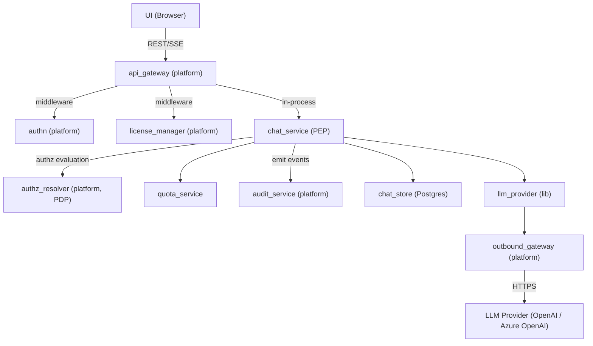
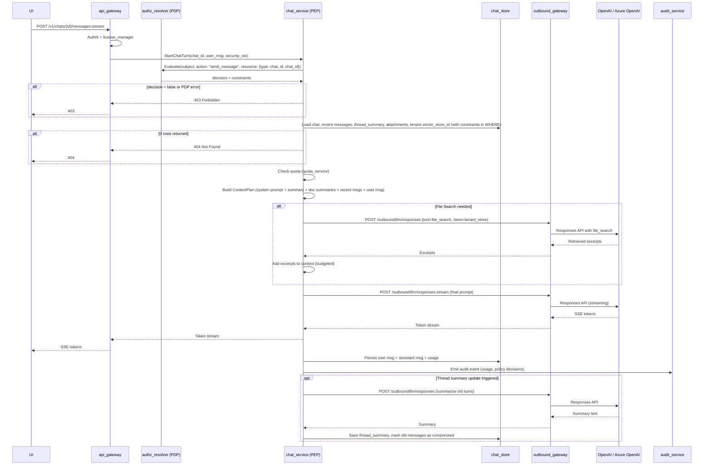
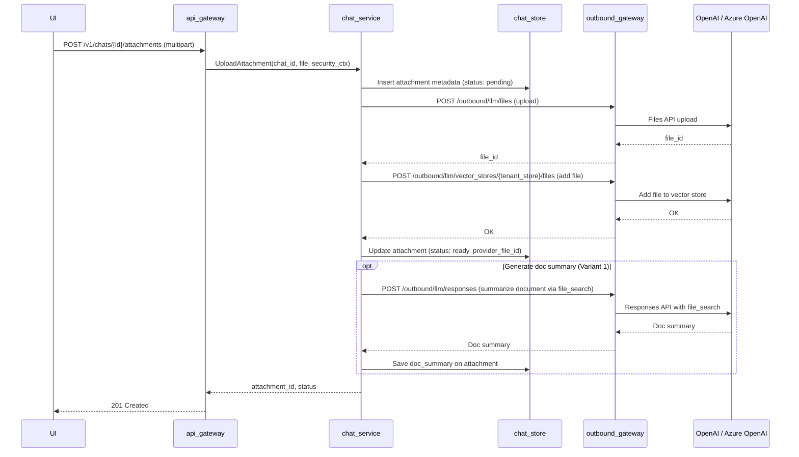
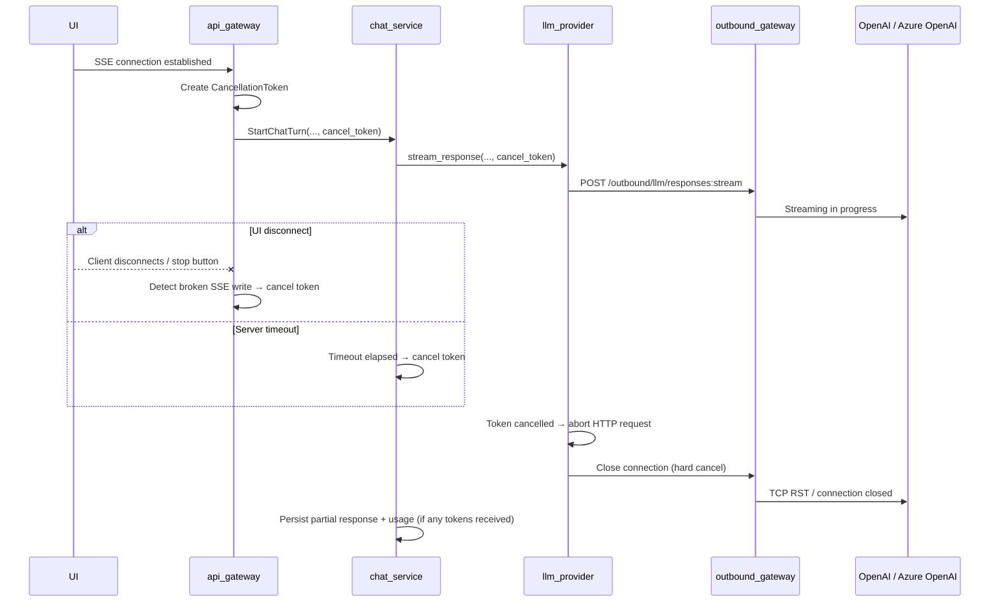
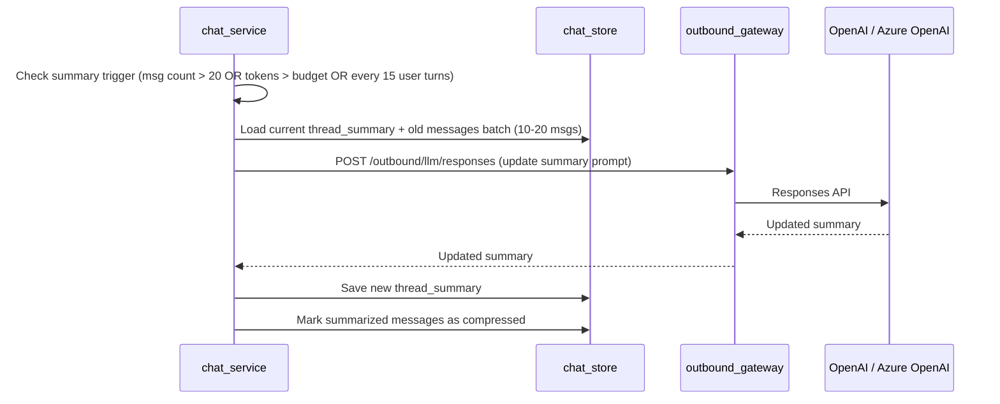

# Technical Design: Mini Chat

## 1. Architecture Overview

### 1.1 Architectural Vision

Mini Chat provides a multi-tenant AI chat experience with SSE streaming, conversation history, and document-aware question answering. Users interact through a REST/SSE API backed by the Responses API with File Search (OpenAI or Azure OpenAI — see [Provider API Mapping](#provider-api-mapping)). The system maintains strict tenant isolation via per-tenant vector stores and enforces cost control through token budgets, usage quotas, and file search limits. Authorization decisions are delegated to the platform's AuthZ Resolver (PDP), which returns query-level constraints compiled to SQL by `chat_service` acting as the Policy Enforcement Point (PEP).

The architecture is modular: `chat_service` orchestrates all request processing — context assembly, LLM invocation, streaming relay, and persistence. It owns the full request lifecycle from receiving a user message to persisting the assistant response and usage metrics. External LLM calls route exclusively through the platform's Outbound API Gateway (OAGW), which handles credential injection and egress control. Mini Chat calls the LLM provider directly via OAGW rather than through `cf-llm-gateway`, because it relies on provider-specific features (Responses API, Files API, File Search with vector stores) that the generic gateway does not abstract. Both OpenAI and Azure OpenAI expose a compatible Responses API surface; OAGW routes to the configured provider and injects the appropriate credentials (API key header for OpenAI, `api-key` header or Entra ID bearer token for Azure OpenAI).

Long conversations are managed via thread summaries — a Level 1 compression strategy where older messages are periodically summarized by the LLM, and the summary replaces them in the context window. This keeps token costs bounded while preserving key facts, decisions, and document references.

### 1.2 Architecture Drivers

#### Functional Drivers

| Requirement | Design Response |
|-------------|-----------------|
| `cpt-cf-mini-chat-fr-chat-streaming` | SSE streaming via `chat_service` → OAGW → Responses API (OpenAI: `POST /v1/responses`; Azure OpenAI: `POST /openai/v1/responses`) |
| `cpt-cf-mini-chat-fr-conversation-history` | `chat_store` (Postgres) persists all messages; recent messages loaded per request |
| `cpt-cf-mini-chat-fr-file-upload` | Upload via OAGW → Files API (OpenAI: `POST /v1/files`; Azure OpenAI: `POST /openai/files`); metadata in `chat_store`; file added to tenant vector store. **Azure note**: use `purpose="assistants"` (Azure does not support `purpose="user_data"`) |
| `cpt-cf-mini-chat-fr-file-search` | File Search tool call scoped to tenant vector store (identical `file_search` tool on both OpenAI and Azure OpenAI Responses API) |
| `cpt-cf-mini-chat-fr-thread-summary` | Periodic LLM-driven summarization of old messages; summary replaces history in context |
| `cpt-cf-mini-chat-fr-chat-crud` | REST endpoints for create/list/get/delete chats |
| `cpt-cf-mini-chat-fr-temporary-chat` | Toggle temporary flag; scheduled cleanup after 24h |
| `cpt-cf-mini-chat-fr-audit` | Emit audit events to platform `audit_service` for every AI interaction |

#### NFR Allocation

| NFR ID | NFR Summary | Allocated To | Design Response | Verification Approach |
|--------|-------------|--------------|-----------------|----------------------|
| `cpt-cf-mini-chat-nfr-tenant-isolation` | Tenant data must never leak across tenants | `chat_service`, `chat_store` | Per-tenant vector store; all queries scoped by `tenant_id`; no user-supplied `file_id` or `vector_store_id` in API | Integration tests with multi-tenant scenarios |
| `cpt-cf-mini-chat-nfr-authz-alignment` | Authorization must follow platform PDP/PEP model | `chat_service` (PEP) | AuthZ Resolver evaluates every data-access operation; constraints compiled to SQL WHERE clauses; fail-closed on PDP errors | Integration tests with mock PDP; fail-closed verification tests |
| `cpt-cf-mini-chat-nfr-cost-control` | Predictable and bounded LLM costs | `quota_service`, `chat_service` | Per-user daily/monthly limits; auto-downgrade to base model; file search call limits; token budget per request | Usage metrics dashboard; budget alert tests |
| `cpt-cf-mini-chat-nfr-streaming-latency` | Low time-to-first-token for chat responses | `chat_service`, OAGW | Direct SSE relay without buffering; cancellation propagation on disconnect | TTFT benchmarks under load; **Disconnect test**: open SSE → receive 1-2 tokens → disconnect → assert provider request closed within 200 ms and active-generation counter decrements; **TTFT delta test**: measure `t_first_token_ui − t_first_byte_from_provider` → assert platform overhead < 50 ms p99 |
| `cpt-cf-mini-chat-nfr-data-retention` | Temporary chats cleaned up; deleted chats purged from provider | `chat_store`, `chat_service` | Scheduled cleanup job; cascade delete to provider files and vector store entries (OpenAI Files API / Azure OpenAI Files API) | Retention policy compliance tests |

### 1.3 Architecture Layers

```
┌───────────────────────────────────────────────────────┐
│  Presentation (api_gateway — platform)                │
│  REST + SSE endpoints, AuthN middleware                │
├───────────────────────────────────────────────────────┤
│  Application (chat_service — PEP)                     │
│  Orchestration, authz evaluation, context planning,   │
│  streaming                                            │
│  ┌───────────┐  ┌─────────────────────┐               │
│  │ quota_svc │  │ authz_resolver (PDP)│               │
│  └───────────┘  └─────────────────────┘               │
├───────────────────────────────────────────────────────┤
│  Domain                                               │
│  Chat, Message, Attachment, ThreadSummary,            │
│  ContextPlan, QuotaPolicy                             │
├───────────────────────────────────────────────────────┤
│  Infrastructure                                       │
│  ┌─────────────┐  ┌───────────────────────────┐       │
│  │ chat_store  │  │ llm_provider (lib)        │       │
│  │ (Postgres)  │  │ → OAGW → OpenAI /         │       │
│  │             │  │          Azure OpenAI      │       │
│  └─────────────┘  └───────────────────────────┘       │
└───────────────────────────────────────────────────────┘
```

| Layer | Responsibility | Technology |
|-------|---------------|------------|
| Presentation | Public REST/SSE API, authentication, routing | Axum (platform api_gateway) |
| Application | Request orchestration, authorization evaluation (PEP), context assembly, streaming relay, quota checks | Rust (chat_service crate) |
| Domain | Business entities and rules | Rust structs |
| Infrastructure | Persistence, external LLM communication | Postgres (sqlx), HTTP client (reqwest) via OAGW |

## 2. Principles & Constraints

### 2.1 Design Principles

#### Tenant-Scoped Everything

**ID**: `cpt-cf-mini-chat-principle-tenant-scoped`

Every data access is scoped by constraints issued by the AuthZ Resolver (PDP). At P0, the PDP returns `in_tenant_subtree` and `eq` predicates on `owner_tenant_id` and `user_id` that `chat_service` (PEP) compiles to SQL WHERE clauses. This replaces application-level tenant/user scoping with a formalized constraint model aligned with the platform's [Authorization Design](../../../docs/arch/authorization/DESIGN.md). Vector stores, file uploads, and quota checks all require tenant context. No API accepts raw `vector_store_id` or `file_id` from the client.

#### Summary Over History

**ID**: `cpt-cf-mini-chat-principle-summary-over-history`

The system favors compressed summaries over unbounded message history. Old messages are summarized rather than paginated into the LLM context. This bounds token costs and keeps response quality stable for long conversations.

#### Streaming-First

**ID**: `cpt-cf-mini-chat-principle-streaming-first`

All LLM responses are streamed. The primary delivery path is SSE from LLM provider (OpenAI / Azure OpenAI) → OAGW → chat_service → api_gateway → UI. Non-streaming responses are not supported for chat completion. Both providers use an identical SSE event format for the Responses API.

### 2.2 Constraints

#### OpenAI-Compatible Provider (P0)

**ID**: `cpt-cf-mini-chat-constraint-openai-compatible`

P0 targets the OpenAI-compatible API surface — either **OpenAI** or **Azure OpenAI** as the LLM provider. Both expose the Responses API, Files API, Vector Stores API, and File Search tool with compatible request/response contracts. The active provider is selected per deployment via OAGW configuration; `llm_provider` does not need a runtime abstraction layer because the API surface is shared. Multi-provider support (e.g., Anthropic, Google) is deferred.

**Provider parity notes** (Azure OpenAI known limitations at time of writing):
- Azure supports only **one vector store** per `file_search` tool call (sufficient for P0: one vector store per tenant).
- `purpose="user_data"` for file uploads is not supported on Azure; use `purpose="assistants"`.
- `vector_stores.search` (client-side manual search) is not exposed on Azure — not used in this design.
- New OpenAI features may appear on Azure with a lag of weeks to months.

#### No Credential Storage

**ID**: `cpt-cf-mini-chat-constraint-no-credentials`

Mini Chat never stores or handles API keys. All external calls go through OAGW, which injects credentials from credstore.

#### Context Window Budget

**ID**: `cpt-cf-mini-chat-constraint-context-budget`

Every request must fit within fixed `max_input_tokens` and `max_output_tokens` budgets. When context exceeds the budget, the system truncates in order: old messages (not summary), doc summaries, retrieval excerpts. A reserve is always maintained for the response.

#### License Gate

**ID**: `cpt-cf-mini-chat-constraint-license-gate`

Access requires the `ai_chat` feature on the tenant license, enforced by the platform's `license_manager` middleware. Requests from unlicensed tenants receive HTTP 403.

#### No Buffering

**ID**: `cpt-cf-mini-chat-constraint-no-buffering`

No layer in the streaming pipeline may collect the full LLM response before relaying it. Every component — `llm_provider`, `chat_service`, `api_gateway` — must read one SSE event and immediately forward it to the next layer. Middleware must not buffer response bodies. `.collect()` on the token stream is prohibited in the hot path.

#### Bounded Channels

**ID**: `cpt-cf-mini-chat-constraint-bounded-channels`

Internal mpsc channels between `llm_provider` → `chat_service` → SSE writer must use bounded buffers (16–64 messages). This provides backpressure: if the consumer is slow, the producer blocks rather than accumulating unbounded memory. Channel capacity is configurable per deployment.

## 3. Technical Architecture

### 3.1 Domain Model

**Technology**: Rust structs

**Core Entities**:

| Entity | Description |
|--------|-------------|
| Chat | A conversation belonging to a user within a tenant. Has title, temporary flag, creation/update timestamps. |
| Message | A single turn in a chat (role: user/assistant/system). Stores content, token estimate, compression status. |
| Attachment | File uploaded to a chat. References provider `file_id` (OpenAI or Azure OpenAI), linked to tenant vector store. Has processing status. |
| ThreadSummary | Compressed representation of older messages in a chat. Replaces old history in the context window. |
| TenantVectorStore | Mapping from `tenant_id` to provider `vector_store_id` (OpenAI or Azure OpenAI Vector Stores API). One vector store per tenant. |
| AuditEvent | Structured event emitted to platform `audit_service`: prompt, response, user/tenant, timestamps, policy decisions, usage. Not stored locally. |
| QuotaUsage | Per-user usage counters for rate limiting and budget enforcement. Tracks daily/monthly periods. |
| ContextPlan | Transient object assembled per request: system prompt, summary, doc summaries, recent messages, user message, retrieval excerpts. |

**Relationships**:
- Chat → Message: 1..\*
- Chat → Attachment: 0..\*
- Chat → ThreadSummary: 0..1
- Attachment → TenantVectorStore: belongs to (via tenant_id)
- Message → AuditEvent: 1..1 (each turn emits an audit event to platform `audit_service`)

### 3.2 Component Model



**Components**:

- **ID**: `cpt-cf-mini-chat-component-chat-service`
  - **chat_service** — Core orchestrator and Policy Enforcement Point (PEP). Receives user messages, evaluates authorization via AuthZ Resolver, builds context plan, invokes LLM via `llm_provider`, relays streaming tokens, persists messages and usage, triggers thread summary updates.

- **ID**: `cpt-cf-mini-chat-component-chat-store`
  - **chat_store** — Postgres persistence layer. Source of truth for chats, messages, attachments, thread summaries, tenant vector store mappings, and quota usage.

- **ID**: `cpt-cf-mini-chat-component-llm-provider`
  - **llm_provider** — Library (not a standalone service) used by `chat_service`. Builds requests for the Responses API (OpenAI or Azure OpenAI — both expose a compatible surface), parses SSE streams, maps errors. Propagates tenant/user metadata via `user` and `metadata` fields on every request (see section 4: Provider Request Metadata). Handles both streaming chat and non-streaming calls (summary generation, doc summary). The library is provider-agnostic at the API contract level; OAGW handles endpoint routing and credential injection per configured provider.

- **ID**: `cpt-cf-mini-chat-component-quota-service`
  - **quota_service** — Enforces per-user usage limits by period (daily, monthly). Supports auto-downgrade to base model when premium quota is exhausted. Tracks file search call counts separately.

- **ID**: `cpt-cf-mini-chat-component-authz-integration`
  - **authz_resolver (PDP)** — Platform AuthZ Resolver module. `chat_service` calls it before every data-access operation to obtain authorization decisions and SQL-compilable constraints. See section 3.8.


### 3.3 API Contracts

**Technology**: REST/OpenAPI, SSE

**Endpoints Overview**:

| Method | Path | Description | Stability |
|--------|------|-------------|-----------|
| `POST` | `/v1/chats` | Create a new chat | stable |
| `GET` | `/v1/chats` | List chats for current user | stable |
| `GET` | `/v1/chats/{id}` | Get chat metadata + recent messages | stable |
| `DELETE` | `/v1/chats/{id}` | Delete chat (with retention cleanup) | stable |
| `POST` | `/v1/chats/{id}:temporary` | Toggle temporary flag (24h TTL) | stable |
| `POST` | `/v1/chats/{id}/messages:stream` | Send message, receive SSE stream | stable |
| `POST` | `/v1/chats/{id}/attachments` | Upload file attachment | stable |

**Streaming Contract** (`POST /v1/chats/{id}/messages:stream`):

Request body:
```json
{
  "content": "string",
  "request_id": "uuid (client-generated, optional)"
}
```

**Idempotency**: If `request_id` is provided and a generation for that `request_id` is already active, the server returns the current stream (or rejects with `409 Conflict`). This prevents browser SSE auto-reconnects from spawning duplicate generations for the same message. If no active generation exists for a known `request_id`, the server returns the completed message without re-generating.

SSE response events:
```
event: token
data: {"content": "partial text"}

event: token
data: {"content": "more text"}

event: ping
data: {}

event: done
data: {"message_id": "uuid", "usage": {"input_tokens": 500, "output_tokens": 120, "model": "gpt-4o"}}

event: error
data: {"code": "quota_exceeded", "message": "Daily limit reached"}
```

**Heartbeat**: During generation, the server sends `event: ping` every 15–30 seconds to prevent idle-timeout disconnects by proxies and browsers (especially when the model is "thinking" before producing tokens). Clients MUST ignore `ping` events.

**Error Codes**:

| Code | HTTP Status | Description |
|------|-------------|-------------|
| `feature_not_licensed` | 403 | Tenant lacks `ai_chat` feature |
| `insufficient_permissions` | 403 | Subject lacks permission for the requested action (AuthZ Resolver denied) |
| `chat_not_found` | 404 | Chat does not exist or not accessible under current authorization constraints |
| `quota_exceeded` | 429 | User exceeded daily/monthly usage limit |
| `rate_limited` | 429 | Too many requests in time window |
| `file_too_large` | 413 | Uploaded file exceeds size limit |
| `unsupported_file_type` | 415 | File type not supported for upload |
| `provider_error` | 502 | LLM provider (OpenAI / Azure OpenAI) returned an error |
| `provider_timeout` | 504 | LLM provider (OpenAI / Azure OpenAI) request timed out |

### 3.4 Internal Dependencies

| Dependency Module | Interface Used | Purpose |
|-------------------|----------------|---------|
| api_gateway (platform) | Axum router / middleware | HTTP request handling, SSE transport |
| authn (platform) | Middleware (JWT/opaque token) | Extract `user_id` + `tenant_id` from request |
| license_manager (platform) | Middleware | Check tenant has `ai_chat` feature; reject with 403 if not |
| authz_resolver (platform) | Access evaluation API (`/access/v1/evaluation`) | Obtain authorization decisions + SQL-compilable constraints for chat operations |
| audit_service (platform) | Event emitter | Receive structured audit events (prompts, responses, usage, policy decisions) |
| outbound_gateway (platform) | Internal HTTP | Egress to LLM provider (OpenAI / Azure OpenAI) with credential injection |

**Dependency Rules**:
- `chat_service` never calls the LLM provider (OpenAI / Azure OpenAI) directly; all external calls go through OAGW
- `SecurityContext` (user_id, tenant_id) propagated through all in-process calls
- `license_manager` runs as middleware before `chat_service` is invoked
- `chat_service` calls `authz_resolver` before every database query; on PDP denial or PDP unreachable, fail-closed (deny access)
- `chat_service` emits audit events to `audit_service` after each turn; mini-chat does not store audit data locally

### 3.5 External Dependencies

#### LLM Provider (OpenAI / Azure OpenAI)

Both providers expose a compatible API surface. OAGW routes requests to the configured provider and injects credentials accordingly.

| API | Purpose | OAGW Route | OpenAI Endpoint | Azure OpenAI Endpoint |
|-----|---------|------------|-----------------|----------------------|
| Responses API (streaming) | Chat completion with tool support | `POST /outbound/llm/responses:stream` | `POST https://api.openai.com/v1/responses` | `POST https://{resource}.openai.azure.com/openai/v1/responses` |
| Responses API (non-streaming) | Thread summary generation, doc summary | `POST /outbound/llm/responses` | `POST https://api.openai.com/v1/responses` | `POST https://{resource}.openai.azure.com/openai/v1/responses` |
| Files API | Upload user documents | `POST /outbound/llm/files` | `POST https://api.openai.com/v1/files` | `POST https://{resource}.openai.azure.com/openai/files` |
| Vector Stores API | Manage per-tenant vector stores, add/remove files | `POST /outbound/llm/vector_stores/*` | `POST https://api.openai.com/v1/vector_stores/*` | `POST https://{resource}.openai.azure.com/openai/v1/vector_stores/*` |
| File Search (tool) | Retrieve document excerpts during chat | — (invoked as tool within Responses API call) | `file_search` tool | `file_search` tool (identical contract) |

<a id="provider-api-mapping"></a>
**Provider API Mapping** — authentication and endpoint differences:

| Aspect | OpenAI | Azure OpenAI |
|--------|--------|--------------|
| **Base URL** | `https://api.openai.com/v1` | `https://{resource}.openai.azure.com/openai/v1` |
| **Authentication** | `Authorization: Bearer {api_key}` | `api-key: {key}` header or Entra ID bearer token |
| **API version** | Not required | Not required for GA (v1 API); `?api-version=preview` for preview features |
| **File upload `purpose`** | `user_data` or `assistants` | `assistants` only (`user_data` not supported) |
| **Vector stores per `file_search`** | Multiple | **One** (sufficient for P0: one store per tenant) |
| **SSE format** | `event:` + `data:` lines, structured events | Identical format |
| **`user` field** | Supported | Supported (feeds into Azure abuse monitoring) |
| **`metadata` object** | Supported | Supported |

#### PostgreSQL

| Usage | Purpose |
|-------|---------|
| Primary datastore | Chats, messages, attachments, summaries, quota counters, tenant vector store mappings |

### 3.6 Interactions & Sequences

#### Send Message with Streaming Response

**ID**: `cpt-cf-mini-chat-seq-send-message`



**Description**: Full lifecycle of a user message — from authorization through streaming LLM response to persistence and optional thread compression. Authorization is evaluated before any database access. The PEP sends an evaluation request to the AuthZ Resolver with the chat's resource type and ID; the returned constraints are applied to the DB query's WHERE clause. If the PDP denies access or is unreachable, the request is rejected immediately (fail-closed). If the constrained query returns 0 rows, the PEP returns 404 (hiding resource existence from unauthorized users).

#### File Upload

**ID**: `cpt-cf-mini-chat-seq-file-upload`



**Description**: File upload flow — the file is uploaded to the LLM provider (OpenAI or Azure OpenAI) via OAGW, added to the tenant's vector store, optionally summarized, and metadata is persisted locally. **Azure note**: file upload uses `purpose="assistants"` instead of `purpose="user_data"`.

#### Streaming Cancellation

**ID**: `cpt-cf-mini-chat-seq-cancellation`

**Cancellation triggers**:
- **UI disconnect** — browser closes SSE connection or navigates away
- **Explicit stop** — user clicks "Stop generating" button, client sends abort signal
- **Server-side timeout** — generation exceeds maximum allowed duration
- **Quota / entitlement failure** — detected mid-preflight (e.g., quota check fails before LLM call)

**Mechanism**: A single `CancellationToken` (e.g., `tokio_util::sync::CancellationToken`) is created per request and propagated end-to-end: `api_gateway` → `chat_service` → `llm_provider` → OAGW HTTP client. When any trigger fires, the token is cancelled, and every layer observing it aborts cooperatively.

**Hard cancel requirement**: Cancellation MUST be a hard cancel — `llm_provider` must abort the outbound HTTP request to OAGW / LLM provider (close the TCP connection), not merely stop reading from the stream. Soft cancel (dropping the receiver while the provider keeps generating) wastes tokens and money because the provider continues generating until its own timeout. This applies identically to both OpenAI and Azure OpenAI.



**Description**: Cancellation propagates end-to-end via a shared `CancellationToken`. When triggered, `llm_provider` performs a hard cancel — aborting the outbound HTTP connection so the LLM provider (OpenAI / Azure OpenAI) stops generating immediately. The partial response (if any tokens were received) is persisted with actual usage for accurate cost tracking.

#### Thread Summary Update

**ID**: `cpt-cf-mini-chat-seq-thread-summary`



**Description**: Thread summary is updated asynchronously after a chat turn when trigger conditions are met. The LLM is asked to incorporate old messages into the existing summary, preserving key facts, decisions, names, and document references.

### 3.7 Database Schemas & Tables

#### Table: chats

**ID**: `cpt-cf-mini-chat-dbtable-chats`

| Column | Type | Description |
|--------|------|-------------|
| id | UUID | Chat identifier |
| tenant_id | UUID | Owning tenant |
| user_id | UUID | Owning user |
| title | VARCHAR(255) | Chat title (user-set or auto-generated) |
| is_temporary | BOOLEAN | If true, auto-deleted after 24h |
| created_at | TIMESTAMPTZ | Creation time |
| updated_at | TIMESTAMPTZ | Last activity time |
| deleted_at | TIMESTAMPTZ | Soft delete timestamp (nullable) |

**PK**: `id`

**Constraints**: NOT NULL on `tenant_id`, `user_id`, `created_at`

**Indexes**: `(tenant_id, user_id, updated_at DESC)` for listing chats

#### Table: messages

**ID**: `cpt-cf-mini-chat-dbtable-messages`

| Column | Type | Description |
|--------|------|-------------|
| id | UUID | Message identifier |
| chat_id | UUID | Parent chat (FK → chats.id) |
| request_id | UUID | Client-generated idempotency key (nullable). Used to deduplicate SSE reconnect retries. |
| role | VARCHAR(16) | `user`, `assistant`, or `system` |
| content | TEXT | Message content |
| token_estimate | INTEGER | Estimated token count |
| is_compressed | BOOLEAN | True if included in a thread summary |
| created_at | TIMESTAMPTZ | Creation time |

**PK**: `id`

**Constraints**: NOT NULL on `chat_id`, `role`, `content`, `created_at`. FK `chat_id` → `chats.id` ON DELETE CASCADE. UNIQUE on `(chat_id, request_id)` WHERE `request_id IS NOT NULL`.

**Indexes**: `(chat_id, created_at)` for loading recent messages

#### Table: attachments

**ID**: `cpt-cf-mini-chat-dbtable-attachments`

| Column | Type | Description |
|--------|------|-------------|
| id | UUID | Attachment identifier |
| tenant_id | UUID | Owning tenant |
| chat_id | UUID | Parent chat (FK → chats.id) |
| filename | VARCHAR(255) | Original filename |
| content_type | VARCHAR(128) | MIME type |
| size_bytes | BIGINT | File size |
| provider_file_id | VARCHAR(128) | LLM provider file ID — OpenAI `file-*` or Azure OpenAI `assistant-*` (nullable until upload completes) |
| status | VARCHAR(16) | `pending`, `ready`, `failed` |
| doc_summary | TEXT | LLM-generated document summary (nullable) |
| summary_model | VARCHAR(64) | Model used to generate the summary (nullable) |
| summary_updated_at | TIMESTAMPTZ | When the summary was last generated (nullable) |
| created_at | TIMESTAMPTZ | Upload time |

**PK**: `id`

**Constraints**: NOT NULL on `tenant_id`, `chat_id`, `filename`, `status`, `created_at`. FK `chat_id` → `chats.id` ON DELETE CASCADE.

**Indexes**: `(chat_id)` for listing attachments per chat

#### Table: thread_summaries

**ID**: `cpt-cf-mini-chat-dbtable-thread-summaries`

| Column | Type | Description |
|--------|------|-------------|
| id | UUID | Summary identifier |
| chat_id | UUID | Parent chat (FK → chats.id, UNIQUE) |
| summary_text | TEXT | Compressed conversation summary |
| summarized_up_to | UUID | Last message ID included in this summary |
| token_estimate | INTEGER | Estimated token count of summary |
| updated_at | TIMESTAMPTZ | Last update time |

**PK**: `id`

**Constraints**: UNIQUE on `chat_id`. FK `chat_id` → `chats.id` ON DELETE CASCADE.

#### Table: tenant_vector_stores

**ID**: `cpt-cf-mini-chat-dbtable-tenant-vector-stores`

| Column | Type | Description |
|--------|------|-------------|
| tenant_id | UUID | Tenant identifier |
| vector_store_id | VARCHAR(128) | Provider vector store ID (OpenAI `vs_*` or Azure OpenAI equivalent) |
| provider | VARCHAR(32) | Provider identifier: `openai` or `azure_openai` |
| created_at | TIMESTAMPTZ | Creation time |

**PK**: `tenant_id`

**Constraints**: NOT NULL on `vector_store_id`, `provider`, `created_at`. One vector store per tenant.

#### Table: quota_usage

**ID**: `cpt-cf-mini-chat-dbtable-quota-usage`

| Column | Type | Description |
|--------|------|-------------|
| id | UUID | Record identifier |
| tenant_id | UUID | Tenant |
| user_id | UUID | User |
| period_type | VARCHAR(16) | `daily` or `monthly` |
| period_start | DATE | Start of the period |
| input_tokens | BIGINT | Total input tokens consumed |
| output_tokens | BIGINT | Total output tokens consumed |
| file_search_calls | INTEGER | Number of file search tool calls |
| premium_model_calls | INTEGER | Calls to premium models |
| updated_at | TIMESTAMPTZ | Last update time |

**PK**: `id`

**Constraints**: UNIQUE on `(tenant_id, user_id, period_type, period_start)`.

**Indexes**: `(tenant_id, user_id, period_type, period_start)` for quota lookups

#### Projection Table: tenant_closure

**ID**: `cpt-cf-mini-chat-dbtable-tenant-closure-ref`

Mini Chat requires the `tenant_closure` local projection table for compiling `in_tenant_subtree` predicates to SQL. This table is maintained by the platform's Tenant Resolver module and is not owned by mini-chat.

Schema is defined in the [Authorization Design](../../../docs/arch/authorization/DESIGN.md#table-schemas-local-projections).

**Usage**: The `in_tenant_subtree` predicate returned by the PDP compiles to:
```sql
WHERE chats.tenant_id IN (
  SELECT descendant_id FROM tenant_closure
  WHERE ancestor_id = :root_tenant_id
    AND barrier = 0
)
```

**P2+ note**: When chat sharing (projects) is introduced, `resource_group_membership` and optionally `resource_group_closure` tables will also be required.

### 3.8 Authorization (PEP)

**ID**: `cpt-cf-mini-chat-authz-pep`

Mini Chat acts as a Policy Enforcement Point (PEP) per the platform's PDP/PEP authorization model defined in [Authorization Design](../../../docs/arch/authorization/DESIGN.md). The `chat_service` builds evaluation requests, sends them to the AuthZ Resolver (PDP), and compiles returned constraints into SQL WHERE clauses.

#### Resource Type

The authorized resource is **Chat**. Sub-resources (Message, Attachment, ThreadSummary) do not have independent authorization — they are accessed through their parent chat, and the chat's authorization decision covers all child operations.

| Attribute | Value |
|-----------|-------|
| GTS Type ID | `gts.x.cf.mini_chat.chat.v1~` |
| Primary table | `chats` |
| Authorization granularity | Chat-level (sub-resources inherit) |

#### PEP Configuration

**Capabilities** (declared in `context.capabilities`):

| Capability | P0 | P2+ | Rationale |
|------------|-----|------|-----------|
| `tenant_hierarchy` | Yes | Yes | Has `tenant_closure` projection table |
| `group_membership` | No | Yes | Needed when chat sharing via projects is introduced |
| `group_hierarchy` | No | Maybe | Needed if projects have nested hierarchy |

**Supported properties** (declared in `context.supported_properties`):

| Resource Property | SQL Column | Description |
|-------------------|------------|-------------|
| `owner_tenant_id` | `chats.tenant_id` | Owning tenant |
| `user_id` | `chats.user_id` | Owning user |
| `id` | `chats.id` | Chat identifier |

#### Per-Operation Authorization Matrix

| Endpoint | Action | `resource.id` | `require_constraints` | Expected P0 Predicates |
|----------|--------|---------------|----------------------|----------------------|
| `POST /v1/chats` | `create` | absent | `false` | decision only (no constraints) |
| `GET /v1/chats` | `list` | absent | `true` | `in_tenant_subtree(owner_tenant_id)` + `eq(user_id)` |
| `GET /v1/chats/{id}` | `read` | present | `true` | `eq(owner_tenant_id)` + `eq(user_id)` |
| `DELETE /v1/chats/{id}` | `delete` | present | `true` | `eq(owner_tenant_id)` + `eq(user_id)` |
| `POST /v1/chats/{id}:temporary` | `update` | present | `true` | `eq(owner_tenant_id)` + `eq(user_id)` |
| `POST /v1/chats/{id}/messages:stream` | `send_message` | present (chat_id) | `true` | `eq(owner_tenant_id)` + `eq(user_id)` |
| `POST /v1/chats/{id}/attachments` | `upload` | present (chat_id) | `true` | `eq(owner_tenant_id)` + `eq(user_id)` |

**Notes**:
- `send_message` and `upload` are actions on the Chat resource, not on Message or Attachment resources. The `resource.id` is the chat's ID.
- For streaming (`send_message`), authorization is evaluated once at SSE connection establishment. The entire streaming session operates under the initial authorization decision. No per-message re-authorization.
- For `create`, the PEP passes `resource.properties.owner_tenant_id` and `resource.properties.user_id` from the SecurityContext. The PDP validates permission without returning constraints.

#### Evaluation Request/Response Examples

**Example 1: List Chats** (`GET /v1/chats`)

PEP → PDP Request:
```jsonc
{
  "subject": {
    "type": "gts.x.core.security.subject_user.v1~",
    "id": "user-abc-123",
    "properties": { "tenant_id": "tenant-xyz-789" }
  },
  "action": { "name": "list" },
  "resource": { "type": "gts.x.cf.mini_chat.chat.v1~" },
  "context": {
    "tenant_context": {
      "mode": "subtree",
      "root_id": "tenant-xyz-789",
      "barrier_mode": "all"
    },
    "token_scopes": ["*"],
    "require_constraints": true,
    "capabilities": ["tenant_hierarchy"],
    "supported_properties": ["owner_tenant_id", "user_id", "id"]
  }
}
```

PDP → PEP Response (P0 — user-owned chats only):
```jsonc
{
  "decision": true,
  "context": {
    "constraints": [
      {
        "predicates": [
          {
            "type": "in_tenant_subtree",
            "resource_property": "owner_tenant_id",
            "root_tenant_id": "tenant-xyz-789",
            "barrier_mode": "all"
          },
          {
            "type": "eq",
            "resource_property": "user_id",
            "value": "user-abc-123"
          }
        ]
      }
    ]
  }
}
```

Compiled SQL:
```sql
SELECT * FROM chats
WHERE tenant_id IN (
    SELECT descendant_id FROM tenant_closure
    WHERE ancestor_id = 'tenant-xyz-789'
      AND barrier = 0
  )
  AND user_id = 'user-abc-123'
  AND deleted_at IS NULL
ORDER BY updated_at DESC
```

**Example 2: Get Chat** (`GET /v1/chats/{id}`)

PEP → PDP Request:
```jsonc
{
  "subject": {
    "type": "gts.x.core.security.subject_user.v1~",
    "id": "user-abc-123",
    "properties": { "tenant_id": "tenant-xyz-789" }
  },
  "action": { "name": "read" },
  "resource": {
    "type": "gts.x.cf.mini_chat.chat.v1~",
    "id": "chat-456"
  },
  "context": {
    "tenant_context": {
      "mode": "subtree",
      "root_id": "tenant-xyz-789"
    },
    "token_scopes": ["*"],
    "require_constraints": true,
    "capabilities": ["tenant_hierarchy"],
    "supported_properties": ["owner_tenant_id", "user_id", "id"]
  }
}
```

PDP → PEP Response:
```jsonc
{
  "decision": true,
  "context": {
    "constraints": [
      {
        "predicates": [
          {
            "type": "eq",
            "resource_property": "owner_tenant_id",
            "value": "tenant-xyz-789"
          },
          {
            "type": "eq",
            "resource_property": "user_id",
            "value": "user-abc-123"
          }
        ]
      }
    ]
  }
}
```

Compiled SQL:
```sql
SELECT * FROM chats
WHERE id = 'chat-456'
  AND tenant_id = 'tenant-xyz-789'
  AND user_id = 'user-abc-123'
  AND deleted_at IS NULL
```

Result: 1 row → return chat; 0 rows → 404 Not Found (hides existence from unauthorized users).

**Example 3: Create Chat** (`POST /v1/chats`)

PEP → PDP Request:
```jsonc
{
  "subject": {
    "type": "gts.x.core.security.subject_user.v1~",
    "id": "user-abc-123",
    "properties": { "tenant_id": "tenant-xyz-789" }
  },
  "action": { "name": "create" },
  "resource": {
    "type": "gts.x.cf.mini_chat.chat.v1~",
    "properties": {
      "owner_tenant_id": "tenant-xyz-789",
      "user_id": "user-abc-123"
    }
  },
  "context": {
    "tenant_context": {
      "mode": "root_only",
      "root_id": "tenant-xyz-789"
    },
    "token_scopes": ["*"],
    "require_constraints": false,
    "capabilities": ["tenant_hierarchy"],
    "supported_properties": ["owner_tenant_id", "user_id", "id"]
  }
}
```

PDP → PEP Response:
```jsonc
{ "decision": true }
```

PEP proceeds with INSERT. No constraints needed for create.

**Example 4: Send Message** (`POST /v1/chats/{id}/messages:stream`)

Same authorization flow as Example 2 (Get Chat), but with `"action": { "name": "send_message" }` and `"resource.id"` set to the chat ID. Authorization is evaluated once before the SSE stream is established. The constraints are applied to the query that loads the chat and its messages from `chat_store`.

#### Fail-Closed Behavior

Mini Chat follows the platform's fail-closed rules (see [Authorization Design — Fail-Closed Rules](../../../docs/arch/authorization/DESIGN.md#fail-closed-rules)):

| Condition | PEP Action |
|-----------|------------|
| `decision: false` | 403 Forbidden (do not expose `deny_reason.details`) |
| PDP unreachable / timeout | 403 Forbidden (fail-closed) |
| `decision: true` + no constraints + `require_constraints: true` | 403 Forbidden |
| Unknown predicate type in constraints | Treat constraint as false; if all constraints false → 403 |
| Unknown `resource_property` in predicate | Treat constraint as false; log error (PDP contract violation) |
| Empty `constraints: []` | 403 Forbidden |

#### Token Scopes

Mini Chat recognizes the following token scopes for third-party application narrowing:

| Scope | Permits |
|-------|---------|
| `ai:chat` | All chat operations (umbrella scope) |
| `ai:chat:read` | `list`, `read` actions only |
| `ai:chat:write` | `create`, `update`, `delete`, `send_message`, `upload` actions |

First-party applications (UI) use `token_scopes: ["*"]`. Third-party integrations receive narrowed scopes. Scope enforcement is handled by the PDP — the PEP includes `token_scopes` in the evaluation request context.

#### P2+ Extensibility: Chat Sharing

When Projects / chat sharing is introduced (P2+), the authorization model extends naturally:

1. Add `group_membership` capability (and optionally `group_hierarchy`).
2. Maintain `resource_group_membership` projection table mapping chat IDs to project group IDs.
3. The PDP returns additional access paths via OR'd constraints — e.g., one constraint for owned chats (`user_id` predicate), another for shared-via-project chats (`in_group` predicate).
4. `supported_properties` remains unchanged (the `id` property is used for group membership joins).

No changes to the PEP flow or constraint compilation logic are needed. The PDP's response structure naturally handles multiple access paths through OR'd constraints.

## 4. Additional Context

### P0 Scope Boundaries

**Included in P0**:
- Single-tenant vector store per tenant (not per workspace)
- Thread summary as only compression mechanism
- On-upload document summary via File Search (Variant 1 from draft)
- Quota enforcement: daily + monthly per user
- Temporary chats with 24h scheduled cleanup
- File Search limited to 1-2 tool calls per message

**Deferred to P2+**:
- Projects / chat sharing
- Full-text search across chats
- Non-OpenAI-compatible provider support (e.g., Anthropic, Google) — OpenAI and Azure OpenAI are both supported at P0 via a shared API surface
- Complex retrieval policies (beyond simple limits)
- Per-workspace vector stores

### Context Plan Assembly Rules

On each user message, `chat_service` assembles a `ContextPlan` in this order:

1. **System prompt** — fixed instructions for the assistant
2. **Thread summary** — if exists, replaces older history
3. **Document summaries** — short descriptions of attached documents
4. **Recent messages** — last 6-10 messages not covered by summary
5. **User message** — current turn

If the total exceeds the input token budget, truncation happens in reverse priority: old messages first, then doc summaries, then retrieval excerpts. Summary and system prompt are never truncated.

### File Search Trigger Heuristics

File Search is invoked when:
- User explicitly references documents ("in the file", "in section", "according to the document")
- Documents are attached and the query likely relates to them
- User requests citations or sources

Limits: max 1-2 file_search tool calls per message, max calls per day/user tracked in `quota_usage`.

### Provider Request Metadata

Every request sent to the LLM provider via `llm_provider` MUST include two identification mechanisms. Both OpenAI and Azure OpenAI support these fields with identical semantics.

**`user` field** — composite tenant+user identifier for provider usage monitoring and abuse detection:

```
"user": "{tenant_id}:{user_id}"
```

| Provider | Behavior |
|----------|----------|
| OpenAI | Used for usage monitoring and abuse detection per API key |
| Azure OpenAI | Feeds into Azure's Potentially Abusive User Detection (abuse monitoring pipeline). MUST NOT contain PII — use opaque IDs only |

**`metadata` object** (Responses API) — structured context for debugging and provider dashboard filtering:

```json
{
  "metadata": {
    "tenant_id": "{tenant_id}",
    "user_id": "{user_id}",
    "chat_id": "{chat_id}",
    "request_type": "chat|summary|doc_summary",
    "feature": "file_search|none"
  }
}
```

These fields are for observability only — they do not provide tenant isolation (that is enforced via per-tenant vector stores and scoped queries). The provider aggregates usage per API key/project (OpenAI) or per deployment/resource (Azure OpenAI), so `user` and `metadata` are the only way to attribute requests within a shared credential.

Primary cost analytics (per-tenant, per-user) MUST be computed internally from response usage data (see `cpt-cf-mini-chat-fr-cost-metrics`). The provider's dashboard is not a billing backend.

### Cancellation Observability

The following metrics MUST be instrumented on the cancellation path:

| Metric | Type | Description |
|--------|------|-------------|
| `cancel_requested_total` | Counter (labeled by trigger: `user_stop`, `disconnect`, `timeout`, `quota`) | Total cancellation requests |
| `cancel_effective_total` | Counter | Cancellations where the provider stream was actually closed |
| `tokens_after_cancel` | Histogram | Tokens received between cancel signal and stream close |
| `time_to_abort_ms` | Histogram | Latency from cancel signal to provider connection closed |
| `time_from_ui_disconnect_to_cancel_ms` | Histogram | End-to-end cancel propagation latency (UI → provider close) |

**Quality thresholds (acceptance criteria)**:
- `time_to_abort_ms` p99 < 200 ms
- `tokens_after_cancel` p99 < 50 tokens

### SSE Infrastructure Requirements

SSE streaming endpoints require specific infrastructure configuration to prevent proxy/browser interference:

- **Response headers**: `Content-Type: text/event-stream`, `Cache-Control: no-cache`, `Connection: keep-alive`
- **Reverse proxy**: Any reverse proxy (Nginx, Envoy, etc.) in front of `api_gateway` MUST have response buffering disabled for SSE routes (`proxy_buffering off` in Nginx, equivalent in other proxies)
- **Load balancer**: Must support long-lived HTTP connections and not timeout SSE streams prematurely

These are deployment constraints that must be validated during infrastructure setup.

### Cleanup on Chat Deletion

When a chat is deleted:
1. Soft-delete the chat record (`deleted_at` set)
2. Delete all provider files associated with chat attachments via OAGW (OpenAI: `DELETE /v1/files/{file_id}`; Azure OpenAI: `DELETE /openai/files/{file_id}`)
3. Remove files from the tenant vector store via OAGW (OpenAI: `DELETE /v1/vector_stores/{store}/files/{file_id}`; Azure OpenAI: identical path under `/openai/v1/`)
4. Anonymize/purge local data per retention policy
5. Temporary chats follow the same flow, triggered by a scheduled job after 24h

## 5. Traceability

- **PRD**: [PRD.md](./PRD.md) (planned)
- **ADRs**: [ADR/](./ADR/)
  - [ADR-0001](./ADR/0001-cpt-cf-mini-chat-adr-llm-provider-as-library.md) — `llm_provider` as a library crate, not a standalone service
  - [ADR-0002](./ADR/0002-cpt-cf-mini-chat-adr-internal-transport.md) — HTTP/SSE for internal transport between `llm_provider` and OAGW
- **Platform dependencies**:
  - [Authorization Design](../../../docs/arch/authorization/DESIGN.md) — PDP/PEP model, predicate types, fail-closed rules, constraint compilation
- **Features**: [features/](./features/) (planned)
