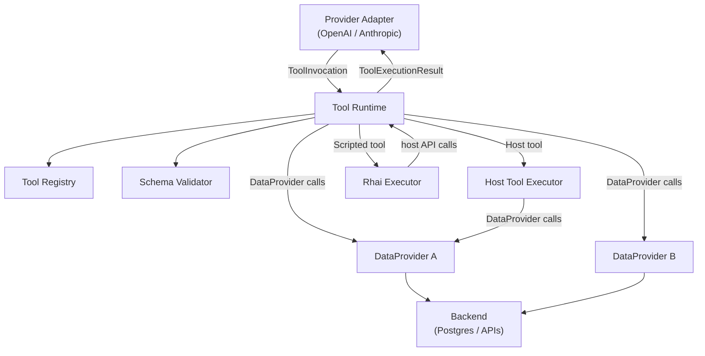
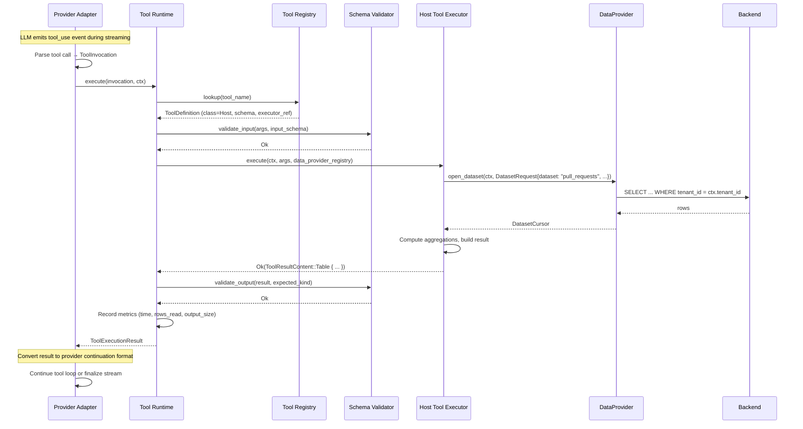
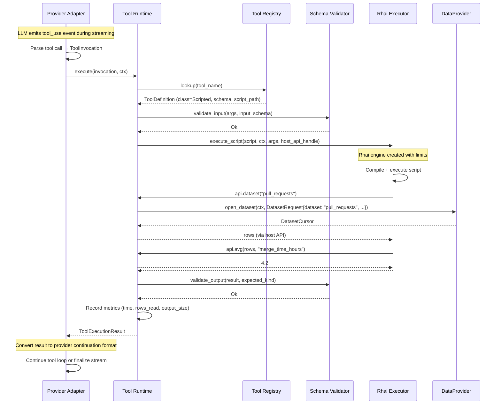

# Technical Design — Custom Tool Runtime

- [ ] `p1` - **ID**: `cpt-cf-mini-chat-tools-design-tool-runtime`

## Table of Contents

<!-- generated by `cypilot toc` -->

## 1. Architecture Overview

### 1.1 Architectural Vision

The Custom Tool Runtime introduces a sandboxed execution layer between provider adapters and domain-specific data,
without altering Mini Chat's core streaming/turn/quota architecture. The central idea: provider adapters translate
provider-specific tool call events into a **unified internal tool ABI** (`ToolInvocation` → `ToolExecutionResult`), the
tool runtime dispatches to the correct executor class (native/host/scripted), and `DataProvider` implementations supply
authorized data views to scripts.

This design preserves the invariant that `StreamService` sees a single `ProviderStream` per turn, regardless of how many
internal tool calls the adapter executed. Tool loops remain adapter-internal — the same pattern already established for
Anthropic's `search_files`/`load_files`.

Three architectural boundaries enforce separation of concerns:

1. **Provider adapter boundary** — translates wire-format tool calls to/from the internal ABI; owns the tool loop
   protocol
2. **Tool runtime boundary** — dispatches, validates, limits, and observes tool execution; owns the registry and schema
   contracts
3. **DataProvider boundary** — exposes authorized data; enforces tenant scoping; hides backend implementation

Rhai scripts sit at the outermost (least-privileged) layer: they can only call host API functions, which delegate to
DataProvider through the tool runtime. No script can reach storage, network, or provider APIs directly.

### 1.2 Architecture Drivers

#### Functional Drivers

| Requirement                                  | Design Response                                                                                                           |
|----------------------------------------------|---------------------------------------------------------------------------------------------------------------------------|
| `cpt-cf-mini-chat-tools-fr-tool-abi`         | `ToolInvocation` / `ToolExecutionContext` / `ToolExecutionResult` structs form the ABI; all adapters target this contract |
| `cpt-cf-mini-chat-tools-fr-registry`         | `ToolRegistry` component with versioned manifests; validated at startup                                                   |
| `cpt-cf-mini-chat-tools-fr-tool-classes`     | Enum-dispatched `ToolClass` (Native, Host, Scripted) in registry entries; runtime dispatches accordingly                  |
| `cpt-cf-mini-chat-tools-fr-data-provider`    | `DataProvider` trait with `schema()`, `open_dataset()`, `get_object()`; registered at startup                             |
| `cpt-cf-mini-chat-tools-fr-rhai-sandbox`     | `RhaiExecutor` wraps `rhai::Engine` with limited scope; host API exposed as Rhai functions                                |
| `cpt-cf-mini-chat-tools-fr-execution-limits` | `ToolExecutionLimits` struct carried in context; enforced by Rhai engine callbacks and DataProvider wrappers              |
| `cpt-cf-mini-chat-tools-fr-result-types`     | `ToolResultContent` enum with closed variant set                                                                          |
| `cpt-cf-mini-chat-tools-fr-adapter-loop`     | Adapters call `ToolRuntime::execute()` inside their existing stream loop; result converted to provider continuation       |
| `cpt-cf-mini-chat-tools-fr-turn-safety`      | Tool execution is synchronous within adapter task; cancelled via `CancellationToken` propagation                          |

#### NFR Allocation

| NFR ID                                         | NFR Summary                  | Allocated To                    | Design Response                                                                                                                               | Verification Approach                                 |
|------------------------------------------------|------------------------------|---------------------------------|-----------------------------------------------------------------------------------------------------------------------------------------------|-------------------------------------------------------|
| `cpt-cf-mini-chat-tools-nfr-script-latency`    | p95 < 5s for scripted tools  | `RhaiExecutor` + `DataProvider` | Wall-clock timeout via `tokio::time::timeout` wrapping synchronous Rhai execution on `spawn_blocking`; DataProvider cursor enforces row limit | Benchmark tests with 10k-row datasets                 |
| `cpt-cf-mini-chat-tools-nfr-sandbox-isolation` | Max 64 MB heap per execution | `RhaiExecutor`                  | Rhai `Engine::set_max_string_size`, `set_max_array_size`, `set_max_map_size`; combined with `set_max_operations`                              | Unit tests that trigger OOM and verify graceful error |

#### Key ADRs

| ADR ID                                       | Decision Summary                                                                                                                              |
|----------------------------------------------|-----------------------------------------------------------------------------------------------------------------------------------------------|
| `cpt-cf-mini-chat-adr-scripting-engine-rhai` | Rhai chosen over Starlark as the scripted tool language: Turing-complete, native Rust integration, suitable for analytics/transform workloads |

### 1.3 Architecture Layers

```text
┌──────────────────────────────────────────────────────────────────────┐
│  Provider Adapter (OpenAI / Anthropic / vLLM)                        │
│  Owns tool loop; translates wire format ↔ internal ABI               │
├──────────────────────────────────────────────────────────────────────┤
│  Tool Runtime                                                        │
│  ┌──────────────────┐  ┌──────────────────┐  ┌──────────────────┐    │
│  │  Tool Registry   │  │ Schema Validator │  │  Limits Enforcer │    │
│  └──────────────────┘  └──────────────────┘  └──────────────────┘    │
│  ┌────────────────────────────────────────────────────────────────┐  │
│  │  Dispatch: Native → passthrough | Host → Rust | Scripted → Rhai│  │
│  └────────────────────────────────────────────────────────────────┘  │
├──────────────────────────────────────────────────────────────────────┤
│  Rhai Executor (scripted tools only)                                 │
│  Sandboxed engine; host API functions only                           │
├──────────────────────────────────────────────────────────────────────┤
│  DataProvider Layer                                                  │
│  ┌───────────────────┐  ┌───────────────────┐  ┌────────────────┐    │
│  │  RepoMetrics      │  │  QualityReports   │  │  ... (custom)  │    │
│  │  DataProvider     │  │  DataProvider     │  │  DataProvider  │    │
│  └───────────────────┘  └───────────────────┘  └────────────────┘    │
│  All scoped by ToolExecutionContext (tenant, user, access)           │
├──────────────────────────────────────────────────────────────────────┤
│  Backend (Postgres / External APIs / Caches)                         │
│  Hidden behind DataProvider; never exposed to scripts                │
└──────────────────────────────────────────────────────────────────────┘
```

| Layer            | Responsibility                                                    | Technology                                                    |
|------------------|-------------------------------------------------------------------|---------------------------------------------------------------|
| Provider Adapter | Wire format translation, tool loop protocol, usage accumulation   | Existing `LlmProvider` trait + per-provider adapter           |
| Tool Runtime     | Registry, dispatch, schema validation, limits, observability      | Rust (new `tool_runtime` module in domain or dedicated crate) |
| Rhai Executor    | Sandboxed script execution, host API surface                      | `rhai` crate                                                  |
| DataProvider     | Authorized data exposure, cursor/batch access, schema publication | Rust trait objects; implementations per domain                |
| Backend          | Persistence, external data sources                                | Postgres, external APIs (hidden)                              |

## 2. Principles & Constraints

### 2.1 Design Principles

#### Core Ownership Preserved

- [ ] `p1` - **ID**: `cpt-cf-mini-chat-tools-principle-core-ownership`

The chat engine core (turn lifecycle, quota, authz, persistence, streaming) remains the sole owner of execution flow.
The tool runtime is a subordinate service invoked by provider adapters within the existing turn boundary. No component
of the tool runtime may create turns, settle quota, bypass authz, or emit SSE events directly.

**ADRs**: `cpt-cf-mini-chat-adr-scripting-engine-rhai`

#### Least Privilege for Scripts

- [ ] `p1` - **ID**: `cpt-cf-mini-chat-tools-principle-least-privilege`

Rhai scripts receive only the capabilities explicitly granted through the host API. The default is deny-all. Each host
API function is a controlled capability gate backed by a DataProvider call that enforces tenant and access scoping.

#### Schema-First Contracts

- [ ] `p1` - **ID**: `cpt-cf-mini-chat-tools-principle-schema-first`

Every tool declares its input schema, output kind, and dataset dependencies upfront. The tool runtime validates both
sides (input from LLM, output from executor) at runtime. Schema drift is caught at startup (manifest loading) or at
execution time (validation), never silently.

### 2.2 Constraints

#### In-Process Execution

- [ ] `p1` - **ID**: `cpt-cf-mini-chat-tools-constraint-in-process`

Rhai scripts and host tools execute in-process (same OS process as the chat module). There is no RPC or subprocess
boundary. This constraint optimizes latency but requires strict resource limits to prevent a single tool from degrading
the entire service.

**ADRs**: `cpt-cf-mini-chat-adr-scripting-engine-rhai`

#### No Side Effects from Scripted Tools; Controlled Side Effects from Host Tools

- [ ] `p1` - **ID**: `cpt-cf-mini-chat-tools-constraint-side-effects`

Scripted tools (Rhai) are pure computations over input data. They MUST NOT produce observable side effects (writes to
storage, network calls, file creation).

Host tools (Rust) MAY produce controlled, idempotent side effects (e.g., caching computed results, writing audit
records, updating derived data). Each side effect MUST be declared in the tool definition and MUST have an idempotency
contract (safe to re-execute on turn retry). Host tools that perform side effects MUST document their replay behavior in
the tool manifest.

#### Single-Turn Scope

- [ ] `p1` - **ID**: `cpt-cf-mini-chat-tools-constraint-single-turn`

All tool execution state is scoped to a single turn. No cross-turn caching, no persistent script state, no session-like
continuations. Each tool invocation starts with a fresh Rhai engine instance.

## 3. Technical Architecture

### 3.1 Domain Model

**Core Entities**:

| Entity                 | Description                                                           |
|------------------------|-----------------------------------------------------------------------|
| `ToolInvocation`       | Incoming tool call: name, call_id, args (JSON)                        |
| `ToolExecutionContext` | Authorization and identity context for tool execution                 |
| `ToolExecutionResult`  | Typed tool output with audit metadata                                 |
| `ToolDefinition`       | Registry entry: name, version, class, schemas, data provider deps     |
| `ToolExecutionLimits`  | Resource bounds: max operations, time, rows, output size, API calls   |
| `ToolResultContent`    | Enum: Text, Json, Table, Metric, ChartSpec, Error                     |
| `DataSchema`           | Formal description of a DataProvider's available datasets and objects |
| `DatasetRequest`       | Query descriptor: dataset name, filter, select, limit                 |
| `Row`                  | A single data row (map of field name → typed value)                   |

### 3.2 Component Model



#### Tool Runtime

- [ ] `p1` - **ID**: `cpt-cf-mini-chat-tools-component-runtime`

##### Why this component exists

Central dispatch and governance point for all non-native tool executions. Without it, each provider adapter would
implement its own tool dispatch, schema validation, and limit enforcement — duplicating logic and creating inconsistent
security boundaries.

##### Responsibility scope

- Resolves `ToolInvocation.tool_name` against the Tool Registry
- Validates invocation arguments against the tool's input JSON schema
- Constructs `ToolExecutionContext` (propagated from adapter)
- Dispatches to the appropriate executor (host or scripted) based on tool class
- Enforces `ToolExecutionLimits` (time, operations, rows, output)
- Validates tool output against the declared result kind
- Records execution metrics (latency, rows, errors)
- Returns `ToolExecutionResult` to the calling adapter

##### Responsibility boundaries

Does NOT: manage the tool loop (adapter's job), interact with `StreamService` or the turn layer, settle quota, emit SSE
events, or persist anything. Has no knowledge of provider-specific wire formats.

##### Related components

- `cpt-cf-mini-chat-tools-component-registry` — reads tool definitions from
- `cpt-cf-mini-chat-tools-component-host-executor` — delegates host tool execution to
- `cpt-cf-mini-chat-tools-component-rhai-executor` — delegates scripted tool execution to
- `cpt-cf-mini-chat-tools-component-data-provider` — delegates data access to (for scripted tools via Rhai host API)
- `cpt-cf-mini-chat-component-llm-provider` — called by (via provider adapters)

#### Tool Registry

- [ ] `p1` - **ID**: `cpt-cf-mini-chat-tools-component-registry`

##### Why this component exists

Provides a single source of truth for available tools, their schemas, capabilities, and execution requirements. Enables
tools to be added without code changes to the runtime.

##### Responsibility scope

- Loads tool manifests from configured directory at startup
- Validates manifest structure, schema correctness, and DataProvider references
- Provides lookup by tool name (returns `ToolDefinition` or error)
- Exposes tool schemas for LLM request construction (function tool definitions)

##### Responsibility boundaries

Does NOT execute tools or validate runtime arguments (that's the runtime's job). Does NOT manage DataProvider lifecycle.

##### Related components

- `cpt-cf-mini-chat-tools-component-runtime` — queried by

#### Rhai Executor

- [ ] `p1` - **ID**: `cpt-cf-mini-chat-tools-component-rhai-executor`

##### Why this component exists

Provides a sandboxed execution environment for Rhai scripts. Encapsulates all Rhai engine configuration, host API
registration, and resource limit enforcement.

##### Responsibility scope

- Creates a fresh `rhai::Engine` per tool execution with configured limits
- Registers host API functions (`dataset`, `object`, `filter`, `group_by`, `sum`, `avg`, `sort_by`, `top`, `chart.*`)
- Executes the tool's Rhai script with `ctx` (read-only context), `api` (host API handle), and `args` (tool arguments)
- Enforces instruction count, memory, and wall-clock time limits
- Captures script return value and maps it to `ToolResultContent`

##### Responsibility boundaries

Does NOT access DataProviders directly — all data access goes through host API functions that delegate to the tool
runtime. Does NOT validate tool schemas (runtime's job). Does NOT handle provider-specific formats.

##### Related components

- `cpt-cf-mini-chat-tools-component-runtime` — invoked by, delegates data access back to

#### Host Tool Executor

- [ ] `p1` - **ID**: `cpt-cf-mini-chat-tools-component-host-executor`

##### Why this component exists

Provides the primary extension mechanism for platform integrators who need full Rust capabilities — direct DataProvider
access, complex multi-step logic, controlled side effects with idempotency, or performance-critical computation that
would be too slow in Rhai. Host tools are the recommended path for production analytics; Rhai is for rapid prototyping
and lightweight transforms.

##### Responsibility scope

- Receives `ToolExecutionContext` and validated arguments from the tool runtime
- Has direct access to registered `DataProvider` instances (via `DataProviderRegistry` handle passed at construction)
- Executes arbitrary async Rust logic: multi-dataset joins, conditional branching, iterative algorithms, external
  service calls (through injected clients)
- May produce controlled, idempotent side effects (e.g., caching computed results, writing audit records) — each side
  effect must declare an idempotency contract in the tool manifest
- Returns `ToolResultContent` conforming to the declared output kind

##### Responsibility boundaries

Does NOT bypass tenant scoping — `ToolExecutionContext` is the only source of authorization identity, and DataProviders
enforce it. Does NOT interact with the turn layer, SSE, quota, or `StreamService`. Does NOT manage its own lifecycle —
the tool runtime creates, invokes, and drops it.

##### Related components

- `cpt-cf-mini-chat-tools-component-runtime` — invoked by; receives DataProvider registry from
- `cpt-cf-mini-chat-tools-component-data-provider` — calls directly via `DataProviderRegistry`

#### DataProvider (interface)

- [ ] `p1` - **ID**: `cpt-cf-mini-chat-tools-component-data-provider`

##### Why this component exists

Decouples tool logic from backend details. A host tool that computes "average PR merge time" works identically whether
the data comes from Postgres, an external API, or a cache — as long as the DataProvider exposes the same schema. For
scripted tools, DataProvider access is mediated through the Rhai host API; for host tools, it is called directly via
`DataProviderRegistry`.

##### Responsibility scope

- Publishes formal data schema (datasets, object types, field types)
- Opens dataset cursors with filter/select/limit support
- Returns individual objects by key
- Enforces tenant scoping and access authorization using `ToolExecutionContext`
- Hides backend implementation (connection pools, query construction, caching)

##### Responsibility boundaries

Does NOT execute scripts or know about Rhai. Does NOT interact with the turn layer, SSE, or provider adapters.

##### Related components

- `cpt-cf-mini-chat-tools-component-runtime` — called by (for scripted tools, as Rhai host API backend)
- `cpt-cf-mini-chat-tools-component-host-executor` — called by (directly, for host tools)

### 3.3 API Contracts

The tool runtime has no public REST API. All interaction is in-process via Rust traits.

#### Internal Rust Interfaces

**`ToolRuntime` service interface** (called by provider adapters):

```rust
pub struct ToolRuntime {
    /* ... */
}

impl ToolRuntime {
    pub async fn execute(
        &self,
        invocation: ToolInvocation,
        ctx: ToolExecutionContext,
    ) -> ToolExecutionResult;

    pub fn available_tools(
        &self,
        capabilities: &ToolCapabilitiesSnapshot,
    ) -> Vec<ToolFunctionSchema>;
}
```

**`DataProvider` trait** (implemented by platform integrators):

```rust
pub trait DataProvider: Send + Sync {
    fn name(&self) -> &str;

    fn schema(&self) -> DataSchema;

    fn open_dataset(
        &self,
        ctx: &ToolExecutionContext,
        request: DatasetRequest,
    ) -> Result<Box<dyn DatasetCursor>, ToolError>;

    fn get_object(
        &self,
        ctx: &ToolExecutionContext,
        key: ObjectKey,
    ) -> Result<serde_json::Value, ToolError>;
}
```

**`DatasetCursor` trait** (returned by `open_dataset`):

```rust
pub trait DatasetCursor: Send {
    fn next_batch(
        &mut self,
        max_rows: usize,
    ) -> Result<Vec<Row>, ToolError>;
}
```

**`HostToolExecutor` trait** (for Rust-implemented custom tools):

```rust
/// Registry that provides DataProvider access to host tools.
pub struct DataProviderRegistry {
    /* Arc<HashMap<String, Arc<dyn DataProvider>>> */
}

impl DataProviderRegistry {
    pub fn get(&self, name: &str) -> Option<Arc<dyn DataProvider>>;
    pub fn list(&self) -> Vec<&str>;
}

/// Async executor for Rust-implemented tools.
///
/// Host tools receive full DataProvider access and can perform multi-step
/// async operations. Each implementation is registered at startup and
/// must be stateless across invocations.
#[async_trait]
pub trait HostToolExecutor: Send + Sync {
    /// Execute the tool with validated arguments and authorized context.
    ///
    /// `data_providers` gives direct access to all registered DataProviders.
    /// The executor MUST use `ctx` for tenant scoping when calling providers.
    async fn execute(
        &self,
        ctx: &ToolExecutionContext,
        args: serde_json::Value,
        data_providers: &DataProviderRegistry,
    ) -> Result<ToolResultContent, ToolError>;
}
```

**Host tool registration** (at module startup):

```rust
impl ToolRuntime {
    pub fn register_host_tool(
        &mut self,
        definition: ToolDefinition,
        executor: Arc<dyn HostToolExecutor>,
    ) -> Result<(), ToolRegistryError>;
}
```

Host tools are registered programmatically during module initialization (in `module.rs` or a startup hook). Unlike
scripted tools loaded from manifests, host tools are compiled into the binary. However, they are still registered
through the `ToolRuntime` API — the runtime does not hardcode knowledge of any specific tool.

### 3.4 Internal Dependencies

| Dependency Module                                       | Interface Used                                         | Purpose                                     |
|---------------------------------------------------------|--------------------------------------------------------|---------------------------------------------|
| `mini-chat` domain (StreamService, FinalizationService) | Unchanged — adapters call tool runtime internally      | Turn lifecycle remains unmodified           |
| `mini-chat` infra/llm (provider adapters)               | `ToolRuntime::execute()` called from adapter tool loop | Tool dispatch entry point                   |
| `mini-chat-sdk`                                         | `ModelToolSupport`, `ModelCatalogEntry`                | Determines which tools to include per model |

### 3.5 External Dependencies

#### `rhai` crate

- **Contract**: `cpt-cf-mini-chat-tools-contract-rhai`

| Dependency | Interface Used                          | Purpose                 |
|------------|-----------------------------------------|-------------------------|
| `rhai`     | `Engine`, `Scope`, `AST`, `Module` APIs | Scripted tool execution |

Rhai engine is configured per execution with strict limits. No persistent engine state across calls. See ADR
`cpt-cf-mini-chat-adr-scripting-engine-rhai` for selection rationale.

### 3.6 Interactions & Sequences

#### Host Tool Execution During Chat Turn

**ID**: `cpt-cf-mini-chat-tools-seq-host-tool-execution`

**Use cases**: `cpt-cf-mini-chat-tools-usecase-invoke-tool`

**Actors**: `cpt-cf-mini-chat-tools-actor-chat-user`, `cpt-cf-mini-chat-tools-actor-llm-provider`,
`cpt-cf-mini-chat-tools-actor-tool-runtime`



**Description**: A host (Rust) tool invocation. The host tool executor receives the `DataProviderRegistry` directly and
performs async data access and computation. Unlike scripted tools, host tools have full Rust capabilities: async I/O,
multiple DataProvider calls, multi-step processing, and controlled side effects. Tenant scoping is enforced by
DataProviders via `ToolExecutionContext`.

#### Scripted Tool Execution During Chat Turn

**ID**: `cpt-cf-mini-chat-tools-seq-scripted-tool-execution`

**Use cases**: `cpt-cf-mini-chat-tools-usecase-invoke-tool`

**Actors**: `cpt-cf-mini-chat-tools-actor-chat-user`, `cpt-cf-mini-chat-tools-actor-llm-provider`,
`cpt-cf-mini-chat-tools-actor-tool-runtime`



**Description**: A scripted (Rhai) tool invocation within a provider adapter's tool loop. The adapter owns the loop; the
tool runtime handles dispatch, validation, and execution. DataProvider calls are mediated through the Rhai host API —
the script never contacts the DataProvider directly.

#### Provider Adapter Tool Loop (Generalized)

**ID**: `cpt-cf-mini-chat-tools-seq-adapter-loop`

```mermaid
sequenceDiagram
    participant SS as StreamService
    participant PA as Provider Adapter
    participant LLM as LLM Provider
    participant TR as Tool Runtime

    SS->>PA: stream(request) → ProviderStream
    PA->>LLM: POST /messages (with tools)
    LLM-->>PA: SSE events (text deltas + tool_use blocks)

    loop For each tool_use in response
        PA->>PA: Emit ClientSseEvent::Tool{Start}
        PA->>TR: execute(ToolInvocation, ctx)
        TR-->>PA: ToolExecutionResult
        PA->>PA: Emit ClientSseEvent::Tool{Done}
        PA->>LLM: POST /messages (with tool_result continuation)
        LLM-->>PA: SSE events (more text / more tool_use)
    end

    PA->>PA: Accumulate usage across all LLM calls
    PA-->>SS: ProviderStream yields events → terminal

    Note over SS: Single turn; single finalization
```

**Description**: Generalized tool loop pattern inside any provider adapter. `StreamService` is unaware of internal
iterations — it sees one `ProviderStream` producing `ClientSseEvent` items. Usage is summed across all LLM calls within
the loop.

### 3.7 Internal Tool ABI — Type Definitions

```rust
/// A tool call from the LLM, translated to provider-agnostic form.
pub struct ToolInvocation {
    pub tool_name: String,
    pub call_id: String,
    pub args: serde_json::Value,
}

/// Execution context propagated from the turn to the tool runtime.
pub struct ToolExecutionContext {
    pub tenant_id: Uuid,
    pub user_id: Option<Uuid>,
    pub chat_id: Uuid,
    pub request_id: Uuid,
    pub selected_model: String,
    pub effective_model: String,
    pub requester_type: RequesterType,
    pub limits: ToolExecutionLimits,
    pub capabilities: ToolCapabilitiesSnapshot,
}

/// Resource limits for a single tool execution.
pub struct ToolExecutionLimits {
    pub max_operations: u64,
    pub max_wall_clock_ms: u64,
    pub max_rows_total: usize,
    pub max_batches: usize,
    pub max_output_bytes: usize,
    pub max_host_api_calls: usize,
}

/// Capabilities snapshot: what the current model/config allows.
pub struct ToolCapabilitiesSnapshot {
    pub function_calling: bool,
    pub web_search: bool,
    pub file_search: bool,
    pub code_interpreter: bool,
    pub custom_tools: bool,
}

/// Result returned by any non-native tool execution.
pub struct ToolExecutionResult {
    pub content: ToolResultContent,
    pub usage_hint: Option<ToolUsageHint>,
    pub audit: ToolAuditInfo,
}

/// Closed set of tool output types.
pub enum ToolResultContent {
    Text(String),
    Json(serde_json::Value),
    Table {
        columns: Vec<ColumnDef>,
        rows: Vec<Vec<serde_json::Value>>,
    },
    Metric {
        title: String,
        value: f64,
        unit: Option<String>,
    },
    ChartSpec {
        format: ChartFormat,
        title: String,
        spec: serde_json::Value,
    },
    Error {
        code: String,
        message: String,
    },
}

pub enum ChartFormat {
    VegaLite,
}

/// Hints for the provider adapter on how to format the result for the LLM.
pub struct ToolUsageHint {
    pub prefer_json_block: bool,
    pub truncate_for_model: bool,
}

/// Audit trail for a tool execution.
pub struct ToolAuditInfo {
    pub tool_name: String,
    pub tool_version: String,
    pub execution_time_ms: u64,
    pub rows_read: usize,
    pub output_size_bytes: usize,
    pub data_providers_used: Vec<String>,
    pub error: Option<String>,
}
```

### 3.8 Tool Registry — Registration Methods

Tools are registered through two mechanisms:

**A. Programmatic registration (host tools)** — at module startup, Rust code registers tools with their executor
instances:

```rust
// In module.rs or a startup hook:
let repo_analysis = Arc::new(RepoAnalysisTool::new(/* injected deps */));
tool_runtime.register_host_tool(
ToolDefinition {
name: "repo_analysis".into(),
version: "1".into(),
class: ToolClass::Host,
description: "Analyze repository metrics: contributor activity, merge times, quality trends".into(),
input_schema: serde_json::json!({
            "type": "object",
            "properties": {
                "analysis_type": {
                    "type": "string",
                    "enum": ["contributor_ranking", "merge_time_report", "quality_trend"]
                },
                "time_range_days": { "type": "integer", "default": 30 }
            },
            "required": ["analysis_type"]
        }),
output_kinds: vec![ResultKind::Table, ResultKind::Metric, ResultKind::ChartSpec],
data_providers: vec!["repo_metrics".into()],
limits: None, // use global defaults
},
repo_analysis,
) ?;
```

**B. Manifest registration (scripted tools)** — TOML manifests loaded from a configured directory at startup:

```toml
[tool]
name = "repo_metrics_quick"
version = "1"
class = "scripted"
script = "repo_metrics_quick.rhai"     # relative to scripts directory
description = "Quick repo metric calculations via Rhai"

[tool.input_schema]
type = "object"
properties.metric_name = { type = "string", enum = ["avg_merge_time", "contributor_ranking", "quality_trend"] }
properties.time_range_days = { type = "integer", default = 30 }

[tool.output]
kinds = ["metric", "table", "chart_spec"]

[tool.data_providers]
required = ["repo_metrics"]

[tool.limits]                    # overrides per tool; falls back to global defaults
max_rows_total = 50000
max_wall_clock_ms = 10000
```

Both mechanisms populate the same `ToolRegistry`. A name collision at startup is a fatal error.

### 3.9 Host Tool Implementation Example

A complete Rust host tool that performs multi-dataset analytics:

```rust
pub struct RepoAnalysisTool;

#[async_trait]
impl HostToolExecutor for RepoAnalysisTool {
    async fn execute(
        &self,
        ctx: &ToolExecutionContext,
        args: serde_json::Value,
        data_providers: &DataProviderRegistry,
    ) -> Result<ToolResultContent, ToolError> {
        let provider = data_providers
            .get("repo_metrics")
            .ok_or_else(|| ToolError::MissingProvider("repo_metrics".into()))?;

        let analysis_type = args["analysis_type"]
            .as_str()
            .ok_or_else(|| ToolError::InvalidArgs("analysis_type required".into()))?;

        let days = args["time_range_days"].as_u64().unwrap_or(30);

        match analysis_type {
            "contributor_ranking" => {
                let mut cursor = provider.open_dataset(
                    ctx,
                    DatasetRequest {
                        dataset: "pull_requests".into(),
                        filter: Some(FilterExpr::Gt {
                            field: "created_at".into(),
                            value: serde_json::json!(days_ago(days)),
                        }),
                        select: Some(vec!["author".into(), "merge_time_hours".into()]),
                        limit: Some(ctx.limits.max_rows_total),
                    },
                )?;

                let mut all_rows = Vec::new();
                while let batch = cursor.next_batch(1000)? {
                    if batch.is_empty() { break; }
                    all_rows.extend(batch);
                }

                let grouped = group_by_field(&all_rows, "author");
                let mut ranking: Vec<Vec<serde_json::Value>> = grouped
                    .iter()
                    .map(|(author, rows)| {
                        let count = rows.len();
                        let avg_merge = avg_field(rows, "merge_time_hours");
                        vec![
                            serde_json::json!(author),
                            serde_json::json!(count),
                            serde_json::json!(format!("{avg_merge:.1}")),
                        ]
                    })
                    .collect();
                ranking.sort_by(|a, b| b[1].as_u64().cmp(&a[1].as_u64()));

                Ok(ToolResultContent::Table {
                    columns: vec![
                        ColumnDef::new("author", FieldType::String),
                        ColumnDef::new("pr_count", FieldType::Integer),
                        ColumnDef::new("avg_merge_hours", FieldType::Float),
                    ],
                    rows: ranking,
                })
            }
            "merge_time_report" => {
                // ... similar pattern: open dataset, aggregate, return Metric
                let mut cursor = provider.open_dataset(ctx, DatasetRequest {
                    dataset: "pull_requests".into(),
                    filter: Some(FilterExpr::Gt {
                        field: "created_at".into(),
                        value: serde_json::json!(days_ago(days)),
                    }),
                    select: Some(vec!["merge_time_hours".into()]),
                    limit: Some(ctx.limits.max_rows_total),
                })?;

                let rows = collect_all(&mut *cursor, 1000)?;
                let avg = avg_field(&rows, "merge_time_hours");

                Ok(ToolResultContent::Metric {
                    title: format!("Average PR merge time ({days}d)"),
                    value: avg,
                    unit: Some("hours".into()),
                })
            }
            _ => Err(ToolError::InvalidArgs(
                format!("Unknown analysis_type: {analysis_type}"),
            )),
        }
    }
}
```

Key properties of host tools:

- **Async** — can perform multiple DataProvider calls, join results, and use standard Rust async patterns
- **Direct DataProvider access** — no indirection through a scripting host API; the executor calls `DataProvider` trait
  methods directly
- **Full Rust type safety** — compile-time guarantees on data handling, no dynamic type surprises
- **Composable** — can call helper functions, use crate-level utilities, share code across tools
- **Testable** — standard Rust unit/integration tests with mock DataProviders

### 3.10 Rhai Host API Specification (scripted tools only)

Scripts receive three parameters: `ctx`, `api`, `args`.

**`ctx` (read-only context)**:

| Field        | Type   | Description               |
|--------------|--------|---------------------------|
| `tenant_id`  | string | Current tenant UUID       |
| `chat_id`    | string | Current chat UUID         |
| `request_id` | string | Current turn request UUID |
| `model`      | string | Effective model name      |

**`api` (host API object)** — methods available to scripts:

| Method             | Signature                                                                      | Description                                                                           |
|--------------------|--------------------------------------------------------------------------------|---------------------------------------------------------------------------------------|
| `dataset`          | `api.dataset(name: string) -> Array`                                           | Open dataset, fetch all rows (up to limit). Shorthand for `open_dataset` + `collect`. |
| `dataset_filtered` | `api.dataset_filtered(name: string, filter: Map) -> Array`                     | Open dataset with filter expression.                                                  |
| `object`           | `api.object(name: string) -> Map`                                              | Retrieve a single named object.                                                       |
| `filter`           | `api.filter(rows: Array, field: string, op: string, value: Dynamic) -> Array`  | Filter rows. Ops: `eq`, `ne`, `gt`, `lt`, `gte`, `lte`, `contains`.                   |
| `group_by`         | `api.group_by(rows: Array, key: string) -> Map`                                | Group rows by field value. Returns `{ key_value: [rows] }`.                           |
| `sum`              | `api.sum(rows: Array, field: string) -> f64`                                   | Sum a numeric field.                                                                  |
| `avg`              | `api.avg(rows: Array, field: string) -> f64`                                   | Average a numeric field.                                                              |
| `min`              | `api.min(rows: Array, field: string) -> f64`                                   | Minimum of a numeric field.                                                           |
| `max`              | `api.max(rows: Array, field: string) -> f64`                                   | Maximum of a numeric field.                                                           |
| `count`            | `api.count(rows: Array) -> i64`                                                | Count rows.                                                                           |
| `sort_by`          | `api.sort_by(rows: Array, field: string, order: string) -> Array`              | Sort rows. Order: `asc`, `desc`.                                                      |
| `top`              | `api.top(rows: Array, n: i64) -> Array`                                        | Take first N rows.                                                                    |
| `unique`           | `api.unique(rows: Array, field: string) -> Array`                              | Distinct values of a field.                                                           |
| `chart_line`       | `api.chart_line(title: string, x: Array, y: Array, opts: Map) -> Map`          | Construct a line chart Vega-Lite spec.                                                |
| `chart_bar`        | `api.chart_bar(title: string, labels: Array, values: Array, opts: Map) -> Map` | Construct a bar chart Vega-Lite spec.                                                 |

Every `api.*` call that accesses data increments the host API call counter. Exceeding `max_host_api_calls` terminates
the script.

**Example Rhai script** (`repo_metrics.rhai`):

```rhai
fn run(ctx, api, args) {
    let metric = args["metric_name"];

    if metric == "avg_merge_time" {
        let prs = api.dataset("pull_requests");
        let avg = api.avg(prs, "merge_time_hours");
        return #{
            kind: "metric",
            title: "Average PR merge time",
            value: avg,
            unit: "hours"
        };
    }

    if metric == "contributor_ranking" {
        let prs = api.dataset("pull_requests");
        let grouped = api.group_by(prs, "author");
        let ranking = [];
        for author in grouped.keys() {
            let author_prs = grouped[author];
            ranking.push(#{
                author: author,
                count: api.count(author_prs),
                avg_merge: api.avg(author_prs, "merge_time_hours")
            });
        }
        let sorted = api.sort_by(ranking, "count", "desc");
        return #{
            kind: "table",
            title: "Contributor ranking",
            columns: ["author", "count", "avg_merge"],
            rows: sorted
        };
    }

    if metric == "quality_trend" {
        let snapshots = api.dataset("quality_snapshots");
        let dates = [];
        let scores = [];
        let sorted = api.sort_by(snapshots, "date", "asc");
        for s in sorted {
            dates.push(s["date"]);
            scores.push(s["score"]);
        }
        return api.chart_line("Code quality over time", dates, scores, #{
            x_label: "Date",
            y_label: "Score"
        });
    }

    return #{ kind: "error", code: "unknown_metric", message: `Unknown metric: ${metric}` };
}
```

### 3.11 DataProvider — Schema Contract

Each DataProvider publishes its schema at registration time:

```rust
pub struct DataSchema {
    pub provider_name: String,
    pub version: String,
    pub datasets: Vec<DatasetSchema>,
    pub objects: Vec<ObjectSchema>,
}

pub struct DatasetSchema {
    pub name: String,
    pub description: String,
    pub fields: Vec<FieldDef>,
}

pub struct ObjectSchema {
    pub name: String,
    pub description: String,
    pub fields: Vec<FieldDef>,
}

pub struct FieldDef {
    pub name: String,
    pub field_type: FieldType,
    pub description: String,
}

pub enum FieldType {
    String,
    Integer,
    Float,
    Boolean,
    DateTime,
    Json,
}
```

Dataset request:

```rust
pub struct DatasetRequest {
    pub dataset: String,
    pub filter: Option<FilterExpr>,
    pub select: Option<Vec<String>>,
    pub limit: Option<usize>,
}

pub enum FilterExpr {
    Eq { field: String, value: serde_json::Value },
    Gt { field: String, value: serde_json::Value },
    Lt { field: String, value: serde_json::Value },
    And(Vec<FilterExpr>),
    Or(Vec<FilterExpr>),
}

pub struct ObjectKey {
    pub object_type: String,
    pub key: Option<String>,
}
```

### 3.12 Rhai Sandbox Configuration

The `RhaiExecutor` creates a new `rhai::Engine` per tool execution with the following settings:

| Setting           | Default | Description                                       |
|-------------------|---------|---------------------------------------------------|
| `max_operations`  | 100,000 | Maximum script operations (loops, function calls) |
| `max_string_size` | 1 MB    | Maximum string length in bytes                    |
| `max_array_size`  | 50,000  | Maximum array length                              |
| `max_map_size`    | 10,000  | Maximum map entry count                           |
| `max_call_levels` | 32      | Maximum function call nesting depth               |
| `max_expr_depth`  | 64      | Maximum expression nesting depth                  |

Wall-clock timeout is enforced externally via `tokio::time::timeout` wrapping the blocking Rhai execution on
`spawn_blocking`.

Disabled Rhai features:

- `no_std_lib_ext`: disabled (standard lib needed for basic operations)
- File I/O: not registered (default — Rhai has no built-in file access)
- Network: not registered
- `eval()`: disabled via `Engine::disable_symbol("eval")`
- Module import: disabled (all functions come from host API registration)

### 3.13 Result Serialization for LLM Consumption

Provider adapters convert `ToolExecutionResult` to text/JSON suitable for the LLM continuation:

| Result Kind | Serialization for LLM                                                              |
|-------------|------------------------------------------------------------------------------------|
| `Text`      | Plain string                                                                       |
| `Json`      | JSON string (compact)                                                              |
| `Table`     | Markdown table (for text models) or JSON array (if model prefers structured input) |
| `Metric`    | `"<title>: <value> <unit>"`                                                        |
| `ChartSpec` | JSON string of the Vega-Lite spec (model may reference it; UI renders it)          |
| `Error`     | `"Tool error [<code>]: <message>"`                                                 |

The serialization strategy is adapter-configurable. Anthropic prefers JSON tool results; OpenAI accepts both text and
JSON.

### 3.14 Observability

Prometheus metrics (following existing `mini_chat_*` convention):

| Metric                                 | Type      | Labels                                             | Description                              |
|----------------------------------------|-----------|----------------------------------------------------|------------------------------------------|
| `mini_chat_tool_executions_total`      | counter   | `tool_name`, `tool_class`, `result_kind`, `status` | Total tool executions                    |
| `mini_chat_tool_execution_duration_ms` | histogram | `tool_name`, `tool_class`                          | Execution latency                        |
| `mini_chat_tool_rows_read_total`       | counter   | `tool_name`, `data_provider`                       | Rows read from DataProviders             |
| `mini_chat_tool_output_bytes`          | histogram | `tool_name`, `result_kind`                         | Output size                              |
| `mini_chat_tool_limit_exceeded_total`  | counter   | `tool_name`, `limit_type`                          | Limit violations (time, rows, ops, etc.) |

### 3.15 Security Invariants

1. **No raw data handles to scripts**: Rhai never receives `DbConn`, `reqwest::Client`, or any I/O primitive. All data
   flows through host API → DataProvider.
2. **Tenant isolation in DataProvider**: Every `open_dataset` and `get_object` call receives `ToolExecutionContext` with
   `tenant_id`. Implementations MUST scope all queries. This mirrors the existing `AccessScope` pattern.
3. **No provider identifiers in scripts**: Scripts receive internal UUIDs only. `provider_file_id`, `vector_store_id`,
   and similar opaque provider tokens are never exposed.
4. **Deterministic termination**: Every execution has a finite operations budget and wall-clock timeout. No script can
   run indefinitely.
5. **No eval**: `eval()` is disabled in the Rhai engine. Scripts cannot construct and execute arbitrary code at runtime.

### 3.16 Implementation Phases

#### Phase 1: Internal Tool ABI + Registry + Host Tools

- Define `ToolInvocation`, `ToolExecutionContext`, `ToolExecutionResult` types
- Implement `ToolRegistry` with TOML manifest loading
- Implement `ToolRuntime` with dispatch to `HostToolExecutor`
- Define `DataProvider` trait and `DatasetCursor`
- One reference `DataProvider` implementation (in-memory, for testing)
- Integration point in one provider adapter (OpenAI Chat Completions, which already supports `LlmTool::Function`)

#### Phase 2: Rhai Executor + Host API

- Implement `RhaiExecutor` with sandbox configuration
- Register host API functions (`dataset`, `object`, `filter`, `group_by`, `sum`, `avg`, `sort_by`, `top`, chart helpers)
- Wire Rhai executor into `ToolRuntime` dispatch for `class = "scripted"`
- Execution limits enforcement (operations, time, rows, output)
- One reference scripted tool with tests

#### Phase 3: Provider Integration + Observability

- Integrate tool ABI into OpenAI Responses adapter (alongside existing native tools)
- Integrate tool ABI into Anthropic adapter (alongside `search_files`/`load_files` custom tools)
- Prometheus metrics for all tool executions
- Audit trail integration (tool execution info in turn audit events)

## 4. Additional Context

### Relationship to Existing Tool Infrastructure

The existing `LlmTool` enum (`FileSearch`, `WebSearch`, `CodeInterpreter`, `Function`) in `domain::llm` remains
unchanged. It describes tools declared to the LLM provider in the request. The new `ToolInvocation` /
`ToolExecutionResult` types live alongside `LlmTool` and describe the execution side — what happens when the LLM
actually calls a tool.

`LlmTool::Function` is the bridge: when a host or scripted tool is registered, the registry generates an
`LlmTool::Function` definition (name, description, parameters JSON schema) that adapters include in LLM requests. When
the LLM calls that function, the adapter creates a `ToolInvocation` and delegates to the tool runtime.

### Host Tools vs Scripted Tools — When to Use Each

| Criterion         | Host Tool (Rust)                                                             | Scripted Tool (Rhai)                                               |
|-------------------|------------------------------------------------------------------------------|--------------------------------------------------------------------|
| Performance needs | High — native speed, zero interpretation overhead                            | Moderate — acceptable when DataProvider I/O dominates              |
| Deployment        | Requires recompilation + redeployment                                        | Script file update (Phase 2: hot-reload)                           |
| Data access       | Direct `DataProvider` trait calls, multiple providers, joins                 | Mediated via host API, single-provider per call                    |
| Side effects      | Allowed (with idempotency contract)                                          | Forbidden                                                          |
| Type safety       | Compile-time (Rust type system)                                              | Runtime (dynamic, validated by tool runtime)                       |
| Async support     | Full (`async fn`, concurrent DataProvider calls)                             | No (synchronous within `spawn_blocking`)                           |
| Testing           | Standard Rust tests, mock DataProviders                                      | Rhai test harness + mock host API                                  |
| Recommended for   | Production analytics, complex multi-dataset logic, side-effecting operations | Rapid prototyping, simple transforms, integrator-authored formulas |

Host tools are the **primary extension mechanism**. Rhai scripted tools are a convenience layer for cases where
recompilation overhead is unacceptable and the logic is simple enough for a sandboxed script.

### Relationship to Anthropic Custom Tools

The Anthropic adapter already defines custom tools (`search_files`, `load_files`) with adapter-internal execution. These
remain as they are — they are effectively "host tools owned by the adapter". The tool runtime provides a generalized
version of this pattern, allowing tools to be shared across adapters without duplication.

Over time, `search_files` and `load_files` could be migrated to registered host tools, but this is not required for
Phase 1.

## 5. Traceability

- **PRD**: [PRD.md](./PRD.md)
- **ADRs**: [ADR/](./ADR/)
- **Parent Design**: [../../DESIGN.md](../../DESIGN.md)
